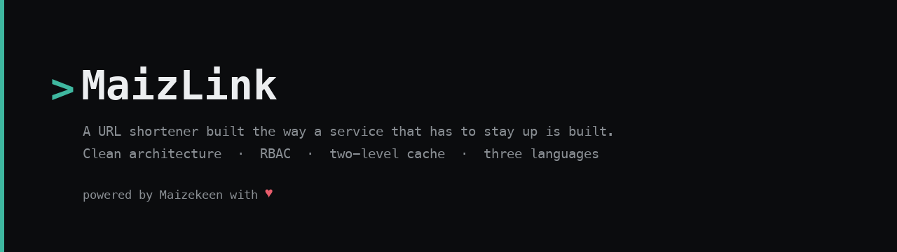
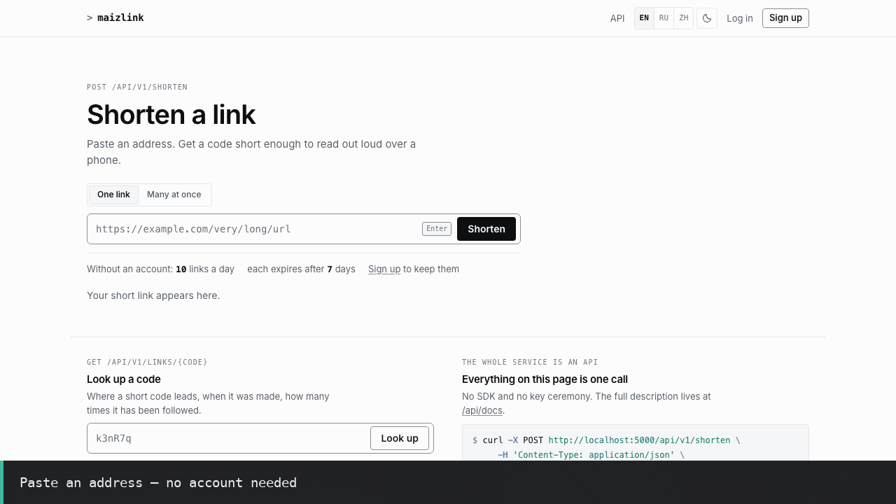
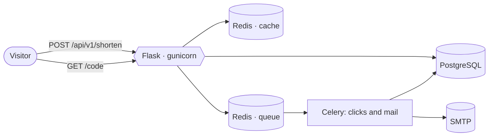

<div align="center">



# MaizLink

Clean architecture, role-based access control, a two-level cache, and a test
suite that fails when the documentation starts lying.

[](https://github.com/IAMN1/link-shortener/actions/workflows/tests.yml)
[](https://www.python.org/)
[](docs/testing.md)
[](docs/testing.md)
[](docs/testing.md)
[](LICENSE)

[Quick start](docs/getting-started.md) ·
[Architecture](docs/architecture.md) ·
[Why it is built this way](docs/decisions.md) ·
[All docs](docs/README.md)

**English** · [Русский](README.ru.md)



</div>

---

```console
$ curl -X POST localhost:5000/api/v1/shorten -H 'Content-Type: application/json' \
       -d '{"url": "https://example.com/a/very/long/address"}'

{ "short_url": "http://localhost:5000/kR3-9fA", "is_new": true,
  "expires_at": "2026-08-21T12:00:33Z", "deletion_token": "IjE3YzJ…" }
```

No account needed for that. The link works, expires in seven days, and the
token in the answer is how its maker deletes it — because a link with no
owner has nothing for ownership to match.

## Why look at this one

URL shorteners are a weekend project. This one is a study in what the
weekend project leaves out.

| | |
|---|---|
| **Anonymous callers are a role, not an exception** | A signed-out visitor acts as `guest`, a real RBAC role with real permissions. There is no `if user is None` branch deciding policy. |
| **The document cannot drift from the code** | `/api/openapi.json` is generated from the same Pydantic models the endpoints validate against, and a test holds the route table against it. Publishing a rate limit the service does not enforce fails the suite. |
| **Refusals are told apart** | `401` means "nobody is authenticated", `403` means "authenticated and not allowed". A guest link's own deletion token is a third answer again. |
| **The interface offers what the caller may do** | The markup asks the same authorization service the route asks. A role cannot be shown a button that answers 403. |
| **Failure is a state, not a crash** | The logger and the cache degrade to a fallback rather than taking the request down, and the health endpoint reports which one is live. |

## Quick start

<table>
<tr><td width="50%" valign="top">

**Locally** — SQLite, in-memory cache

```bash
uv sync
cp .env.example .env
uv run flask security \
    generate-secrets --write .env
uv run flask alembic upgrade head
uv run flask create-admin \
    --email admin@example.com \
    --password 'your-password'
uv run flask run
```

</td><td width="50%" valign="top">

**In Docker** — PostgreSQL, Redis, Celery, Mailpit

```bash
cp .env.docker.example .env.docker
uv run flask security generate-secrets \
    --write .env.docker \
    --with-service-passwords
docker compose --env-file .env.docker \
    up -d --build
```

</td></tr>
</table>

> [!TIP]
> Two templates rather than one, because one file cannot answer both
> questions: `.env.example` describes the run on the left, SQLite and a
> cache in the process; `.env.docker.example` describes the one on the
> right, with every dependency in a container. Eight lines differ between
> them and a test holds the rest identical.
>
> `--write` fills the secrets into the file in place; without them the
> deployed profiles refuse to start. `--with-service-passwords` adds the
> two the stack's own PostgreSQL and Redis are started with — the
> repository ships no default password, and both services refuse to start
> rather than come up open. Roles seed themselves on startup in
> `development`, which is why neither block runs `db load-base-roles`.
>
> Something else — the application on the host against containerised
> services, your own PostgreSQL, a different profile: the whole matrix,
> with the values for each combination, is in
> [Getting started](docs/getting-started.md#choosing-where-each-part-runs).
> Step-by-step, with the expected output of every command, is there too.

## What it does



| | |
|---|---|
| **Guest links** | Shortened without an account, seven-day life, quota per address |
| **Accounts** | Permanent links, personal statistics, a dashboard |
| **Batch** | Several URLs per request; what fails comes back per item |
| **Deduplication** | Within one owner: shortening your own URL again returns your own live link |
| **RBAC** | `guest`, `user`, `analyst`, `auditor`, `admin` — roles seeded from YAML, editable through the panel |
| **Email confirmation** | Registration never says whether an address is taken |
| **Two-level cache** | Redirects and link objects, invalidated on delete |
| **Asynchronous counters** | Clicks counted by Celery, off the request path |
| **Rate limiting** | Every route, tighter on auth and link creation; `/health` and `/static/` exempt |
| **CLI** | Seven command groups for operating the service |

## API

Thirty-nine operations. Full description: `/api/openapi.json`, rendered at
`/api/docs`.

| Method | Endpoint | Permission | |
|---|---|---|---|
| `POST` | `/api/v1/shorten` | `link:create` — held by `guest` | Create a link |
| `POST` | `/api/v1/batch/shorten` | `link:create` | Several at once |
| `GET` | `/api/v1/links/{code}` | — | Where it points. Owner and traffic withheld from everyone else |
| `GET` | `/api/v1/links/{code}/extended` | ownership, `admin:all` or `stats:view_any` | Derived analytics |
| `DELETE` | `/api/v1/links/{code}` | `link:delete_own` / `link:delete_any` / deletion token | Remove it |
| `GET` | `/api/v1/stats` | `stats:view_basic` — held by `guest` | Service totals |
| `GET` | `/api/v1/stats/visits` | `stats:view_basic` / `link:view_own` | When links were opened, bucketed; `scope=mine` for your own; `?code=` needs the link's owner or `stats:view_any` |
| `GET` | `/api/v1/stats/visits/daily` | `stats:view_basic` / `link:view_own` | Visits per day, reaching past the retention window |
| `GET` | `/api/v1/stats/mine` | `link:view_own` | Your own |

<details>
<summary>Authentication, accounts and administration</summary>

| Method | Endpoint | Permission | |
|---|---|---|---|
| `POST` | `/api/v1/auth/register` | — | `202`, and the same answer whether or not the address was free |
| `GET`, `POST` | `/api/v1/auth/verify` | — | Spend the confirmation token |
| `POST` | `/api/v1/auth/resend-verification` | — | Ask for another message |
| `POST` | `/api/v1/auth/login` | — | Tokens; a wrong password, a switched-off account and an unconfirmed address are all `INVALID_CREDENTIALS` |
| `POST` | `/api/v1/auth/refresh` | refresh token | Rotate the pair |
| `POST` | `/api/v1/auth/logout` | session | Revoke it server-side |
| `POST` | `/api/v1/auth/change-password` | session | Replace your own password; every session goes, this one is reopened |
| `POST` | `/api/v1/auth/forgot-password` | — | `202`, and the same answer whether or not the address has an account |
| `POST` | `/api/v1/auth/reset-password` | — | Spend a mailed token and set a new password; every session goes |
| `GET`, `POST` | `/api/v1/admin/users` | `admin:view_users` / `admin:manage_users` | List, create |
| `PUT` | `/api/v1/admin/users/{id}/roles` | `admin:manage_users` | Replace roles |
| `POST` | `/api/v1/admin/users/{id}/deactivate` | `admin:manage_users` | Suspend; refused for the last administrator |
| `POST` | `/api/v1/admin/users/{id}/verify-email` | `admin:manage_users` | Confirm an address the mailed link cannot reach; spends any outstanding token |
| `POST` | `/api/v1/admin/users/{id}/resend-verification` | `admin:manage_users` | Send the confirmation message again, addressed by account id |
| `GET`, `POST` | `/api/v1/admin/roles` | `admin:view_roles` / `admin:manage_roles` | List, create |
| `PUT` | `/api/v1/admin/roles/{name}/permissions` | `admin:manage_roles` | Replace permissions; system roles are protected |
| `GET` | `/api/v1/admin/health` | `admin:view_system_health` | What each dependency answered |
| `GET` | `/api/v1/journals/{journal}` | `audit:view` for `audit`, `logs:view` for `application` and `error` | The end of one journal, oldest line first; `admin:all` does not carry the first of the two |

</details>

## The parts that usually go wrong

> [!NOTE]
> These are the rules people trip over. Each one is enforced by a test that
> fails when the behaviour changes — the reasoning is in
> [Decisions](docs/decisions.md).

- **An expired link answers `410`** everywhere — on the redirect and on both
  information endpoints.
- **What is public**: the short address, the destination, when it was made,
  when it expires. **What is not**: the owner and the traffic. The counters
  are closed together with the identifier, because `/extended` is computed
  entirely from them.
- **Registration does not say whether an address is taken.** Same answer,
  same timing, a message either way. The administrative path says so
  outright — there the caller is entitled to know.
- **Cookies pass CSRF, bearer tokens do not need to.** A client that can set
  `Authorization` has already shown it can set headers.
- **Logging out revokes the session** rather than merely dropping the cookie,
  and a spent refresh token revokes the chain it belonged to.

## Testing

```bash
uv run pytest tests/                      # 4921 tests
uv run python tests/live/smoke_test.py    # 157 checks over HTTP
uv run python tests/live/browser_test.py  # 68 checks in a real browser
```

Four levels — unit, integration on SQLite, integration on real PostgreSQL and
Redis, end-to-end — plus two live runs that pytest does not collect. CI runs
the suite twice, in a clean environment and in a hostile one, to catch tests
that read configuration nobody gave them.

Full breakdown: [Testing](docs/testing.md).

## Documentation

| | |
|---|---|
| [Getting started](docs/getting-started.md) | From an empty directory to a working service, with the expected output of each step |
| [Architecture](docs/architecture.md) | Layers, data flows, caching, authorization |
| [Configuration](docs/configuration.md) | Profiles, precedence, and the settings that bite; the exhaustive list of what an operator sets is `.env.example` |
| [Operations](docs/operations.md) | Migrations, CLI, backups, upgrades, health |
| [Testing](docs/testing.md) | The four levels, the live runs, and what CI enforces |
| [Development](docs/development.md) | Patterns, the frontend, the load profile |
| [Decisions](docs/decisions.md) | Ninety-six write-ups of why something is the way it is |
| [Roadmap](docs/roadmap.md) | What was considered and never built, and what each idea would cost |

## Requirements

Python 3.12, [uv](https://docs.astral.sh/uv/). Docker Compose v2 for the full
stack. PostgreSQL and Redis are required in the deployed profiles and optional
locally.

## Contributing

Issues and pull requests are welcome — [CONTRIBUTING.md](CONTRIBUTING.md)
covers the setup, what a change has to pass, and the one-flag sign-off
(`git commit -s`) the project uses instead of a CLA. Taking part means
keeping to the [Code of Conduct](CODE_OF_CONDUCT.md), and the address in
it reaches the maintainer and nobody else.

## Security

Found a hole? Please report it privately through the
[Security tab](https://github.com/IAMN1/link-shortener/security/advisories/new)
rather than a public issue — [SECURITY.md](SECURITY.md) says what to
expect, what is already known, and what I will not pursue you for.

## License

[Apache License 2.0](LICENSE). Use it, fork it, ship it — commercially
too. Keep the copyright notice, say what you changed, and note that the
licence carries an explicit patent grant: a contributor cannot later sue
users over patents in what they contributed.

The licence covers the code and not the name: section 6 grants no
trademark rights, so a fork travels under a name of its own.
