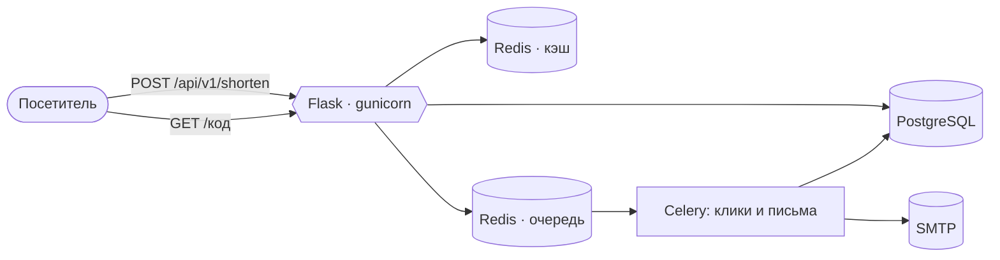
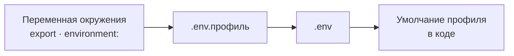

# Link Shortener

Сервис сокращения ссылок на Python/Flask, выстроенный по чистой архитектуре.
Гостевые и пользовательские ссылки, RBAC, подтверждение адреса по почте,
асинхронная статистика и двухуровневый кэш.

[](https://www.python.org/)
[](https://github.com/IAMN1/link-shortener/actions/workflows/tests.yml)



## Что умеет

| | |
|---|---|
| **Гостевые ссылки** | Сокращение без регистрации, срок жизни 7 дней |
| **Аккаунты** | Постоянные ссылки, личная статистика, панель управления |
| **Пакетное создание** | Несколько URL за один запрос |
| **TTL** | Настраиваемый срок жизни ссылки |
| **Дедупликация** | В пределах владельца: повторное сокращение своего URL возвращает свою же живую ссылку (`200`, `is_new: false`) |
| **RBAC** | Роли `guest`, `user`, `analyst`, `admin`; анонимный запрос выполняется в роли `guest`, а не «без ролей» |
| **Подтверждение адреса** | Регистрация не выдаёт, занят ли адрес |
| **Кэш** | Два уровня — редиректы и объекты ссылок — с инвалидацией |
| **Асинхронная статистика** | Подсчёт кликов через Celery |
| **Rate limiting** | На auth-эндпоинтах и на создании ссылок |
| **CLI** | Семь групп команд обслуживания плюс `create-admin` и `create-user` |
| **Отказоустойчивость** | Логгер и кэш деградируют, не роняя запрос |

## Запуск

**Локально** — SQLite, кэш в памяти, без Celery:

```bash
uv sync
cp .env.example .env                       # задайте SECRET_KEY и SHORT_CODE_PEPPER
uv run flask alembic upgrade head          # схема БД
uv run flask db load-base-roles            # роли guest/user/analyst/admin
uv run flask create-admin --email admin@example.com --password 'пароль'
uv run flask run
```

**В Docker** — PostgreSQL, Redis, Celery, Mailpit:

```bash
cp .env.example .env.docker                # задайте секреты и пароли
docker compose --env-file .env.docker up -d --build
```

Какие из четырёх сервисов поднимать своими, а какие взять внешними, решает
`COMPOSE_PROFILES` в том же файле: шаблон включает все (`db,cache,broker,mail`),
а тот, кто подключает внешние БД, Redis, брокер и почтовый сервер, убирает их
из списка и получает только `migrations`, `app` и `celery_worker`.

Пошагово, с ожидаемым выводом каждой команды и разбором частых ошибок —
[docs/QUICKSTART.md](docs/QUICKSTART.md).

## API

| Метод | Эндпоинт | Требуемое разрешение | Описание |
|-------|----------|----------------------|----------|
| POST | `/api/v1/shorten` | `link:create` (есть у `guest`) | Создать короткую ссылку |
| POST | `/api/v1/batch/shorten` | `link:create` | Пакетное создание; не прошедшие элементы возвращаются поэлементной ошибкой, сам запрос отвечает `200` |
| GET | `/api/v1/links/<code>` | Нет | Информация о ссылке. `owner_id`, `clicks` и `last_accessed` — только владельцу, админу и держателю `stats:view_any` |
| GET | `/api/v1/links/<code>/extended` | Владение, `admin:all` или `stats:view_any` | Расширенная аналитика |
| GET | `/api/v1/links/mine` | `link:view_own` | Свои ссылки (`offset`, `limit`) |
| DELETE | `/api/v1/links/<code>` | `link:delete_own` / `link:delete_any` | Удалить ссылку |
| GET | `/api/v1/stats` | `stats:view_basic` (есть у `guest`) | Итоги по сервису; разбивка `popular_links` требует `stats:view_full` |
| GET | `/api/v1/stats/mine` | `link:view_own` | Личная статистика |
| POST | `/api/v1/auth/register` | Нет | Регистрация; `202` и одинаковый ответ для занятого и свободного адреса |
| GET | `/api/v1/auth/verify?token=…` | Нет | Подтвердить адрес по ссылке из письма (одноразовая) |
| POST | `/api/v1/auth/resend-verification` | Нет | Прислать ссылку заново |
| POST | `/api/v1/auth/login` | Нет | JWT-токены; неподтверждённый адрес — `EMAIL_NOT_VERIFIED` |
| POST | `/api/v1/auth/refresh` | Refresh-токен | Обменять на новую пару (токен ротируется) |
| POST | `/api/v1/auth/logout` | Refresh-токен или Bearer | Завершить сессию |
| GET | `/api/v1/admin/health`, `/users`, `/roles` | Admin | Администрирование |

Машиночитаемое описание — `/api/openapi.json`, страница — `/api/docs`.

## Как это себя ведёт

Правила, о которые чаще всего спотыкаются:

- **`401` против `403`.** `401` — «запрос никем не аутентифицирован», `403` —
  «аутентифицирован, но разрешения нет». Аноним не отвергается автоматически:
  он действует в роли `guest`.
- **Истёкшая ссылка** отвечает `410` везде — и на редиректе, и на обоих
  информационных эндпоинтах.
- **Что публично:** адрес короткой ссылки, исходный URL, дата создания, срок
  жизни. Что приватно: `owner_id` и трафик — счётчики закрыты вместе с
  идентификатором, потому что `/extended` целиком считается из них.
- **Регистрация** не говорит, занят ли адрес: одинаковый ответ, одинаковое
  время и письмо в обоих случаях. Админский путь
  (`POST /api/v1/admin/users`) говорит прямо — там вызывающий имеет право знать.
- **Аутентификация** — `Authorization: Bearer <token>` для программных
  клиентов, cookie для браузера. Запрос на cookie проходит проверку CSRF
  (двойная отправка, подпись, `Origin`); запрос с валидным Bearer её не
  проходит вовсе.
- **Сессии.** Выход отзывает сессию на сервере, а не только удаляет cookie;
  повторное предъявление потраченного refresh-токена отзывает цепочку этого
  входа и только её.

Почему каждое из них устроено так — в
[docs/DEVELOPER_GUIDE.md](docs/DEVELOPER_GUIDE.md).

## Архитектура

```
src/link_shortener/
├── domain/          # Сущности, объекты-значения, интерфейсы репозиториев
├── application/     # Use case'ы, DTO, сервисы приложения, порты
├── infrastructure/  # Реализации: БД, кэш, авторизация, DI, CLI
└── web/             # Контроллеры, middleware, шаблоны, статика
```

Repository, Unit of Work, DI-контейнер с ленивой инициализацией, фасады для
веб-слоя, декораторы прав. Слои, границы и схемы —
[docs/ARCHITECTURE.md](docs/ARCHITECTURE.md).

## Тестирование

```bash
uv run pytest tests/                      # весь набор
uv run pytest tests/unit/                 # только unit
uv run python tests/live/smoke_test.py    # 114 проверок по HTTP
uv run python tests/live/browser_test.py  # 9 проверок настоящим браузером
uv run flake8 src tests && uv run pylint src && uv run bandit -r src -q && uv run mypy src
```

Три уровня: unit на моках, интеграционные на in-memory SQLite и отдельно на
настоящих PostgreSQL с Redis в Docker, плюс e2e. Живые прогоны pytest не
собирает — их запускают отдельно.

CI гоняет набор дважды, в чистом окружении и во враждебном, чтобы поймать
тесты, читающие конфигурацию, которую им не давали. Пропущенный тест считается
отказом. Обе половины заканчиваются живым прогоном; отдельная задача проходит
`flake8`, `pylint`, `bandit` и `mypy`, каждый своим шагом.

Разбор уровней и структура — в
[docs/DEVELOPER_GUIDE.md](docs/DEVELOPER_GUIDE.md#запуск-тестов).

## Конфигурация

`FLASK_ENV` выбирает профиль (`development`, `staging`, `production`,
`testing`), `.env` переопределяет его умолчания.



Побеждает левое. Профиль `testing` игнорирует окружение целиком — автотесты
должны давать одинаковый результат на любой машине.

Пять переменных, без которых развёртывание ведёт себя не так, как ожидают:

| Переменная | По умолчанию | Что будет иначе |
|------------|--------------|-----------------|
| `FLASK_ENV` | development | Выбирает профиль, а с ним умолчания всего остального |
| `SECRET_KEY` | случайный | Подписывает JWT: без явного значения токены умирают при каждом рестарте |
| `SHORT_CODE_PEPPER` | случайный | Соль генерации кодов: разойдётся между инстансами — разойдутся и коды |
| `DOMAIN` | (пусто) | Обязателен в `production` и `staging`. Иначе `BASE_URL` собирается как `http://{HOST}:{PORT}/` |
| `DATABASE_TYPE` | sqlite | В `production` и `staging` допустим только `postgresql` |

Остальные — в `.env.example` и
[docs/OPERATIONS_AND_MIGRATIONS.md](docs/OPERATIONS_AND_MIGRATIONS.md#справочник-конфигурации).

## Стек

Python 3.12, Flask 3, PostgreSQL 15, Redis 7, Celery 5, Alembic, PyJWT,
Pydantic v2, structlog, uv, Docker Compose.

## CLI

```bash
flask alembic upgrade head                     # применить миграции
flask db load-base-roles                       # системные роли из roles.yaml
flask create-admin --email <e> --password <p>  # первый администратор
flask security check-secrets                   # ключи не остались дефолтными?
flask maintenance health                       # БД и Redis отвечают?
```

Полный справочник —
[docs/OPERATIONS_AND_MIGRATIONS.md](docs/OPERATIONS_AND_MIGRATIONS.md#cli-команды).

## Документация

| Документ | О чём |
|----------|-------|
| [Быстрый старт](docs/QUICKSTART.md) | Запуск с нуля, шаг за шагом, с ожидаемым выводом |
| [Архитектура](docs/ARCHITECTURE.md) | Слои, потоки данных, кэш, RBAC, наблюдаемость |
| [Руководство разработчика](docs/DEVELOPER_GUIDE.md) | Тесты, конфигурация, нагрузочный профиль, принятые решения |
| [Эксплуатация](docs/OPERATIONS_AND_MIGRATIONS.md) | CLI, миграции, справочник настроек, обслуживание |

## Лицензия

MIT
