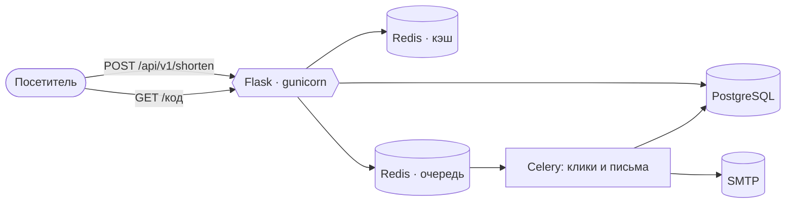

<div align="center">


# MaizLink

**Сокращатель ссылок, собранный так, как собирают сервис, которому надо стоять.**

Чистая архитектура, доступ по правам, двухуровневый кэш и набор тестов,
который краснеет, когда документация начинает врать.

[](https://github.com/IAMN1/link-shortener/actions/workflows/tests.yml)
[](https://www.python.org/)
[](docs/testing.md)
[](docs/testing.md)
[](docs/testing.md)
[](LICENSE)

[Быстрый старт](docs/getting-started.ru.md) ·
[Архитектура](docs/architecture.md) ·
[Почему сделано так](docs/decisions.md) ·
[Вся документация](docs/README.md)

[English](README.md) · **Русский**


</div>

---

```console
$ curl -X POST localhost:5000/api/v1/shorten -H 'Content-Type: application/json' \
       -d '{"url": "https://example.com/a/very/long/address"}'

{ "short_url": "http://localhost:5000/kR3-9fA", "is_new": true,
  "expires_at": "2026-08-21T12:00:33Z", "deletion_token": "IjE3YzJ…" }
```

Для этого не нужна учётная запись. Ссылка работает, живёт семь дней, а токен
в ответе — то, чем её удаляет тот, кто её сделал: у ссылки без владельца
нечему совпасть с владением.

## Зачем смотреть именно на этот

Сокращатель ссылок — проект на выходные. Этот — разбор того, что проект на
выходные оставляет за кадром.

| | |
|---|---|
| **Аноним — это роль, а не исключение** | Вышедший из системы посетитель действует как `guest`: настоящая роль RBAC с настоящими правами. Ветки `if user is None`, решающей политику, нет вообще. |
| **Документ не может разойтись с кодом** | `/api/openapi.json` генерируется из тех же моделей Pydantic, по которым валидируют эндпоинты, а тест держит его против таблицы маршрутов. Опубликованный лимит, которого сервис не соблюдает, роняет набор. |
| **Отказы различаются** | `401` — «никто не аутентифицирован», `403` — «аутентифицирован и не имеет права». Токен удаления гостевой ссылки — снова третий ответ. |
| **Интерфейс предлагает то, что вызывающему можно** | Разметка спрашивает ту же службу авторизации, что и маршрут. Роли нельзя показать кнопку, которая ответит 403. |
| **Отказ — это состояние, а не падение** | Логгер и кэш деградируют на запасной путь, не роняя запрос, а health-эндпоинт говорит, какой из них сейчас работает. |

## Быстрый старт

<table>
<tr><td width="50%" valign="top">

**Локально** — SQLite, кэш в памяти

```bash
uv sync
cp .env.example .env
uv run flask security \
    generate-secrets --write .env
uv run flask alembic upgrade head
uv run flask create-admin \
    --email admin@example.com \
    --password 'ваш-пароль'
uv run flask run
```

</td><td width="50%" valign="top">

**В Docker** — PostgreSQL, Redis, Celery, Mailpit

```bash
cp .env.docker.example .env.docker
uv run flask security generate-secrets \
    --write .env.docker \
    --with-service-passwords
docker compose --env-file .env.docker \
    up -d --build
```

</td></tr>
</table>

> [!TIP]
> Шаблона два, а не один, потому что один файл не отвечает на два вопроса
> сразу: `.env.example` описывает запуск слева — SQLite и кэш в процессе,
> `.env.docker.example` описывает запуск справа, где все зависимости в
> контейнерах. Различаются девять строк, остальное держит одинаковым тест.
>
> `--write` вписывает секреты прямо в файл; без них развёрнутые профили не
> стартуют. `--with-service-passwords` добавляет ещё два — те, с которыми
> запускаются собственные PostgreSQL и Redis стека: пароля по умолчанию в
> репозитории нет, и оба сервиса скорее откажутся стартовать, чем поднимутся
> открытыми. Роли в `development` засеваются при старте сами — поэтому
> `db load-base-roles` нет ни в одном блоке.
>
> **Чтобы посмотреть, как регистрируется посетитель, берите правый блок.**
> Он поднимает Mailpit, и письмо с подтверждением попадает в его ящик на
> <http://127.0.0.1:8025>, а не уходит наружу. В левом блоке ловца нет:
> почта там идёт на `localhost:1025`, где никто не слушает, — и
> зарегистрировавшийся остаётся с неподтверждённым адресом и учётной
> записью, в которую не войти. Администратор, которого создаёт этот блок,
> подтверждён сразу, так что остальное работает. Чтобы было и то и другое,
> поднимите рядом с локальным приложением
> `docker compose --env-file .env.docker up -d mailpit`.
>
> Что-то другое — приложение на хосте против контейнерных сервисов, своя
> PostgreSQL, другой профиль: вся матрица со значениями для каждого
> сочетания лежит в
> [Быстром старте](docs/getting-started.ru.md#где-что-запускать).
> Там же — по шагам, с ожидаемым выводом каждой команды.

## Что умеет



| | |
|---|---|
| **Гостевые ссылки** | Сокращение без регистрации, срок жизни семь дней, квота на адрес |
| **Учётные записи** | Постоянные ссылки, личная статистика, панель управления |
| **Пакетное создание** | Несколько URL за запрос; не прошедшее возвращается поэлементно |
| **QR-коды** | Каждая ссылка — SVG-квадрат, на своей странице и по своему адресу. Кодируется *короткий* URL, поэтому счётчики, срок жизни и удаление продолжают действовать |
| **Дедупликация** | В пределах владельца: повторное сокращение своего URL вернёт свою же живую ссылку |
| **RBAC** | `guest`, `user`, `analyst`, `auditor`, `admin` — роли засеваются из YAML и правятся через панель |
| **Подтверждение адреса** | Регистрация никогда не говорит, занят ли адрес |
| **Двухуровневый кэш** | Редиректы и объекты ссылок, с инвалидацией при удалении |
| **Асинхронные счётчики** | Клики считает Celery, вне пути запроса |
| **Ограничение частоты** | На каждом маршруте, строже — на auth и создании ссылок; `/health` и `/static/` не ограничены |
| **CLI** | Семь групп команд для эксплуатации сервиса |

## API

Тридцать девять операций. Полное описание — `/api/openapi.json`, страницей —
`/api/docs`.

| Метод | Эндпоинт | Право | |
|---|---|---|---|
| `POST` | `/api/v1/shorten` | `link:create` — есть у `guest` | Создать ссылку |
| `POST` | `/api/v1/batch/shorten` | `link:create` | Несколько за раз |
| `GET` | `/api/v1/links/{code}` | — | Куда ведёт. Владелец и трафик скрыты от остальных |
| `GET` | `/api/v1/links/{code}/extended` | владение, `admin:all` или `stats:view_any` | Производная аналитика |
| `GET` | `/api/v1/links/{code}/qr` | — | Короткая ссылка как QR-код в SVG |
| `DELETE` | `/api/v1/links/{code}` | `link:delete_own` / `link:delete_any` / токен удаления | Удалить |
| `GET` | `/api/v1/stats` | `stats:view_basic` — есть у `guest` | Итоги по сервису |
| `GET` | `/api/v1/stats/visits` | `stats:view_basic` / `link:view_own` | Когда открывали ссылки, по интервалам; `scope=mine` — только свои; `?code=` — владелец ссылки или `stats:view_any` |
| `GET` | `/api/v1/stats/visits/daily` | `stats:view_basic` / `link:view_own` | Переходы по дням, дальше срока хранения сырых событий |
| `GET` | `/api/v1/stats/mine` | `link:view_own` | Свои |

<details>
<summary>Аутентификация, учётные записи и администрирование</summary>

| Метод | Эндпоинт | Право | |
|---|---|---|---|
| `POST` | `/api/v1/auth/register` | — | `202`, и одинаковый ответ, свободен адрес или нет |
| `GET`, `POST` | `/api/v1/auth/verify` | — | Потратить токен подтверждения |
| `POST` | `/api/v1/auth/resend-verification` | — | Попросить письмо заново |
| `POST` | `/api/v1/auth/login` | — | Токены; неверный пароль, отключённая учётка и неподтверждённый адрес — один и тот же `INVALID_CREDENTIALS` |
| `POST` | `/api/v1/auth/refresh` | refresh-токен | Ротировать пару |
| `POST` | `/api/v1/auth/logout` | сессия | Отозвать её на сервере |
| `POST` | `/api/v1/auth/change-password` | сессия | Сменить свой пароль; все сессии гаснут, текущая открывается заново |
| `POST` | `/api/v1/auth/forgot-password` | — | `202`, и одинаковый ответ, есть у адреса учётная запись или нет |
| `POST` | `/api/v1/auth/reset-password` | — | Потратить высланный токен и задать новый пароль; все сессии гаснут |
| `GET`, `POST` | `/api/v1/admin/users` | `admin:view_users` / `admin:manage_users` | Список, создание |
| `PUT` | `/api/v1/admin/users/{id}/roles` | `admin:manage_users` | Заменить роли |
| `POST` | `/api/v1/admin/users/{id}/deactivate` | `admin:manage_users` | Приостановить; последнему администратору отказано |
| `POST` | `/api/v1/admin/users/{id}/verify-email` | `admin:manage_users` | Подтвердить адрес, до которого не доходит письмо; выданные токены при этом гасятся |
| `POST` | `/api/v1/admin/users/{id}/resend-verification` | `admin:manage_users` | Выслать письмо заново, по идентификатору учётной записи |
| `GET`, `POST` | `/api/v1/admin/roles` | `admin:view_roles` / `admin:manage_roles` | Список, создание |
| `PUT` | `/api/v1/admin/roles/{name}/permissions` | `admin:manage_roles` | Заменить права; системные роли защищены |
| `GET` | `/api/v1/admin/health` | `admin:view_system_health` | Что ответила каждая зависимость |
| `GET` | `/api/v1/journals/{journal}` | `audit:view` для `audit`, `logs:view` для `application` и `error` | Конец одного журнала, старые строки первыми; `admin:all` первого права не даёт |

</details>

## Места, где обычно спотыкаются

> [!NOTE]
> Это правила, о которые спотыкаются чаще всего. Каждое держит тест, который
> краснеет при изменении поведения, а разбор — в
> [Принятых решениях](docs/decisions.md).

- **Истёкшая ссылка отвечает `410`** везде — и на редиректе, и на обоих
  информационных эндпоинтах.
- **Что публично**: адрес короткой ссылки, назначение, когда создана, когда
  истекает. **Что нет**: владелец и трафик. Счётчики закрыты вместе с
  идентификатором, потому что `/extended` считается целиком из них.
- **Регистрация не говорит, занят ли адрес.** Тот же ответ, то же время,
  письмо в любом случае. Административный путь говорит прямо — там
  вызывающий имеет право знать.
- **Cookie проходят CSRF, bearer-токенам это не нужно.** Клиент, умеющий
  выставить `Authorization`, уже показал, что умеет выставлять заголовки.
- **Выход отзывает сессию**, а не просто удаляет cookie, а потраченный
  refresh-токен отзывает цепочку, которой принадлежал.

## Тестирование

```bash
uv run pytest tests/                      # 5206 тестов
uv run python tests/live/smoke_test.py    # 159 проверок по HTTP
uv run python tests/live/browser_test.py  # 69 проверок настоящим браузером
```

Четыре уровня — unit, интеграционные на SQLite, интеграционные на настоящих
PostgreSQL и Redis, e2e — плюс два живых прогона, которые pytest не собирает.
CI гоняет набор дважды, в чистом окружении и во враждебном, чтобы поймать
тесты, читающие конфигурацию, которую им не давали.

Полный разбор: [Тестирование](docs/testing.md).

## Документация

Глубокие руководства ведутся на английском — их читают те, кто уже решил
разбираться. Витрина и быстрый старт есть на обоих языках.

| | |
|---|---|
| [Быстрый старт](docs/getting-started.ru.md) | Из пустого каталога до работающего сервиса, с ожидаемым выводом каждого шага |
| [Архитектура](docs/architecture.md) | Слои, потоки данных, кэш, авторизация |
| [Конфигурация](docs/configuration.md) | Профили, приоритет и настройки, которые кусаются; исчерпывающий список задаваемого оператором — `.env.example` |
| [Эксплуатация](docs/operations.md) | Миграции, CLI, резервные копии, обновление, здоровье |
| [Тестирование](docs/testing.md) | Четыре уровня, живые прогоны и что требует CI |
| [Разработка](docs/development.md) | Паттерны, фронтенд, нагрузочный профиль |
| [Принятые решения](docs/decisions.md) | Сто разборов, почему сделано так, а не иначе |
| [Планы](docs/roadmap.md) | Что рассматривалось и не сделано, и во что обошлась бы каждая мысль |

## Требования

Python 3.12, [uv](https://docs.astral.sh/uv/). Docker Compose v2 для полного
стека. PostgreSQL и Redis обязательны в развёрнутых профилях и необязательны
локально.

## Как поучаствовать

Issues и pull request'ы приветствуются — [CONTRIBUTING.md](CONTRIBUTING.md)
описывает настройку, что должна пройти правка и подпись одним флагом
(`git commit -s`), которую проект использует вместо CLA. Участие
предполагает [кодекс поведения](CODE_OF_CONDUCT.md); адрес в нём ведёт к
мейнтейнеру и больше ни к кому.

## Безопасность

Нашли дыру? Сообщите приватно через
[вкладку Security](https://github.com/IAMN1/link-shortener/security/advisories/new),
а не публичным issue — [SECURITY.md](SECURITY.md) говорит, чего ждать,
что уже известно и за что я не стану вас преследовать.

## Лицензия

[Apache License 2.0](LICENSE). Пользуйтесь, форкайте, поставляйте —
в том числе коммерчески. Сохраните копирайт, отметьте, что изменили, и
учтите: лицензия несёт явный патентный грант — контрибьютор не сможет
потом судиться с пользователями за патенты в том, что он внёс.

Лицензия покрывает код, но не название: раздел 6 не даёт прав на товарный
знак, поэтому форк идёт под своим именем.
