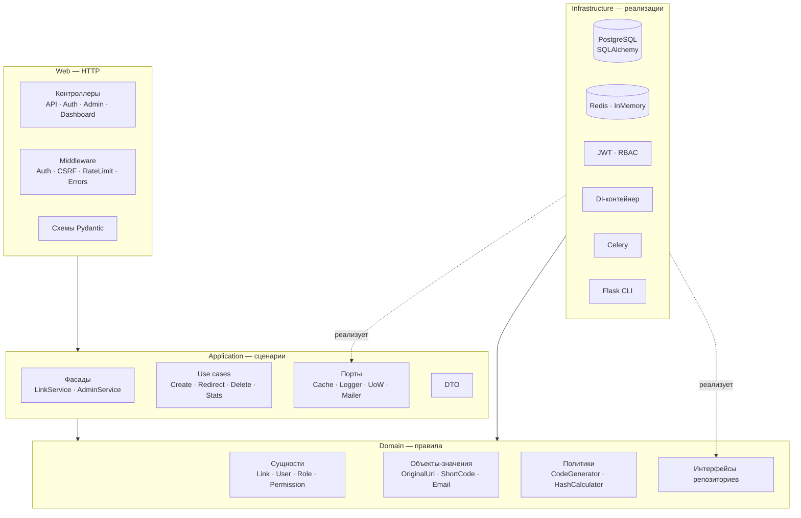
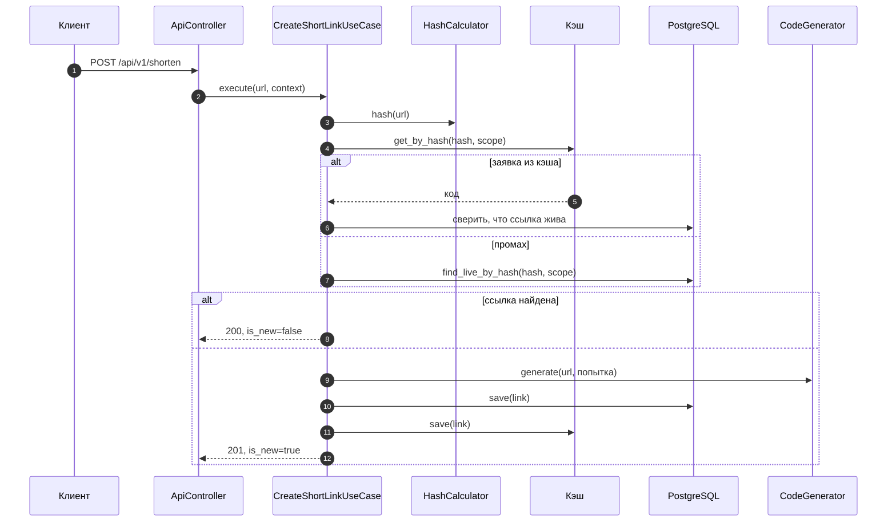
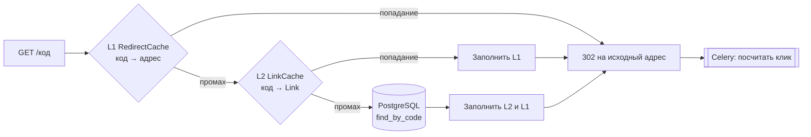
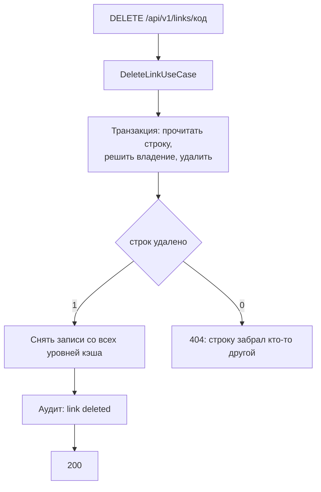
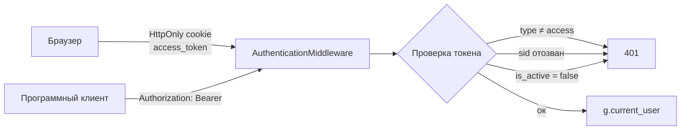
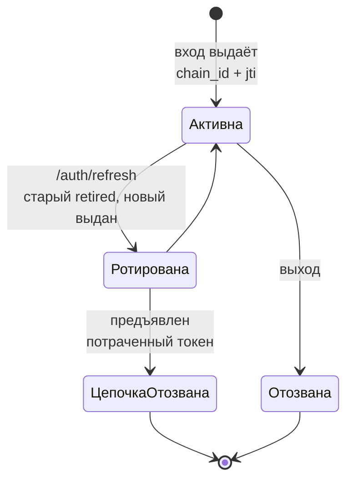
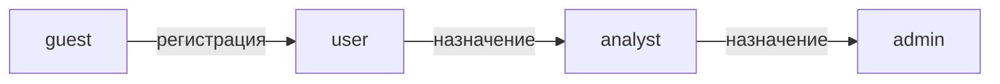
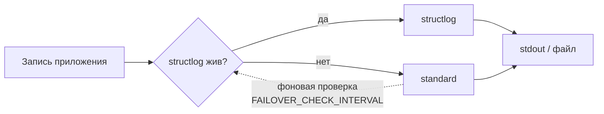
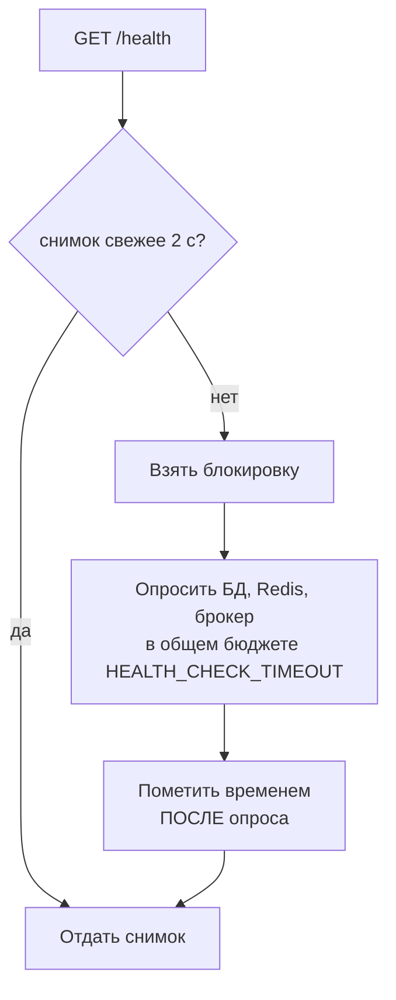
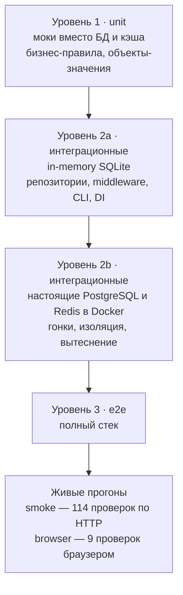

# Архитектура

Слои, границы между ними и правила, которые эти границы держат.

| Раздел | О чём |
|--------|-------|
| [Слои](#слои) | Четыре слоя и направление зависимостей |
| [Структура проекта](#структура-проекта) | Что лежит в каждом каталоге |
| [Потоки данных](#потоки-данных) | Создание, редирект, удаление |
| [Кэширование](#кэширование) | Два уровня, инвалидация, подпись |
| [Транзакционность](#транзакционность) | Unit of Work и счётчики |
| [Безопасность](#безопасность) | Аутентификация, CSRF, сессии |
| [Авторизация](#авторизация-rbac) | Роли, эскалация прав, потолок анонима |
| [Наблюдаемость](#наблюдаемость) | Логи, failover, health check |
| [Расширяемость](#расширяемость) | Как добавить use case, эндпоинт, роль |

---

## Слои

Чистая архитектура: зависимости направлены внутрь. Домен не знает ни о базе,
ни о HTTP; инфраструктура реализует порты, объявленные приложением.



Пунктир — реализация интерфейса: инфраструктура зависит от домена и
приложения, а не наоборот.

---

## Структура проекта

```
src/link_shortener/
├── domain/                    # Правила, ни от чего не зависящие
│   ├── entities/              # Link, User, Role, Permission
│   ├── value_objects/         # OriginalUrl, ShortCode, UrlHash, Email, OwnerID
│   ├── repositories/          # Интерфейсы хранения
│   ├── policies/              # HashCalculator, CodeGenerator
│   ├── exceptions.py
│   └── system_permissions.py
│
├── application/               # Сценарии
│   ├── use_cases/             # links · auth · admin · stats · batch
│   ├── services/              # Фасады для веб-слоя
│   ├── dtos/                  # Объекты передачи данных
│   ├── ports/                 # Абстракции инфраструктуры
│   └── context.py             # RequestContext
│
├── infrastructure/            # Реализации
│   ├── database/              # Модели, репозитории, Unit of Work
│   ├── cache/                 # Redis, in-memory, null
│   ├── auth/                  # JWT и RBAC
│   ├── di/                    # Контейнер и его компоненты
│   ├── configs/               # Профили конфигурации
│   ├── cli/                   # Команды Flask
│   ├── logging/               # structlog, standard, failover
│   ├── failover/              # Переключение при отказе логгера
│   ├── rate_limit/            # Ограничитель частоты
│   ├── mail/                  # SMTP и шаблоны писем
│   ├── task_queue/            # Задачи Celery
│   └── health/                # Опрос зависимостей
│
└── web/                       # HTTP
    ├── controllers/
    ├── middleware/
    ├── security/              # Декораторы и контекст
    ├── schemas/               # Валидация входящих данных
    └── templates/             # Jinja2
```

### Что за что отвечает

| Слой | Содержимое | Правило |
|------|------------|---------|
| **Domain** | Сущности, объекты-значения, политики, интерфейсы репозиториев | Ошибки валидации — `ValidationError(DomainError)`, не `ValueError`. `Role` — frozen dataclass; `User` сравнивается по идентификатору |
| **Application** | Use case на сценарий, фасады, DTO, порты | Каждый use case наследует `BaseUseCase`, зависимости объявлены полями `@dataclass` |
| **Infrastructure** | Репозитории, кэш, JWT, RBAC, DI, очередь | Реализует порты; преобразует domain ↔ ORM |
| **Web** | Контроллеры, middleware, декораторы, схемы | Не принимает решений о правах: спрашивает `AuthorizationService` |

---

## Потоки данных

### Создание короткой ссылки



**Дедупликация — в пределах владельца и только по живым ссылкам.** Ключ —
пара «хэш URL + владелец»: зарегистрированный пользователь сам себе область,
гость — в пределах своего `guest_identifier`, ссылки без того и другого
(созданные из CLI) — в общей анонимной области.

Отсюда два следствия:

- **Уникального индекса на `urls.url_hash` нет.** Один и тот же URL законно
  встречается у разных владельцев, а после истечения — и у одного и того же.
  Baseline создаёт неуникальные `ix_urls_url_hash_owner_id` и
  `ix_urls_url_hash_guest_identifier`.
- **Попадание в кэш по хэшу — заявка, а не ответ.** Код сверяется с базой
  прежде, чем быть отданным как существующий: ключи `code:` и `hash:`
  вытесняются независимо (`allkeys-lru`), поэтому запись переживает строку,
  о которой рассказывает.

Истёкшие ссылки в дедупликации не участвуют: иначе повторное сокращение
отдавало бы мёртвый код, а рабочую ссылку на этот URL создать было бы уже
нельзя.

### Редирект — самый горячий путь



Счётчик кликов обновляется задачей, а не в обработчике запроса: при
`CELERY_ENABLED=false` та же работа выполняется синхронно.

### Удаление



Владение решает use case по строке, прочитанной в собственной транзакции.
Ответ строится по числу удалённых строк, а не по предшествующему чтению:
под READ COMMITTED два одновременных удаления видят строку каждый в своём
снимке.

---

## Кэширование

Два уровня, оба необязательные: `CACHE_ENABLED=false` превращает обращения в
холостые.

| Уровень | Ключ → значение | Зачем |
|---------|-----------------|-------|
| **L1 `RedirectCache`** | `код → исходный адрес` | Редирект без сборки сущности |
| **L2 `LinkCache`** | `код → Link` | Информация о ссылке и дедупликация |

Замер вклада кэша — [DEVELOPER_GUIDE.md](DEVELOPER_GUIDE.md#нагрузочный-профиль).

### Инвалидация

| Событие | Что сбрасывается |
|---------|------------------|
| Истечение TTL | Автоматически |
| Удаление ссылки | Все ключи ссылки: `Cache.delete(link)` принимает сущность, а не код — запись дедупликации лежит под ключом из хэша и области |
| Создание и удаление, чистка истёкших | Кэш сводной статистики |
| Клик | Ничего: клики приходят на каждом редиректе, и сброс на каждый оставил бы кэшу нечего отдавать |

Счётчик кликов поэтому отстаёт на `CACHE_STATS_TTL` — цена, ради которой кэш
и существует. Ошибки инвалидации логируются и не прерывают операцию.

### Подпись значений

Всё, что кэш хранит, подписано `itsdangerous.TimestampSigner` на
`SECRET_KEY` — той же библиотекой, которой Flask подписывает сессии.

- **Значение непереносимо.** Ключ Redis идёт `salt`-ом, то есть для каждого
  ключа выводится свой ключ подписи. Запись, выписанная для одного кода, под
  другим не проверяется, и границу между ключом и нагрузкой сдвинуть нельзя.
- **Значение не вечно.** Время выпуска лежит внутри подписанного сообщения, а
  `max_age` при чтении отвергает всё, что старше TTL. Это не дублирование TTL
  Redis: TTL исполняет сервер кэша, и тот, кто может писать в Redis, может
  задать другой или не задать вовсе.

Без подписи одной команды `SET link_shortener:code:<код> '<валидный JSON>'`
хватает, чтобы увести редирект на чужой адрес; тем же способом подставляются
запись дедупликации и статистика.

Непроверенное значение считается **промахом, а не ошибкой**: промах уводит
запрос на уровни, которые умеют ответить, а исключение на пути редиректа было
бы 500. Просроченная подпись отвергается так же, как поддельная.

> Смена `SECRET_KEY` делает весь кэш непроверяемым — развёртывание прогревает
> его заново. Каждый отказ пишется в лог: это либо смена ключа, либо
> посторонняя запись в Redis, и оператору стоит знать о том и о другом.

---

## Транзакционность

```python
with self.uow_factory() as uow:
    if uow.links.find_live_by_hash(url_hash, scope) is None:
        uow.links.save(new_link)
    uow.commit()
# Выход из контекста без коммита — откат
```

Чтение и запись в одной транзакции, коммит явный, незакоммиченное
откатывается на выходе.

> **Счётчики так не обновляют.** `save` пишет весь агрегат целиком, поэтому
> сущность, прочитанная раньше и сохранённая обратно, откатывает всё, что
> изменилось между чтением и записью, — в первую очередь счётчик кликов.
> Для него есть `uow.links.increment_clicks(code)`: атомарный `UPDATE`, при
> котором два одновременных клика не читают одно и то же число. Метод ничего
> не возвращает: счётчик другой запрос мог сдвинуть сразу же, так что
> отданная оттуда сущность была бы снимком, выданным за текущее состояние.

---

## Безопасность

### Аутентификация



- JWT содержит claim `type` (`access` / `refresh`); middleware принимает
  **только** access-токен, refresh годится исключительно для `/auth/refresh`.
- Access-токен несёт claim `sid` с именем своей сессии, и оно проверяется на
  каждом запросе. Без этого токен был бы неотзываемым: выход удалял бы только
  копию клиента.
- `is_active` проверяется на каждом запросе, при выдаче access-токена и при
  входе: деактивация отзывает доступ немедленно.
- Срок жизни cookie берётся из `JWT_ACCESS_TOKEN_EXPIRE_MINUTES` и
  `JWT_REFRESH_TOKEN_EXPIRE_DAYS` — cookie и JWT истекают вместе.
- Браузеру нужны именно cookie: страницы дашборда отдаёт сервер, и обычная
  навигация не может послать заголовок. Скрипты токен не видят.

### CSRF

Три проверки вместе, на каждом небезопасном методе, если запрос
аутентифицирован **cookie**:

| Проверка | Что закрывает |
|----------|---------------|
| **Double submit** | Токен в читаемой cookie `csrf_token` дублируется заголовком `X-CSRF-Token`. Сторонний сайт умеет заставить браузер отправить cookie, но не умеет её прочитать |
| **Подпись** | Токен — HMAC-SHA256 на `SECRET_KEY`, привязанный к пользователю. Без неё схема принимает любое значение, лишь бы две копии совпали |
| **Origin** | Если браузер назвал origin, он должен быть нашим. Это закрывает подсадку cookie с соседнего поддомена: cookie поддомены не различают, `Origin` различает |

Запрос с валидным `Authorization: Bearer` проверку не проходит вовсе: клиент,
способный выставить заголовок, к CSRF не уязвим. Освобождение выдаётся по
тому, чем запрос аутентифицировался (`g.auth_token_source`), а не по форме
заголовка, и не действует на эндпоинты из `COOKIE_AUTHORITY_ENDPOINTS`.

При отсутствии `Origin` и `Referer` эта проверка пропускается — прокси их
вырезают, — но подписанный токен всё равно обязан сойтись.

### Сессии и кража refresh-токена



- Каждый refresh-токен несёт `jti` (строка в `refresh_sessions`) и `chain_id`
  — одна цепочка на один вход, сколько бы раз токен ни ротировался.
- Выход отзывает свою сессию и не трогает другие устройства; блокировка
  учётной записи отзывает все.
- Повторное предъявление потраченного токена означает копию: отзывается **его
  цепочка**, а не все сессии пользователя, иначе один мёртвый токен позволял
  бы разлогинить человека везде по требованию.
- Захват сессии при ротации — один условный `UPDATE`: «прочитать, проверить,
  записать» пропускает два одновременных запроса с одним токеном и порождает
  две живые цепочки, при которых вор и владелец сосуществуют незамеченными.

### Прочее

- **X-Forwarded-For** читается только с адреса из `TRUSTED_PROXIES`, и берётся
  крайний правый элемент — тот, который дописал сам прокси.
- **Ограничитель частоты** считает по тому же `get_client_ip()`.
- **CORS** ограничен списком `CORS_ORIGINS`.

---

## Авторизация (RBAC)



| Роль | Кто это | Ключевые разрешения |
|------|---------|---------------------|
| `guest` | Неаутентифицированный посетитель | `link:create`, `stats:view_basic` |
| `user` | Зарегистрированный пользователь | `link:create`, `link:view_own`, `link:delete_own` |
| `analyst` | Аналитик | `stats:view_full`, `stats:view_any`, `link:view_own` |
| `admin` | Администратор | `admin:all` |

### Нельзя дать больше, чем имеешь сам

Каждый путь, которым права попадают к пользователю, проверяет, вправе ли сам
вызывающий их раздавать: назначение ролей, создание пользователя, создание
роли, изменение набора её разрешений. Держатель `admin:all` проходит свободно.

Без этой проверки `admin:manage_users` — короткое написание `admin:all`:
назначить себе роль `admin` и прочитать разрешения обратно.
`admin:manage_roles` даёт то же в два шага. Обе цепочки укладываются в один
HTTP-запрос, то есть любая «модераторская» роль оказывается полным
администратором.

Правило совпадает с отраслевым: Kubernetes проверяет его в самом API-сервере,
а исключения сделаны явными глаголами `escalate` и `bind`; AWS IAM решает ту
же задачу *permissions boundaries*.

> **Цена, принятая осознанно.** Роль, которая должна раздавать роль `user`,
> обязана сама нести все её разрешения. Роль с одним `admin:manage_users` не
> сможет назначить `user` — это ровно то, что правило означает.

**Последний администратор не удаляется, не блокируется и не разжалуется.**
Проверка стоит на удалении, деактивации и смене ролей; считается число
активных держателей `admin:all` без учёта того, кого операция касается. Это
про доступность: система, потерявшая последнего админа, восстанавливается
только из консоли.

### Анонимный запрос и потолок над ним

Запрос без аутентификации — не «пользователь без ролей», а роль `guest`,
которую `RBACAuthorizationService` читает из базы. Анонимное сокращение
работает не потому, что проверки нет, а потому что `guest` несёт
`link:create`.

Над ролью стоит потолок в коде — `ANONYMOUS_PERMISSION_CEILING` в
`infrastructure/auth/rbac_authorization_service.py`. Что бы ни лежало в строке
`guest`, аноним не получит ничего сверх этого набора.

*Зачем потолок.* Содержимое роли — состояние времени выполнения, и до него
можно дотянуться. На штатно засеянной базе `guest` помечена `is_system: true`
и админский API её не правит, но и этот флаг — состояние времени выполнения:
`create_role` жёстко ставит `is_system=False`, а сидирование переписывает
скалярные поля только при `update_existing=True`. Строка `guest`, удалённая и
созданная заново через API, остаётся незащищённой навсегда.

Ошибка этого класса делалась на любом масштабе: в Kubernetes группа
`system:unauthenticated` — обычный субъект RoleBinding (кампания *RBAC
Buster*), и GKE с 1.28 запрещает хардкодом привязывать `cluster-admin` к
`system:anonymous`; у PostgreSQL та же история с псевдоролью `PUBLIC`
(CVE-2018-1058).

*Если роли `guest` в базе нет,* аноним не получает ничего: отсутствие роли
означает «развёртывание не сказало, что можно гостю», а не «можно всё, что
разрешает потолок».

### Ограничение частоты

Числа — в [OPERATIONS_AND_MIGRATIONS.md](OPERATIONS_AND_MIGRATIONS.md#rate-limiting),
одной таблицей, собранной из `BaseConfig.RATE_LIMITS`. Здесь — устройство:

- Гостевая квота считается отдельно от частоты запросов: `GUEST_LINK_LIMIT`
  за `GUEST_LINK_WINDOW_DAYS`, по адресу.
- Счёт идёт по адресу, пока вызывающий аноним, и по учётной записи, как только
  он вошёл.
- `/health` и всё под `/static/` не троттлятся: освобождение проверяется
  раньше лимита.
- Запись `RATE_LIMITS`, которая не может сработать, не игнорируется молча —
  приложение отказывается стартовать. Недостижимым ключ делают освобождённый
  эндпоинт, эндпоинт под `/static/` и имя, на которое не отвечает ни один
  маршрут.
- `RATE_LIMIT_AUTH_DISABLED=true` гасит все `auth.*` лимиты разом и отказом не
  считается — это переключатель для разработки.

---

## Наблюдаемость

### Логирование

Три уровня: журнал приложения, журнал аудита и failover между реализациями.



Отказ записи доходит до failover: обработчики проекта переопределяют
`Handler.handleError`, потому что stdlib по умолчанию печатает
`--- Logging error ---` в stderr и возвращает управление — полный диск или
отвалившийся том не порождают исключения, и переключения не происходит.

Поднимаются только ошибки на записях самого приложения (`link_shortener.*`,
`audit`, `global`); SQLAlchemy, werkzeug и celery пишут через те же
обработчики, но failover за ними не стоит.

Состояние цепочек видно снаружи: `GET /api/v1/admin/health` отдаёт секцию
`logging` с активной реализацией, числом потерянных вызовов
(`dropped_calls`), неудачных фоновых проверок (`failed_checks`) и строк,
которые сам failover не смог записать (`lost_log_lines`) — отдельно для
логгера и для аудита.

### Health check



Снимок кэшируется на 2 секунды: `/health` анонимен и не троттлится, поэтому
каждый запрос без кэша стоит похода в базу, пинга Redis и брокера и пула
потоков — 200 запросов порождают 563 потока ОС.

Время ставится **после** наблюдения: снятое до, оно делает наблюдение,
которое шло дольше TTL, устаревшим уже в момент записи, и каждый ждавший на
блокировке наблюдает заново.

---

## Расширяемость

<details>
<summary><b>Добавить use case</b></summary>

1. `application/use_cases/<область>/<имя>.py`
2. Унаследовать `BaseUseCase`, объявить зависимости полями `@dataclass`
3. Реализовать `execute()`
4. Зарегистрировать в `infrastructure/di/components/use_cases/`
5. Добавить геттер в `infrastructure/di/container.py`
6. Подключить к контроллеру или фасаду
</details>

<details>
<summary><b>Добавить эндпоинт</b></summary>

1. Метод в контроллере
2. Схема Pydantic в `web/schemas/`, если есть тело запроса
3. Маршрут в `_register_routes()`
4. Декораторы `@login_required` / `@require_permission`, если доступ ограничен
</details>

<details>
<summary><b>Добавить роль</b></summary>

1. Разрешения — в `domain/system_permissions.py`
2. Роль — в `infrastructure/configs/rbac/roles.yaml`
3. `flask db load-base-roles`
</details>

---

## Тестирование

Три уровня; дерево каталогов, команды и что закрывает каждый флаг —
[DEVELOPER_GUIDE.md](DEVELOPER_GUIDE.md#запуск-тестов).


