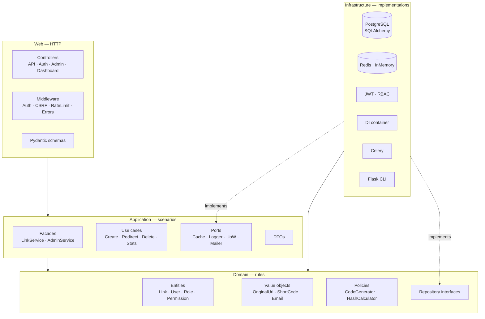
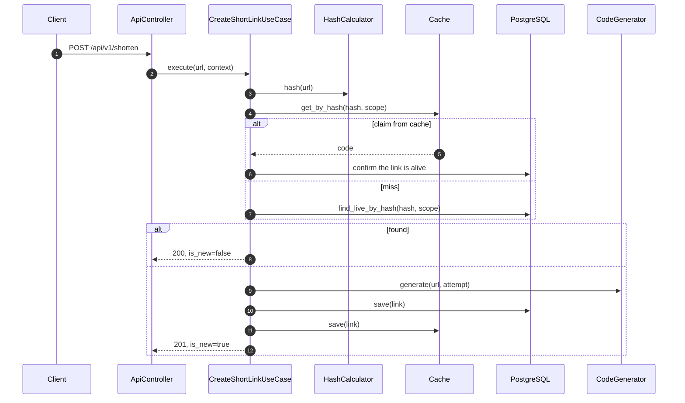
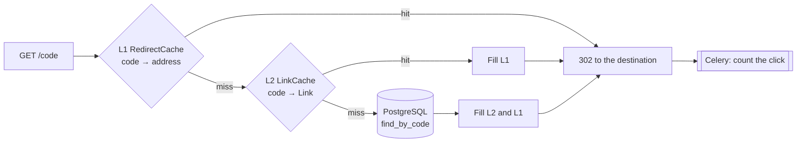
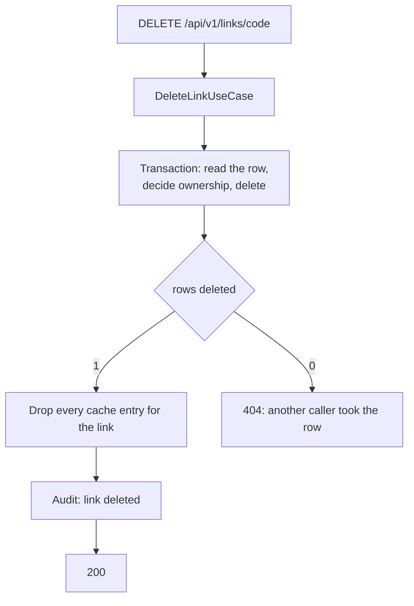
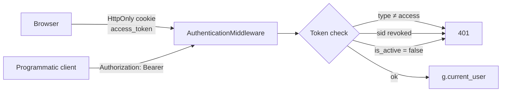
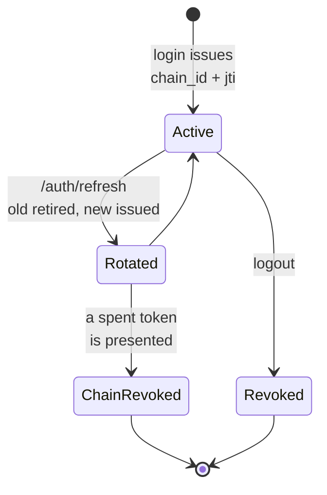
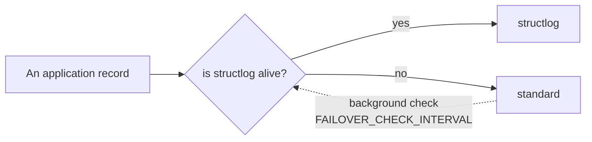

# Architecture

How the pieces fit and which rules hold the boundaries in place. For *why*
a particular decision went the way it did, see [Decisions](decisions.md).

[All docs](README.md) · [Getting started](getting-started.md) ·
[Development](development.md)

| Section | About |
|---|---|
| [Layers](#layers) | Four layers and which way dependencies point |
| [Project layout](#project-layout) | What lives in each directory |
| [Data flows](#data-flows) | Creating, resolving and deleting a link |
| [Caching](#caching) | Two levels, invalidation, why values are signed |
| [Transactions](#transactions) | Unit of Work, and the one counter that breaks the rule |
| [Security](#security) | Authentication, CSRF, sessions |
| [Authorization](#authorization-rbac) | Roles, privilege escalation, the anonymous ceiling |
| [Observability](#observability) | Logs, failover, health |
| [Extending it](#extending-it) | Where a new use case, endpoint or role goes |

---

## Layers

Clean architecture: dependencies point inward. The domain knows nothing
about the database or about HTTP; infrastructure implements the ports the
application declares.



| Layer | Holds | Rule |
|---|---|---|
| **Domain** | Entities, value objects, policies, repository interfaces | Validation failures are `ValidationError(DomainError)`, never `ValueError`. `Role` is a frozen dataclass; `User` compares by identity |
| **Application** | One use case per scenario, facades, DTOs, ports | Every use case extends `BaseUseCase`; dependencies are declared as `@dataclass` fields |
| **Infrastructure** | Repositories, cache, JWT, RBAC, DI, queue | Implements the ports; translates domain ↔ ORM |
| **Web** | Controllers, middleware, decorators, schemas, templates | Makes no authorization decisions of its own — it asks `AuthorizationService`. The markup does too, through `can(...)`, rather than reading role names |

---

## Project layout

```
src/link_shortener/
├── domain/                    # Rules that depend on nothing
│   ├── entities/              # Link, User, Role, Permission
│   ├── value_objects/         # OriginalUrl, ShortCode, UrlHash, Email, OwnerID
│   ├── repositories/          # Storage interfaces
│   ├── policies/              # HashCalculator, CodeGenerator
│   └── system_permissions.py
│
├── application/               # Scenarios
│   ├── use_cases/             # links · auth · admin · stats · batch
│   ├── services/              # Facades for the web layer
│   ├── dtos/                  # Data transfer objects
│   └── ports/                 # Infrastructure abstractions
│
├── infrastructure/            # Implementations
│   ├── database/              # Models, repositories, Unit of Work
│   ├── cache/                 # Redis, in-memory, null
│   ├── auth/                  # JWT and RBAC
│   ├── di/                    # Container and its components
│   ├── configs/               # Configuration profiles
│   ├── cli/                   # Flask commands
│   ├── logging/ · failover/   # structlog, standard, switching between them
│   ├── rate_limit/ · mail/ · task_queue/ · health/
│
└── web/                       # HTTP
    ├── controllers/ · middleware/ · schemas/
    ├── security/              # Decorators, request context, can() for templates
    ├── templates/             # Jinja2
    └── static/                # CSS and page scripts
```

Outside `src/`:

```
dockers/            # Dockerfile, docker-compose*.yml, entrypoint.sh
datas/              # Everything a run leaves behind
├── databases/      #   SQLite files
└── logs/           #   journals, when LOG_TO_FILE=true
migrations/         # Alembic revisions
```

Both `datas/` directories are created on demand and ship empty in git, so
the place is visible from the tree rather than only from the docs. Where
they point is configurable — see [`DATABASE_DIR` and
`LOG_DIR`](configuration.md#storage-locations).

---

## Data flows

### Creating a link



**Deduplication is per owner and only over live links.** The key is the pair
*URL hash + owner*: a registered account is a scope of its own, a guest is
scoped by its `guest_identifier`, and links with neither — the ones the CLI
makes — share the anonymous scope.

Two consequences follow:

- **There is no unique index on `urls.url_hash`.** The same URL legitimately
  appears for different owners, and after expiry for the same one twice. The
  baseline creates the non-unique `ix_urls_url_hash_owner_id` and
  `ix_urls_url_hash_guest_identifier`.
- **A cache hit on a hash is a claim, not an answer.** The code is confirmed
  against the database before being handed back as existing: the `code:` and
  `hash:` keys are evicted independently under `allkeys-lru`, so the entry
  outlives the row it describes.

Expired links take no part in deduplication: otherwise shortening again
would hand back a dead code, and a working link for that URL could never be
created.

### Resolving — the hot path



The click counter is updated by a task rather than in the request handler.
With `CELERY_ENABLED=false` the same work runs synchronously.

### Deleting



Ownership is decided by the use case from the row it read in its own
transaction. The answer is built from the number of rows deleted rather than
from a preceding read: under READ COMMITTED two concurrent deletes each see
the row in their own snapshot.

---

## Caching

Two levels, both optional: `CACHE_ENABLED=false` turns every call into a
no-op.

| Level | Key → value | For |
|---|---|---|
| **L1 `RedirectCache`** | `code → destination` | Redirecting without building an entity |
| **L2 `LinkCache`** | `code → Link` | Link information and deduplication |

What the cache is worth, measured: [Development](development.md#load-profile).

### Invalidation

| Event | What is dropped |
|---|---|
| TTL expiry | Automatic |
| Deleting a link | Every key of that link. `Cache.delete(link)` takes the entity, not the code — the deduplication entry is keyed by hash and scope |
| Creating, deleting, clearing expired | The service statistics entry |
| A click | Nothing. Clicks arrive on every redirect, and dropping the entry on each would leave the cache nothing to answer with |

The click counter therefore lags by `CACHE_STATS_TTL`, which is the price
the cache exists for. Invalidation failures are logged and do not abort the
operation.

### Signed values

Everything the cache stores is signed with `itsdangerous.TimestampSigner`
under `SECRET_KEY` — the same library Flask signs sessions with.

- **A value is not portable.** The Redis key is used as the salt, so each
  key derives its own signing key. An entry issued for one code does not
  verify under another, and the boundary between key and payload cannot be
  shifted.
- **A value is not eternal.** The issue time is inside the signed message,
  and `max_age` on read rejects anything older than the TTL. This does not
  duplicate the Redis TTL: that one is enforced by the cache server, and
  whoever can write to Redis can set a different one, or none.

Without the signature, a single `SET link_shortener:code:<code> '<valid
JSON>'` is enough to point a redirect at somebody else's address; the
deduplication entry and the statistics go the same way.

A value that fails verification counts as a **miss, not an error**: a miss
sends the request to the levels that can answer, while an exception on the
redirect path would be a 500. An expired signature is rejected exactly like
a forged one.

> [!WARNING]
> Changing `SECRET_KEY` makes the whole cache unverifiable — a deployment
> warms it again from scratch. Every rejection is logged: it is either a key
> rotation or a foreign write into Redis, and an operator should hear about
> both.

---

## Transactions

```python
with self.uow_factory() as uow:
    if uow.links.find_live_by_hash(url_hash, scope) is None:
        uow.links.save(new_link)
    uow.commit()
# Leaving the context without a commit rolls back
```

Reads and writes share one transaction, the commit is explicit, and
anything uncommitted is rolled back on the way out.

> [!WARNING]
> **Counters are not updated this way.** `save` writes the whole aggregate,
> so an entity read earlier and saved back rolls back everything that
> changed in between — the click counter first of all. It has
> `uow.links.increment_clicks(code)`: an atomic `UPDATE` where two
> simultaneous clicks do not read the same number. It returns nothing, on
> purpose: another request may have moved the counter immediately, so an
> entity handed back from there would be a snapshot passed off as the
> current state.

---

## Security

### Authentication



- The JWT carries a `type` claim (`access` / `refresh`), and the middleware
  accepts **only** an access token; a refresh token is good for
  `/auth/refresh` and nothing else.
- An access token carries `sid`, the name of its session, and that is
  checked on every request. Without it the token would be irrevocable:
  logging out would only delete the client's copy.
- `is_active` is checked on every request, when an access token is issued
  and at login: deactivation revokes access immediately.
- Cookie lifetimes come from `JWT_ACCESS_TOKEN_EXPIRE_MINUTES` and
  `JWT_REFRESH_TOKEN_EXPIRE_DAYS`, so the cookie and the JWT expire
  together.
- A browser needs cookies specifically: dashboard pages are served by the
  server, and ordinary navigation cannot send a header. Scripts never see
  the token.

### CSRF

Three checks together, on every unsafe method, when the request is
authenticated **by cookie**:

| Check | What it closes |
|---|---|
| **Double submit** | The token in the readable `csrf_token` cookie is echoed in the `X-CSRF-Token` header. A third-party site can make the browser send a cookie; it cannot read one |
| **Signature** | The token is HMAC-SHA256 under `SECRET_KEY`, bound to the user. Without it the scheme accepts any value as long as the two copies match |
| **Origin** | If the browser named an origin, it must be ours. This closes cookie injection from a neighbouring subdomain: cookies do not distinguish subdomains, `Origin` does |

A request with a valid `Authorization: Bearer` does not go through the check
at all: a client that can set a header is not exposed to CSRF. The exemption
is granted on what the request authenticated *with* (`g.auth_token_source`),
not on the shape of the header, and it does not apply to the endpoints in
`COOKIE_AUTHORITY_ENDPOINTS`.

With neither `Origin` nor `Referer` present the origin check is skipped —
proxies strip them — but the signed token must still match.

### Sessions and a stolen refresh token



- Every refresh token carries `jti` (a row in `refresh_sessions`) and
  `chain_id` — one chain per login, however many times the token rotates.
- Logging out revokes its own session and leaves other devices alone;
  blocking an account revokes all of them.
- Presenting a spent token means a copy exists: **its chain** is revoked,
  not every session the user has, or one dead token would let anyone log a
  person out everywhere on demand.
- Claiming the session during rotation is a single conditional `UPDATE`:
  "read, check, write" lets two simultaneous requests through with the same
  token and produces two live chains, in which thief and owner coexist
  unnoticed.

### The rest

- **X-Forwarded-For** is read only from an address in `TRUSTED_PROXIES`, and
  the rightmost entry is taken — the one the proxy itself appended.
- **The rate limiter** counts by that same `get_client_ip()`.
- **CORS** is confined to the `CORS_ORIGINS` list.

---

## Authorization (RBAC)

| Role | Who that is | Key permissions |
|---|---|---|
| `guest` | An unauthenticated visitor | `link:create`, `stats:view_basic` |
| `user` | A registered account | `link:create`, `link:view_own`, `link:delete_own` |
| `analyst` | An analyst | `stats:view_full`, `stats:view_any`, `link:view_own` |
| `admin` | An administrator | `admin:all` |

### You cannot grant more than you hold

Every path by which permissions reach a user checks whether the caller is
entitled to hand them out: assigning roles, creating a user, creating a
role, changing the permissions of one. A holder of `admin:all` passes
freely.

Without that check, `admin:manage_users` is shorthand for `admin:all`:
assign yourself the `admin` role and read the permissions back.
`admin:manage_roles` does the same in two steps. Both chains fit in one HTTP
request, which makes any "moderator" role a full administrator.

The rule matches the industry one: Kubernetes checks it in the API server
itself and makes the exceptions explicit verbs — `escalate` and `bind`; AWS
IAM solves the same problem with *permissions boundaries*.

> [!NOTE]
> **A cost, accepted knowingly.** A role that is to hand out the `user` role
> must itself carry every permission `user` has. A role holding only
> `admin:manage_users` cannot assign `user` — which is exactly what the rule
> means.

**The last administrator cannot be deleted, deactivated or demoted.** The
check sits on deletion, deactivation and role changes, and counts active
holders of `admin:all` excluding whoever the operation is about. This is
about availability: a system that has lost its last admin is recovered only
from a console.

### The anonymous request and the ceiling over it

A request with no authentication is not "a user without roles" — it is the
`guest` role, which `RBACAuthorizationService` reads from the database.
Anonymous shortening works not because a check is missing but because
`guest` carries `link:create`.

Above the role sits a ceiling in code: `ANONYMOUS_PERMISSION_CEILING` in
`infrastructure/auth/rbac_authorization_service.py`. Whatever the `guest`
row holds, an anonymous caller gets nothing beyond that set.

<details>
<summary>Why a ceiling, when the row is already marked as a system role</summary>

The contents of a role are runtime state, and runtime state can be reached.
On a properly seeded database `guest` is `is_system: true` and the admin API
will not edit it — but that flag is runtime state too: `create_role` sets
`is_system=False` outright, and seeding rewrites scalar fields only under
`update_existing=True`. A `guest` row deleted and recreated through the API
stays unprotected for good.

This class of mistake has been made at every scale. In Kubernetes the
`system:unauthenticated` group is an ordinary RoleBinding subject — that is
what the *RBAC Buster* campaign used — and since 1.28 GKE hard-codes a
refusal to bind `cluster-admin` to `system:anonymous`. PostgreSQL has the
same story with the `PUBLIC` pseudo-role (CVE-2018-1058).

</details>

**If the `guest` row is absent**, an anonymous caller gets nothing: a
missing role means "this deployment did not say what a guest may do", not
"anything the ceiling allows".

### Rate limiting

The numbers live in [Configuration](configuration.md#rate-limits), in one
table generated from `BaseConfig.RATE_LIMITS`. The mechanics:

- The guest quota is counted separately from request frequency:
  `GUEST_LINK_LIMIT` per `GUEST_LINK_WINDOW_DAYS`, per address.
- Counting is per address while the caller is anonymous, and per account the
  moment they sign in.
- `/health` and everything under `/static/` are never throttled: the
  exemption is checked before the limit.
- A `RATE_LIMITS` entry that could never fire is not ignored quietly — the
  application refuses to start. An entry is unreachable when it names an
  exempt endpoint, something under `/static/`, or a name no route answers
  to.
- `RATE_LIMIT_AUTH_DISABLED=true` silences every `auth.*` limit at once and
  does not count as a failure; it is a development switch.

---

## Observability

### Logging

Three parts: the application journal, the audit journal, and failover
between implementations.



Work returns to the primary no more than once every five minutes, and the
cooldown is spent by a check that had something to do — otherwise a service
that is healthy when polled and failing when called would take the work back
on every check.

Work moves down by two routes: an exception from a call, and the health poll
on the background check. The second is needed because the failure the
mechanism exists for raises nothing: a `StandardLogger` with no handlers
answers `is_healthy() == False` and accepts calls in silence.

### Health

`GET /api/v1/admin/health` reports what each dependency answered, and — where
a failover logger is configured — the counters that say whether the audit
trail is still being written. Those counters are reported nowhere else: an
audit trail that had quietly stopped looked, from every surface an operator
has, exactly like one that was fine.

---

## Extending it

| You want to add | Where it goes |
|---|---|
| A scenario | A use case in `application/use_cases/`, extending `BaseUseCase`, with dependencies as dataclass fields; wire it in the DI container |
| An endpoint | A method on a controller in `web/controllers/`, a Pydantic schema for the body, `@require_permission` for the guard — and an entry in `web/schemas/openapi.py`, or the docs test fails |
| A permission | `domain/system_permissions.py`, then the YAML in `infrastructure/configs/rbac/roles.yaml` |
| A role | The same YAML; `flask db load-base-roles` seeds it |
| A storage backend | Implement the repository interface from `domain/repositories/` and register it in the container |

Anything that changes what a page offers a role belongs in the markup's
`can(...)` rather than in a role-name check — see
[Development](development.md#the-frontend-asks-the-server).
