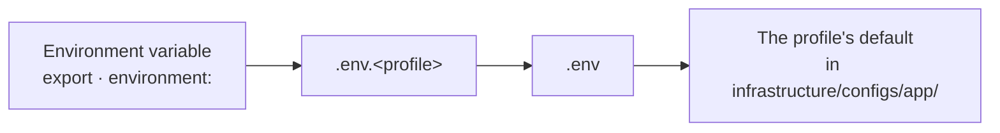

# Configuration

Looked up rather than read. The exhaustive list — every variable, one line
of description each — is [`.env.example`](../.env.example); this page covers
the rules around it and the settings that bite.

[All docs](README.md) · [Getting started](getting-started.md) ·
[Operations](operations.md)

## Profiles and precedence

`FLASK_ENV` picks a **profile** (a configuration class), the profile sets
defaults, and `.env` overrides them.



Leftmost wins.

| Profile | For | Notably |
|---|---|---|
| `development` | Local work | SQLite, in-memory cache, Redis off, debug on |
| `staging` | Pre-production | PostgreSQL required, secrets required, logs to `/var/log/link_shortener/staging` |
| `production` | The real thing | PostgreSQL required, secrets required, `Secure` cookies, gunicorn |
| `testing` | The suite | **Ignores `.env` and the environment entirely** |

> [!IMPORTANT]
> The `testing` profile reads no environment at all. That is deliberate: a
> test must give the same answer on every machine. If you are wondering why
> a variable "does not apply" under pytest, this is why.

## What the deployed profiles refuse to start without

With an empty environment, `staging` and `production` refuse to start and
name five reasons at once. `development` and `testing` come up with nothing
set.

| Variable | Why it is mandatory there |
|---|---|
| `SECRET_KEY` | Signs JWTs, sessions and cache entries. The default is random per process, so workers disagree and tokens die on restart |
| `SHORT_CODE_PEPPER` | Salts code generation. Differing values across instances produce different codes for one URL |
| `DOMAIN` | The host every short link is built from. Without it the address comes from `HOST:PORT` — where the process listens, not where callers arrive |
| `DATABASE_TYPE=postgresql` + host, name, user — or one `DATABASE_URL` | SQLite there would mean an empty new file, and the service answering as though the data had never existed |
| `REDIS_URL` | These profiles default `REDIS_ENABLED=true`, and an enabled Redis with no address is a cache and a limiter with nothing to connect to |

Conditionally mandatory: `MAIL_HOST` and `MAIL_FROM` when
`MAIL_ENABLED=true`. `production` additionally refuses to submit mail
without TLS — a submission in the clear carries the confirmation link to
anyone on the path.

```bash
uv run flask security generate-secrets              # prints both, ready to paste
uv run flask security generate-secrets --write .env # or fills them in, in place
```

`--write` refuses a file that already sets either value, because replacing
`SECRET_KEY` signs out every session and replacing `SHORT_CODE_PEPPER`
stops the codes already handed out from resolving. `--force` does it
anyway.

## Storage locations

| Variable | Default | Meaning |
|---|---|---|
| `DATABASE_DIR` | `datas/databases` | Where SQLite files live. Relative to the project root; absolute is taken as it stands and works inside a container too, where there is no project root |
| `DATABASE_NAME` | `db_shortener` | A file name for SQLite, a database name for PostgreSQL. An absolute path here wins over `DATABASE_DIR` |
| `LOG_DIR` | `datas/logs` | Where journals go when `LOG_TO_FILE=true`. Same rule: relative to the root, absolute as it stands |

Both directories are created on demand. Relative paths are anchored to the
project root rather than to the working directory of the process — read
against the cwd, the same setting names a different directory for every
process, and `flask` started from `src/` opened a second, empty database
without a word about it.

| What you set | Where the file lands |
|---|---|
| `DATABASE_NAME=app.db` | `<root>/datas/databases/app.db` |
| `DATABASE_DIR=/var/lib/shortener` | `/var/lib/shortener/app.db` |
| `DATABASE_NAME=/srv/live.db` | `/srv/live.db`; `DATABASE_DIR` is not read |
| `DATABASE_URL=sqlite:////srv/live.db` | `/srv/live.db`; no other `DATABASE_*` is read |

## Guest links

| Variable | Default | |
|---|---|---|
| `GUEST_LINK_LIMIT` | 10 | Links per window for one address. Applied under a lock on the guest identifier, so concurrent requests cannot spend the same quota twice — on PostgreSQL; on SQLite the limit is advisory |
| `GUEST_LINK_WINDOW_DAYS` | 1 | The window |
| `DEFAULT_GUEST_TTL_SECONDS` | 604800 | Seven days |

## Interface language

| Variable | Default | |
|---|---|---|
| `SUPPORTED_LANGUAGES` | `en,ru,zh` | Languages the interface is offered in, best first. The order is what `Accept-Language` is matched against, so a browser that accepts several of them equally gets the first one named |
| `DEFAULT_LANGUAGE` | `en` | For a caller who asked for none. Must be one of the above, or the service refuses to start |

A request is answered in the first of these that yields a language on offer:
the `lang` cookie, then `Accept-Language`, then `DEFAULT_LANGUAGE`. The
cookie outranks the header because it is the only one of the two the visitor
chose; the header is what their browser was installed with.

> [!NOTE]
> Most callers reach the default rather than the negotiation. Measured:
> neither a Flask test client nor the Chromium the browser run drives sends
> `Accept-Language` at all, so `DEFAULT_LANGUAGE` is what a program sees —
> which is the point. A script reading `message` out of an error envelope
> gets English without configuring anything.

Because a page is built from both the cookie and the header, every rendered
page says `Vary: Cookie, Accept-Language`. Every JSON answer says it too,
for the same reason and since the same change: `message` is translated now,
so one address gives different bytes to different callers. Removing either
would let a shared cache answer one visitor out of what it stored for
another — see `web/middleware/cache_control.py`.

### What the language reaches

The interface, the API's `message`, and the messages the service mails.

`message` in the error envelope is **language-dependent**. `error` is not:
it is the machine-readable code, it is the same string in every language,
and it is what a client should branch on. A client that matched on the
sentence was already relying on wording that could be reworded; it now
breaks against a browser's cookie as well.

| | Language | Why |
|---|---|---|
| `error` | never translated | A code, not a sentence |
| `message` | cookie, then `Accept-Language`, then default | What a person reads |
| `details[].message` | English | Written inside Pydantic from a rule name, not a sentence this project owns |
| A 5xx `message` | English, and always the same one | It says only "An internal error occurred", on the page as in the envelope; what actually failed is in `application.log` |
| `application.log` | English | The operator reading it did not choose the visitor's language |
| Mail | the language of the request that triggered it | Carried on `RequestContext.language`, because the worker rendering it has no request to ask |
| What a page script writes | the language the page was built in | The script runs in the browser, where the catalogues are not, so it is handed its sentences translated — see [decisions](decisions.md#a-page-script-is-handed-its-sentences-it-never-carries-them) |

A programmatic client carries no cookie and sends no `Accept-Language`, so
it keeps getting English without configuring anything. A browser calling
the same endpoint sends its own cookie and gets the language on screen.

## Security

| Variable | Default | |
|---|---|---|
| `SECRET_KEY` | random per process | Signs JWTs, sessions, cache entries |
| `SHORT_CODE_PEPPER` | random per process | Salts code generation |
| `COOKIE_SECURE` | `false`, `true` in production | The `Secure` flag on auth cookies |
| `SESSION_COOKIE_SECURE` | `false`, `true` in production | The same for Flask's session cookie |
| `SESSION_COOKIE_SAMESITE` | `Lax` | |
| `SESSION_COOKIE_HTTPONLY` | `true` | |
| `CORS_ORIGINS` | `http://localhost:5000,http://127.0.0.1:5000` | Origins allowed to send credentials |
| `TRUSTED_PROXIES` | empty | Only from these is `X-Forwarded-For` believed |
| `VISIT_TRACKING_ENABLED` | `true` | Record each redirect as an event, not only count it. Off, `urls.clicks` still counts and every chart with time on an axis stays empty |
| `VISIT_RETENTION_DAYS` | `90` | How long a raw visit row is kept. Finished days are folded into one row per link per day first, so the long-range charts keep their shape after the rows behind them go. `0` disables the sweep and the table grows without limit |
| `SECURITY_EVENT_RETENTION_DAYS` | `365` | How long a raw security event row is kept. Folded into one row per kind per day first, like the visits. A year rather than ninety days: a visit is traffic and last quarter's answers a question this quarter's answers better, while a sign-in is evidence and is usually asked about long after the fact. `0` disables the sweep |
| `AUTO_SEED_ROLES` | `true`; `false` in `staging` and `production` | Ensure the four system roles on every startup. Where it is off, `flask db load-base-roles` has to be run once — an anonymous caller acts as `guest`, and that role is what carries `link:create` |

> [!WARNING]
> `CORS_ORIGINS` holds both spellings of the loopback on purpose. The CSRF
> layer compares the browser's `Origin` against this list before letting an
> unsafe cookie-authenticated request through. With `localhost` alone,
> opening `http://127.0.0.1:5000` gives a working landing page — an
> anonymous caller does not go through CSRF — and "CSRF token missing or
> invalid" on every form the moment you sign in. Measured on the Docker
> stack.

## Rate limits

| Endpoint | Limit | Period | For |
|---|---|---|---|
| `auth.login` | 5 | 60 s | Brute force |
| `auth.register` | 3 | 3600 s | Spam |
| `auth.refresh_token` | 10 | 60 s | Replay |
| `auth.logout` | 20 | 60 s | |
| `auth.verify_email` | 10 | 60 s | Guessing a confirmation token |
| `auth.resend_verification` | 3 | 3600 s | Mail on demand |
| `api.create_short_link` | 30 | 60 s | Creating links |
| `api.batch_create` | 5 | 60 s | Creating in bulk |
| `api.get_link_info` | 100 | 60 s | Reading a link |
| `api.get_extended_link_info` | 50 | 60 s | Reading with metrics |
| `api.get_stats` | 10 | 60 s | Service counters |
| `redirect_to_original` | 200 | 60 s | Redirects |

Anything absent from the table goes by `DEFAULT_RATE_LIMIT` — 100 requests
per `DEFAULT_RATE_LIMIT_PERIOD` (60 seconds).

`RATE_LIMIT_AUTH_DISABLED=true` silences all six `auth.*` rows at once. It
is a development switch; in production it must stay off, or there is no
protection against password guessing.

> [!NOTE]
> This table is parsed by `test_documented_rate_limits.py` and held against
> `BaseConfig.RATE_LIMITS`. Publishing a limit the service does not enforce
> fails the suite — a limit is a security decision, and a document naming
> the wrong one is worse than a document naming none, because it is
> believed.

<details>
<summary>Why <code>/health</code> cannot be given a limit, and what the start-up check rejects</summary>

A probe is how an orchestrator learns whether an instance is alive, and it
cannot tell `429` from a real failure: throttling the probe means a busy
service gets restarted. `health` therefore sits in `EXEMPT_ENDPOINTS`
(`web/middleware/rate_limit.py`), and the exemption is checked **before** the
limit.

A `RATE_LIMITS` entry for an exempt endpoint does not fail quietly: probe
after probe, no `429`, and the setting reads as protection that is not
there. Every key is therefore held against the routing table at start-up,
and the application **will not come up** if a key is unreachable — exempt,
served from `/static/`, or pointing at nothing.

Values are checked too; without that, each bad shape survives until the
first request and breaks in its own way:

| Value | What happens |
|---|---|
| `10`, `(5,)`, `("5", 60)` | `500` on every request to that endpoint |
| `(0, 60)` | Refuses **everyone, always** |
| `(5, -60)` | The window start moves into the future, every mark falls outside it, and nothing is throttled **at all** |

`("5", 60)` deserves its own mention: against Redis it is not a defect — its
script coerces the number — while against the in-memory cache it is a `500`.
A setting that works in production and fails in development takes longer to
find than one that works nowhere.

**A typo in an endpoint name is the likeliest case and the quietest.**
`auth.login` written as `auth.log_in` raises nothing: the endpoint keeps
answering, but on the default limit — and the protection against password
guessing is gone while the configuration says it is there.

</details>

## Cache

| Variable | Default | |
|---|---|---|
| `CACHE_ENABLED` | `true` | `false` turns every cache call into a no-op |
| `REDIS_ENABLED` | `false` in development, `true` in deployed profiles | Redis or the in-memory implementation |
| `REDIS_URL` | — | Mandatory when Redis is on |
| `CACHE_LINK_TTL` | 3600 | Seconds a link object is kept |
| `CACHE_STATS_TTL` | 300 | Seconds service statistics are kept — and how far the click counter can lag |

## Mail

| Variable | Default | |
|---|---|---|
| `MAIL_ENABLED` | `true` | With it off, registration still answers `202` and no message leaves |
| `MAIL_HOST`, `MAIL_PORT` | `localhost`, 1025 in development | Aimed at the Mailpit catcher |
| `MAIL_USE_TLS` / `MAIL_USE_SSL` | `false` in development | `production` requires one of them |
| `MAIL_FROM` | — | Mandatory when mail is on |
| `UNVERIFIED_ACCOUNT_TTL_HOURS` | 24 | How long an unconfirmed account is kept before `maintenance clean-unverified` removes it |

## Compose-only variables

Read by `docker compose`, not by the application.

| Variable | |
|---|---|
| `ENV_FILE` | Which env file the services load; must match what you pass to `--env-file` |
| `COMPOSE_FILE` | Which compose files make up the stack. Set because they live in `dockers/` |
| `COMPOSE_PROFILES` | Which of `db`, `cache`, `broker`, `mail` to run yourself |
| `APP_HOST_PORT`, `DATABASE_HOST_PORT`, `REDIS_HOST_PORT`, `MAILPIT_UI_PORT` | Where each service is published on the host |
| `APP_SRC_PATH`, `LOG_HOST_PATH` | What the dev overlay mounts. Relative to `dockers/`, hence the `../` |

## Where the numbers come from

Defaults live in `infrastructure/configs/app/base.py` and are overridden per
profile in `development.py`, `staging.py` and `production.py`. Every one is
declared through a lazy environment descriptor, so a value is read when it
is used and a profile can narrow an optional setting into a mandatory one —
which is what `staging` and `production` do with the secrets.
