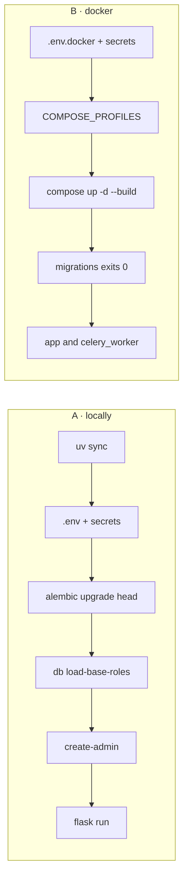
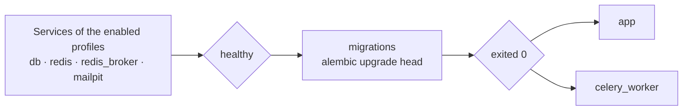

# Getting started

From an empty directory to a service answering requests. Every step says
what it should print, so you can tell a slow step from a broken one.

**English** · [Русский](getting-started.ru.md) · [All docs](README.md)

Two paths. They are independent — pick one.

| | Needs | You get |
|---|---|---|
| [**A · Locally**](#a--locally) | Python 3.12 + [uv](https://docs.astral.sh/uv/) | SQLite, in-memory cache, no Celery |
| [**B · In Docker**](#b--in-docker) | Docker Compose v2+ | PostgreSQL, Redis, Celery, Mailpit |



---

## A · Locally

### 1. Dependencies

```bash
git clone https://github.com/IAMN1/link-shortener.git
cd link-shortener
uv sync
```

Expected: a `.venv` is created and the project is installed in editable mode,
so `flask` and `alembic` work without `PYTHONPATH`.

### 2. The environment file

```bash
cp .env.example .env
uv run flask security generate-secrets
```

The second command prints two ready lines — put them in `.env`:

```ini
SECRET_KEY=<64-byte hex string>
SHORT_CODE_PEPPER=<another hex string>
```

Everything else already suits a local run: `DATABASE_TYPE=sqlite`,
`CELERY_ENABLED=false`, and Redis is off by the `development` profile's own
default.

> [!NOTE]
> Mail is enabled in the template and aimed at `localhost:1025`, where
> Mailpit from the Docker stack would catch it. With no catcher running,
> registration still answers `202`, no message leaves, and the log says
> `Verification email not delivered` — there is nothing to confirm an
> address with in that run.

### 3. The schema

```bash
uv run flask alembic upgrade head
```

Expected: `Running upgrade -> 0001, initial schema`.

### 4. System roles

```bash
uv run flask db load-base-roles
```

Expected: `Roles and permissions seeded.` listing
`admin, analyst, guest, user`.

> [!IMPORTANT]
> This step is not optional. An anonymous request runs as the `guest` role,
> and that role is what carries `link:create`. Without it, public shortening
> answers `401`.

### 5. An administrator

```bash
uv run flask create-admin --email admin@example.com --password 'your-password'
```

Expected: `Admin user admin@example.com created successfully.`

### 6. Run it

```bash
uv run flask run
```

Expected: the service on `http://127.0.0.1:5000/`.

### 7. Check

```bash
curl -s -X POST http://127.0.0.1:5000/api/v1/shorten \
  -H "Content-Type: application/json" \
  -d '{"url": "https://example.com"}'
```

Expected: `201` and a body carrying `short_code`, `short_url` and
`is_new: true`, where `short_url` is `http://localhost:5000/<code>`.

<details>
<summary>Why the template leaves <code>HOST</code> commented out</summary>

The address in a short link is assembled from `HOST` and `PORT` when
`DOMAIN` is not set. An active `HOST=0.0.0.0` therefore produced links like
`http://0.0.0.0:5000/<code>`, which no browser follows — measured by
walking these very steps. The profile's own default is `localhost`, which is
a working link, and inside a container the bind address comes from the
image's `CMD` instead.

</details>

---

## B · In Docker

### 1. The environment file

```bash
cp .env.example .env.docker
```

Set eleven values — the template already knows the rest:

```ini
ENV_FILE=.env.docker          # must match what you pass to --env-file
SECRET_KEY=<64-byte hex string>
SHORT_CODE_PEPPER=<another hex string>

DATABASE_TYPE=postgresql
DATABASE_HOST=db              # the service name inside the compose network
DATABASE_NAME=db_shortener    # a database name, not a file
DATABASE_USER=shortener
DATABASE_PASSWORD=<password>

REDIS_ENABLED=true
REDIS_PASSWORD=<password>
CELERY_ENABLED=true

DOMAIN=localhost:5000         # the name short links are built from
```

Mail needs no editing: `MAIL_ENABLED=true` is in the template and the
catcher's address is supplied to the containers by
`dockers/docker-compose.override.yml`.

### 2. Which services to run yourself

The template turns on all four:

```ini
COMPOSE_PROFILES=db,cache,broker,mail
```

| Profile | Brings up | Left out — then set |
|---|---|---|
| `db` | PostgreSQL | `DATABASE_URL` |
| `cache` | Redis for cache and limits | `REDIS_URL` |
| `broker` | Redis for the Celery queue | `CELERY_BROKER_URL` |
| `mail` | the Mailpit catcher | `MAIL_HOST`, `MAIL_PORT` |

An empty value means "everything is external": only `migrations`, `app` and
`celery_worker` come up.

### 3. Start

```bash
docker compose --env-file .env.docker up -d --build
```

Expected order — there is no separate step for migrations:



> [!WARNING]
> `--env-file` is not optional. Without it compose reads `.env`, which is
> written for a local SQLite run — and it will not see `COMPOSE_PROFILES`
> either, so neither the database nor Redis comes up.

The compose files live in `dockers/`, and the command above still works from
the project root because `COMPOSE_FILE` in the env file names them both.

```bash
docker compose --env-file .env.docker ps
```

Expected: every service `running`, `migrations` — `exited (0)`.

### 4. Roles and an administrator

```bash
docker compose --env-file .env.docker exec app flask db load-base-roles
docker compose --env-file .env.docker exec app \
    flask create-admin --email admin@example.com --password 'your-password'
```

Expected: the same output as steps A4 and A5.

### 5. Check

```bash
curl -s http://localhost:5000/health
```

Expected: `{"status": "healthy", "components": {"database": "ok",
"cache": "ok", "task_queue": "ok", "rate_limiter": "enforcing"}}`.

<details>
<summary>The production form of the stack</summary>

```bash
docker compose -f dockers/docker-compose.yml --env-file .env.docker up -d --build
```

The same stack without `dockers/docker-compose.override.yml`: gunicorn
instead of the dev server, no debugger, no mounted sources. You can tell
them apart by `/console` — `200` in dev, `404` here.

</details>

---

## Using it

### As a guest

Open `http://localhost:5000/`. The page states up front how many links a day
you get without an account and how long they live — ten and seven days by
default. A link you just made can be deleted right there: the button under
the result works while that page is open, because a guest link has nothing
to prove ownership with except the token issued alongside it.

The **Info** tab resolves any short code; its click counters are shown only
to whoever made the link. There is no **Extended** tab for a guest —
extended figures are for the owner or for a holder of `stats:view_any`, and
a guest link belongs to nobody.

### Registering

1. **Sign Up** in the header, or `http://localhost:5000/register`. The page
   answers the same whether the address was free or taken.
2. Open the message and follow the link. In Docker, Mailpit catches mail at
   `http://127.0.0.1:8025`. The link lands on a page with a button, and the
   click is what spends the token — a scanner that follows links in mail
   cannot spend it for you.
3. Sign in at `http://localhost:5000/login`.

### From the command line

```bash
# Shorten (as a guest)
curl -X POST http://localhost:5000/api/v1/shorten \
  -H "Content-Type: application/json" \
  -d '{"url": "https://example.com"}'

# With a time to live of one hour
curl -X POST http://localhost:5000/api/v1/shorten \
  -H "Content-Type: application/json" \
  -d '{"url": "https://example.com", "ttl_seconds": 3600}'

# What a code points at
curl http://localhost:5000/api/v1/links/<short_code>

# Sign in, then use the token
curl -X POST http://localhost:5000/api/v1/auth/login \
  -H "Content-Type: application/json" \
  -d '{"email": "admin@example.com", "password": "your-password"}'

curl "http://localhost:5000/api/v1/links/mine?offset=0&limit=20" \
  -H "Authorization: Bearer <token>"
```

Full description of the API: `http://localhost:5000/api/docs`.

### The dashboard

| Section | Opened by |
|---|---|
| My Links | `link:view_own`, deleting needs `link:delete_own` |
| My Stats | `link:view_own` |
| Create Link | `link:create` |
| Service Stats | `stats:view_basic`; the popular-links table needs `stats:view_full` |
| Users, Roles, Health Check | the administrative permissions |

What a role is shown is decided by the permission its page asks for, so a
menu entry that answers `403` is a bug rather than a fact of life. See
[Development](development.md#the-frontend-asks-the-server).

---

## When something does not work

| Symptom | What to do |
|---|---|
| `ModuleNotFoundError: No module named 'link_shortener'` | `uv sync`, and run through `uv run` |
| `no such table: urls` | `uv run flask alembic upgrade head` |
| `Role 'user' not found` on registration | `uv run flask db load-base-roles` |
| `401` on `POST /api/v1/shorten` as an anonymous caller | The `guest` role is not seeded, or seeded without `link:create`. Re-run `db load-base-roles`; check with `flask security list-roles` |
| `403` on the same call while signed in | That account's role does not hold `link:create` — `analyst` does not, by design |
| Values in `.env` are ignored | The `testing` profile ignores `.env` deliberately. Otherwise a real environment variable outranks the file |
| `No 'script_location' key found` | A bare `alembic` was run from outside the directory holding `alembic.ini` — use `flask alembic` |
| `this profile runs on PostgreSQL` | `production` and `staging` run on PostgreSQL only |
| `a SQLite database that no DATABASE_URL in the environment named` | A migration outside `development` will not go to an unnamed SQLite file. Name it, or hand the URL over in `ALEMBIC_DATABASE_URL` |
| `nothing names a profile` | `FLASK_ENV` is unset — name the profile or the database |
| `SECRET_KEY must be set in environment` | `staging` and `production` require explicit secrets |
| JWTs stop working after a restart | `SECRET_KEY` is unset: in `development` it is generated afresh every process |
| The confirmation message never arrives | Check the log. `Verification email not delivered` means the submission server is unreachable — locally, that is the missing catcher on `localhost:1025`. `MAIL_ENABLED=false` means mail is off entirely |
| Only `app` and `celery_worker` came up | `COMPOSE_PROFILES` is empty or unset in the env file |
| Links look like `http://0.0.0.0:5000/...` | `HOST=0.0.0.0` with no `DOMAIN`; see the note in step A7 |

---

## Next

```bash
uv run pytest tests/     # the suite; Docker services for level 2b start themselves
uv run flask alembic migrate "what changed"   # a new revision after editing models
```

- How it is put together — [Architecture](architecture.md)
- Why it is put together that way — [Decisions](decisions.md)
- Running a deployment — [Operations](operations.md)
