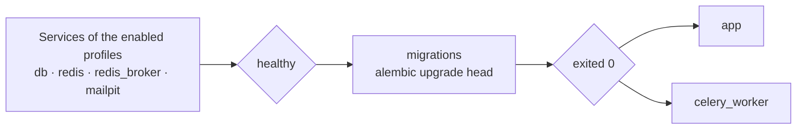

# Getting started

Eight commands from an empty directory to a service answering requests.
Paste the block, then read what it did — or don't, and go look at the
running service instead.

**English** · [Русский](getting-started.ru.md) · [All docs](README.md)

---

## Run it

Needs Python 3.12 and [uv](https://docs.astral.sh/uv/). Nothing else: the
default profile runs on SQLite, keeps its cache in memory and does its
background work inline, so there is no database, no Redis and no queue to
install first.

```bash
git clone https://github.com/IAMN1/link-shortener.git
cd link-shortener
uv sync
cp .env.example .env
uv run flask security generate-secrets --write .env
uv run flask alembic upgrade head
uv run flask create-admin --email admin@example.com --password 'ChangeMe1!'
uv run flask run
```

## Check it

In another terminal:

```bash
curl -s -X POST http://127.0.0.1:5000/api/v1/shorten \
  -H "Content-Type: application/json" \
  -d '{"url": "https://example.com"}'
```

```json
{
  "clicks": 0,
  "created_at": "2026-08-30T12:36:33.619533+00:00",
  "deletion_token": "Ijg0YjgwMWY1LWFjMDAtNDM2Zi05ZDM2…",
  "expires_at": "2026-09-06T12:36:33.619533+00:00",
  "from_cache": false,
  "is_new": true,
  "last_accessed": null,
  "original_url": "https://example.com",
  "owner_id": null,
  "short_code": "q68J3qY",
  "short_url": "http://localhost:5000/q68J3qY"
}
```

Then open `http://localhost:5000/` and sign in as `admin@example.com` —
the dashboard is at `/dashboard/`, and `http://localhost:5000/api/docs`
describes the JSON API: every operation under `/api/v1`, and the redirect
at `/<code>` beside them. What is not there is what is not part of it —
the dashboard pages, and `/health`, which this guide has you call further
down.


That is a real screenshot of this application, not a mock-up — taken on a
demonstration account with data seeded into it (`flask db seed`), which is
why it has links and counters. A dashboard opened straight after the eight
commands above is empty, and an administrator sees more sections than the
`user` in the picture: Users, Roles, Health Check and Journals as well.
The theme is the dark one — the control for it sits in the header, and the
choice is kept in a cookie and applied by the server before the page is
painted, so nothing flashes on the way in.

---

## What those commands did

| Command | What it does | What tells you it worked |
|---|---|---|
| `uv sync` | Creates `.venv` and installs the project in editable mode, so `flask` and `alembic` run without `PYTHONPATH` | A list of installed packages |
| `cp .env.example .env` | The template already suits a local run: `DATABASE_TYPE=sqlite`, `CELERY_ENABLED=false`, Redis off | — |
| `security generate-secrets --write .env` | Fills `SECRET_KEY` and `SHORT_CODE_PEPPER` in place. Without them `development` invents a key per process, so tokens die on restart | `SECRET_KEY and SHORT_CODE_PEPPER written to .env.` |
| `flask alembic upgrade head` | Creates the schema | `INFO  [alembic.runtime.migration] Running upgrade  -> 0001, initial schema` — alembic writes it through its own logger, so the line carries that prefix |
| `flask create-admin` | The first administrator, which no endpoint can make: registration hands out `user`, and granting `admin` needs an account that already holds it | `Admin user admin@example.com created successfully (active: True).` |
| `flask run` | Serves on `http://127.0.0.1:5000/` | `* Serving Flask app` and `* Debug mode: on` |

> [!NOTE]
> The line you may be looking for — `* Running on http://127.0.0.1:5000`
> — is not printed. The template sets `WERKZEUG_LOG_LEVEL=WARNING`, and
> Werkzeug writes that one through its logger at `INFO`. The two lines
> above come from Flask itself and are unaffected; `* Debugger is
> active!` follows them, because it is a warning.

<details>
<summary>Where are the roles seeded?</summary>

Nowhere, in this run: `development` and `testing` carry
`AUTO_SEED_ROLES=true`, so `admin`, `analyst`, `auditor`, `guest` and
`user` are ensured every time the application starts — including when a
CLI command starts it.

It matters because an anonymous request runs as the `guest` role, and that
role is what carries `link:create`. Without it public shortening answers
`401`.

`staging` and `production` default the flag to `false`, on the grounds
that a production process should not be writing roles on boot. There, seed
once by hand:

```bash
uv run flask db load-base-roles      # Roles and permissions seeded. permissions created: 15; roles created: 5
                                     # (run again: permissions created: 0; roles created: 0;
                                     #  left as they are: admin, analyst, auditor, guest, user)
uv run flask security list-roles     # what each role now holds
```

</details>

<details>
<summary>Mail, and why nothing arrives</summary>

`MAIL_ENABLED=true` is in the template, and `MAIL_HOST` is left empty
beside it — so the address comes from the profile, and `development`
defaults to `localhost:1025`, which is where the Mailpit of the Docker
stack listens. With no catcher running, registration still answers `202`,
no message leaves, and the log says `could not deliver mail via
localhost:1025: [Errno 61] Connection refused`, then `Verification email
not delivered`.

So bringing that Mailpit up is enough to catch messages locally: nothing
to set. The `587` in the template is the default of the deployed profiles,
where a real mail server is named.

So on a local run there is nothing to confirm an address with — which is
why the block above makes an administrator through the CLI rather than
registering one.

Signing in as that unconfirmed account answers `401 INVALID_CREDENTIALS`,
"Invalid email or password" — the same answer a wrong password gets, and
deliberately so: telling the two apart would answer "is this the password"
to anybody willing to try. The password is not the problem; the address is
unconfirmed. Which of the two it was is in the audit journal, under
`audit:view`.

To confirm somebody else's address without mail, an administrator can do
it from the users page, or:

```bash
curl -X POST http://127.0.0.1:5000/api/v1/admin/users/<id>/verify-email \
  -H "Authorization: Bearer <token>"
```

</details>

<details>
<summary>Why the template leaves <code>HOST</code> commented out</summary>

The address in a short link is assembled from `HOST` and `PORT` when
`DOMAIN` is not set. An active `HOST=0.0.0.0` therefore produced links like
`http://0.0.0.0:5000/<code>`, which no browser follows — measured by
walking these very steps. The profile's own default is `localhost`, which
is a working link, and inside a container the bind address comes from the
image's `CMD` instead.

</details>

---

## The whole stack, in Docker

PostgreSQL, Redis, a Celery worker and a Mailpit catcher, the way a
deployment runs. Five commands, and none of them is "then edit ten
values":

Stop the `flask run` from the first block before you start: this stack
publishes the same port, and leaving it up costs twice — `up` fails with
`bind: address already in use`, and if it does not, the `curl` at the end
is answered by the local server rather than by the stack. Its `"cache":
"disabled"` is the tell.

This block is written for a first run. If you already have a `.env.docker`,
move it aside rather than letting the first line copy over it — the
password in it is the one the database volume was initialised with, and it
is not recoverable from anywhere else.

```bash
cp .env.docker.example .env.docker
uv run flask security generate-secrets --write .env.docker --with-service-passwords
docker compose --env-file .env.docker up -d --build
docker compose --env-file .env.docker exec app \
    flask create-admin --email admin@example.com --password 'ChangeMe1!'
curl -s http://localhost:5000/health
```

> [!WARNING]
> If `up` ends with `service "migrations" didn't complete successfully:
> exit 1`, the console does not say why — the reason is in the container:
> `docker logs link-shortener-migrations-1`. The likeliest one on a second
> run is `password authentication failed for user "shortener"`: the
> database volume outlived the env file and keeps the password it was
> **initialised** with, so the freshly generated one does not open it. The
> troubleshooting table at the end of this page has the two ways out.

> [!NOTE]
> `.env.docker.example` is the same catalogue as `.env.example` with nine
> lines set for containers — the backend, the service name of the
> database, the two switches for Redis and Celery, the domain short links
> are built from, and journals written to file, because this stack ships
> the rotator that moves them. Its own header lists all nine with the
> reason for each, and `test_the_two_templates_do_not_drift.py` holds every other
> line identical between the two files.
>
> There used to be one template for both paths, and it said
> `COMPOSE_PROFILES=db,cache,broker` and `DATABASE_TYPE=sqlite` on the
> same page. Following it brought up PostgreSQL and two Redis and left the
> application on SQLite: the migration wrote a schema inside its own
> container and exited 0, the application opened an empty file beside it,
> `/health` answered `healthy` and the landing page answered `500 no such
> table: roles`. Two of the three are now impossible — the templates
> cannot contradict each other, and `/health` reports `no_schema` with a
> 503 rather than `ok`. That answer is settled when the process starts and
> remembered once the schema has been seen whole, so a schema that
> disappears under a running service is not noticed until it restarts —
> measured on two live walks, which is a bound worth knowing rather than a
> promise of continuous watching.

> [!TIP]
> `--with-service-passwords` writes two more values than the local path
> needs: what this stack's own PostgreSQL and Redis are started with. The
> repository ships no default password for either, and both services
> refuse to start rather than come up open — with a message naming the
> variable, the command that fills it and the way to use a service of your
> own instead.

```json
{
  "components": {
    "cache": "ok",
    "database": "ok",
    "rate_limiter": "enforcing",
    "task_queue": "ok"
  },
  "status": "healthy"
}
```

Locally the same call answers `"cache": "disabled"` and `"task_queue":
"inline"`: the development
profile keeps its cache in the process rather than in Redis.

> [!WARNING]
> `--env-file` is not optional. Without it compose reads `.env`, which is
> written for a local SQLite run — and its compose section names the same
> profiles, so the services do come up: measured,
> `docker compose --env-file .env config --services` resolves all eight,
> `db`, both Redis and the catcher included. What you get is the stack
> running beside an application told `DATABASE_TYPE=sqlite`, which speaks
> to none of it — the arrangement the two templates exist to prevent.

There is no separate step for migrations: `migrations` runs
`alembic upgrade head` and has to exit `0` before `app` and
`celery_worker` are started.



<details>
<summary>Which services to run yourself</summary>

Every one of them can be somebody else's. The table of what to name in
place of each, and the four other ways this stack can be arranged, is
[below](#choosing-where-each-part-runs) — it is written once there rather
than twice, because a profile and the switch beside it have to agree and a
second copy is a second thing that can stop agreeing.

The compose files live in `dockers/`, and the commands above still work
from the project root because `COMPOSE_FILE` in the env file names them
both.

</details>

<details>
<summary>The production form of the stack</summary>

```bash
docker compose -f dockers/docker-compose.yml --env-file .env.docker up -d --build
```

The same stack without `dockers/docker-compose.override.yml`: gunicorn
instead of the dev server, no debugger, no mounted sources. You can tell
them apart by `/console` — `200` in dev, `404` here.

Set `FLASK_ENV=production` for it, and note that the profile defaults
`AUTO_SEED_ROLES` to `false`: seed the roles once, as above.

</details>

---

## Choosing where each part runs

The two blocks above are the ends of a range, not the whole of it. Nothing
in the stack insists that a part run in a container: each infrastructure
service is behind a compose profile, and every one of them can be replaced
by an address instead. The application itself is the same — it is a
process, and where it runs is your choice.

The rule the whole table follows: **a profile brings a service up, a switch
tells the application to use one.** They are two different statements and
both have to be made. A profile on with its switch off runs a container
nobody talks to; a switch on with its profile off needs the address of a
service you brought yourself.

| # | Application | Its dependencies | `COMPOSE_PROFILES` | Settings | Also name |
|---|---|---|---|---|---|
| 1 | container | containers | `db,cache,broker,mail,logs` | `DATABASE_TYPE=postgresql` · `REDIS_ENABLED=true` · `CELERY_ENABLED=true` | — |
| 2 | host | containers | `db,cache,broker,mail` | `DATABASE_TYPE=postgresql` · `REDIS_ENABLED=true` · `CELERY_ENABLED=true` | `DATABASE_HOST=localhost` · `REDIS_URL` · `CELERY_BROKER_URL` |
| 3 | host | host | *(empty)* | `DATABASE_TYPE=sqlite` · `REDIS_ENABLED=false` · `CELERY_ENABLED=false` | — |
| 4 | container | yours, outside | *(empty)* | `DATABASE_TYPE=postgresql` · `REDIS_ENABLED=true` · `CELERY_ENABLED=true` | `DATABASE_URL` · `REDIS_URL` · `CELERY_BROKER_URL` |
| 5 | host | database in a container, the rest in the process | `db` | `DATABASE_TYPE=postgresql` · `REDIS_ENABLED=false` · `CELERY_ENABLED=false` | `DATABASE_HOST=localhost` |

> [!NOTE]
> This table is read by `test_the_documented_matrix_is_coherent.py`. It
> checks the rule above on every row — a profile whose switch is off, or a
> switch with neither its profile nor an address, fails the suite. The
> combination that made this document necessary is row 1 with
> `DATABASE_TYPE=sqlite`, and that row cannot be written here any more.

**Row 1** is `.env.docker.example` as it ships, and the block above.

**Row 2** — the application on the host against the stack's services. Bring
up only the infrastructure, then run the application as in the first block:

```bash
docker compose --env-file .env.docker up -d db redis redis_broker mailpit
uv run flask alembic upgrade head
uv run flask run
# in another terminal, because CELERY_ENABLED=true means somebody has to drain the queue
uv run celery -A link_shortener.infrastructure.task_queue.celery_app worker --loglevel=info
```

Naming the services is what keeps `app` and `celery_worker` out; they carry
no profile, so a bare `up` starts them. The addresses go in `.env`, not in
`.env.docker`: the ports are published on the loopback —
`127.0.0.1:5432`, `127.0.0.1:6379` for the cache, `127.0.0.1:6381` for the
broker — and the passwords are the ones `generate-secrets` wrote.

The worker is the part that is easy to forget, and the service says so
rather than hiding it: without one `/health` answers `degraded` with
`"task_queue": "unavailable"` — measured while writing this row. Clicks
stop being counted and mail stops being sent, and nothing else goes wrong,
which is exactly why it is worth being told. `CELERY_ENABLED=false` is the
other honest answer: the work is then done inline, on the request.

**Row 3** is the application settings `.env.example` ships, and the first block above. Its `COMPOSE_PROFILES` column is empty because this row runs no containers — the file itself names five profiles, in the section headed "For docker compose only", for the reader who points compose at `.env`. Doing that is what the warning above is about.

**Row 4** — your own PostgreSQL and Redis, wherever they are. Empty
`COMPOSE_PROFILES` means only `migrations`, `app` and `celery_worker` come
up; each address is a single string, and a string beats the `DATABASE_*`
parts.

The address is written from inside the container, which is the part that
catches people: `localhost` there is the container itself. A service
published on the host's loopback is reached as `host.docker.internal`,
which needs `extra_hosts: host.docker.internal:host-gateway` outside
Docker Desktop and was measured going unreachable mid-run even with it.
Where your services are themselves containers, the address that does not
depend on any of that is their own name on their own network — join it as
an external network and use `db:5432`.

**Row 5** and anything else — take a profile out, name what replaces it.
Name the services on the command line here too, for the reason row 2 gives:

```bash
docker compose --env-file .env.docker up -d db
```

Measured: with `COMPOSE_PROFILES=db` a bare `up -d` resolves four services,
not one — `app`, `celery_worker` and `migrations` carry no profile, so they
come along. On this row that starts a second application in a container,
which grabs the published port and then loops on `redis` and `redis_broker`
names that nothing answers to.

| Profile | Brings up | Left out — then set |
|---|---|---|
| `db` | PostgreSQL | `DATABASE_URL`, or the `DATABASE_*` parts |
| `cache` | Redis for the cache and the limits | `REDIS_URL`, or `REDIS_ENABLED=false` for a cache in the process |
| `broker` | Redis for the Celery queue | `CELERY_BROKER_URL`, or `CELERY_ENABLED=false` to do the work inline |
| `mail` | the Mailpit catcher | `MAIL_HOST` and `MAIL_PORT`, or `MAIL_ENABLED=false` |
| `logs` | journal rotation | rotate them yourself — without it the files grow until the disk ends |

### Which profile, and which backend

`FLASK_ENV` is a separate axis from all of the above: it picks the
configuration class, and the class sets defaults the env file then
overrides.

| `FLASK_ENV` | Database | Cache | Notably |
|---|---|---|---|
| `development` | SQLite or PostgreSQL | in-process or Redis | debug on, roles seeded at startup, cookies without `Secure` |
| `staging` | **PostgreSQL only** | Redis | the same mandatory settings production has, `DOMAIN` included |
| `production` | **PostgreSQL only** | Redis | `Secure` cookies, gunicorn, `AUTO_SEED_ROLES=false`, mail refused without TLS |
| `testing` | ignores the environment entirely | — | so a test gives the same answer on every machine |

The deployed profiles refuse to start on anything but PostgreSQL, and that
refusal is the reason: `DATABASE_TYPE` defaults to `sqlite`, so a
deployment that forgot to configure a database came up on an empty new file
and answered as though the data had never existed. The full list of what
they will not start without is in
[Configuration](configuration.md#what-the-deployed-profiles-refuse-to-start-without).

Two settings are worth knowing before switching a container stack to
`production`:

* `AUTO_SEED_ROLES` defaults to `false` there — seed once with
  `flask db load-base-roles`, or an anonymous visitor cannot create a link
  at all, because `link:create` is carried by the `guest` role;
* `CORS_ORIGINS` has to contain any address people open that is **not**
  the one in `DOMAIN`. The CSRF layer compares the browser's `Origin`
  against this list plus `BASE_URL`, which `DOMAIN` already covers — so the
  service's own pages need nothing here, and a second address does. With
  the wrong value the landing page works — an anonymous caller does not go
  through CSRF — and every form fails the moment somebody signs in. The
  measured table is in [Configuration](configuration.md).

---

## Using it

Open `http://localhost:5000/`. The page states up front how many links a
day you get without an account and how long they live — ten and seven days
by default. A link you just made can be deleted right there, because a
guest link has nothing to prove ownership with except the token issued
alongside it.

The **Look up a code** card resolves any short code; its click counters are
shown only to whoever made the link. The card above it shortens, and its
two tabs are **One link** and **Many at once**. There is no extended view
for a guest — extended figures are for the owner or for a holder of
`stats:view_any`.

```bash
# With a time to live of one hour. A URL this page has not shortened
# already: the same one twice returns the first link, lifetime and all
curl -X POST http://localhost:5000/api/v1/shorten \
  -H "Content-Type: application/json" \
  -d '{"url": "https://example.com/an-hour", "ttl_seconds": 3600}'

# Sign in. The answer carries two tokens: `access_token`, which is the one
# below, and `refresh_token`, which buys a new pair when it expires
curl -X POST http://localhost:5000/api/v1/auth/login \
  -H "Content-Type: application/json" \
  -d '{"email": "admin@example.com", "password": "ChangeMe1!"}'

curl "http://localhost:5000/api/v1/links/mine?offset=0&limit=20" \
  -H "Authorization: Bearer <access_token>"
```

> [!NOTE]
> Under `/api/v1` this service refuses what it does not understand rather
> than ignoring it. Both answers are `400 VALIDATION_ERROR` and both name
> the offender in `details[0].field`, and they are worded by the layer
> that caught it: a body field no model declares comes back `Extra inputs
> are not permitted` with `"code": "extra_forbidden"`, and a query
> parameter no operation declares comes back `'bogus' is not a parameter
> of this endpoint`. It is why a mistyped `?short_code=` cannot come back
> as service-wide figures. Pages are not held to it: navigation carries
> whatever the address bar was given.

| Dashboard section | Opened by |
|---|---|
| Overview | any signed-in account — no permission guards it, and it says what the account may *not* do |
| My Links | `link:view_own`, deleting needs `link:delete_own` |
| My Stats | `link:view_own` |
| Create Link | `link:create` |
| Service Stats | `stats:view_basic`; the popular-links table needs `stats:view_full` |
| Users, Roles, Health Check | the administrative permissions |
| Journals | `audit:view` or `logs:view`; each journal is offered only to whoever may read that one |
| Security | any signed-in account — it holds that account's own password change |

What a role is shown is decided by the permission its page asks for, so a
menu entry that answers `403` is a bug rather than a fact of life. See
[Development](development.md#the-frontend-asks-the-server).

---

## When something does not work

| Symptom | What to do |
|---|---|
| `ModuleNotFoundError: No module named 'link_shortener'` | `uv sync`, and run through `uv run` |
| `Address already in use` on port 5000 | Something else holds it — on macOS often AirPlay Receiver or a Docker stack from an earlier run. `uv run flask run --port 5055`, or stop the other one. **Set `PORT=5055` in `.env` as well**: the flag moves the socket, and every address the service *writes* comes from the configuration. With only the flag, the links it hands out and the example on the landing page still say 5000, and following one lands nowhere |
| `no such table: roles` (and `urls`, and the rest) | The schema was never applied to this database. `uv run flask alembic upgrade head`. `roles` is the one usually seen first — the landing page asks what a guest may do before anything reaches a link |
| `401` on `POST /api/v1/shorten` as an anonymous caller | The `guest` role is missing or lacks `link:create`. Check with `uv run flask security list-roles`. If the role is **missing**, `uv run flask db load-base-roles` creates it. If it is there and short of a permission, that command will not touch it — seeding leaves an existing role alone on purpose, so an edit somebody made survives. Replace the role's set from the shipped file: `uv run flask db load-custom-roles src/link_shortener/infrastructure/configs/rbac/roles.yaml --update-existing`, which answers `permissions replaced on: guest` (measured: `load-base-roles` alone left `guest` with `stats:view_basic` and the 401 in place). Not from the panel: the five base roles are system roles, and both doors refuse — `PUT /api/v1/admin/roles/guest/permissions` answers `400 ROLE_IS_SYSTEM`, and the roles page shows them as protected with no Edit link |
| `403` on the same call while signed in | That account's role does not hold `link:create` — `analyst` does not, by design |
| `already sets SECRET_KEY` | The file has been filled in before. `--force` replaces the values, which signs out every session. For `SHORT_CODE_PEPPER` it costs less than it sounds: a link is resolved by looking its stored code up, so links already made keep their codes and go on working — measured, a code made under one pepper answers `302` from a process running another, and the same URL still deduplicates to it. What changes is the code a URL *not yet shortened* will get |
| Values in `.env` are ignored | The `testing` profile ignores `.env` deliberately. Otherwise a real environment variable outranks the file |
| `No 'script_location' key found` | A bare `alembic` was run from outside the directory holding `alembic.ini` — use `flask alembic` |
| `this profile runs on PostgreSQL` | `production` and `staging` run on PostgreSQL only |
| `a SQLite database that no DATABASE_URL in the environment named` | A migration outside `development` will not go to an unnamed SQLite file. Name it, or hand the URL over in `ALEMBIC_DATABASE_URL` |
| `nothing names a profile` | `FLASK_ENV` is unset — name the profile or the database |
| `SECRET_KEY must be set in environment` | `staging` and `production` require explicit secrets |
| JWTs stop working after a restart | `SECRET_KEY` is unset: in `development` it is generated afresh every process |
| The confirmation message never arrives | Check the log. `Verification email not delivered` means the submission server is unreachable — locally, that is the missing catcher on `localhost:1025`. `MAIL_ENABLED=false` means mail is off entirely |
| Only `app` and `celery_worker` came up | `COMPOSE_PROFILES` is empty or unset in the env file |
| Links look like `http://0.0.0.0:5000/...` | `HOST=0.0.0.0` with no `DOMAIN`; see the note above |
| `password authentication failed for user "shortener"` right after a fresh `.env.docker` | The volume outlived the file. PostgreSQL keeps the password it was **initialised** with, so a newly generated `DATABASE_PASSWORD` does not reach a database that already exists. `docker compose --env-file .env.docker down -v` to start over — it takes the data with it — or put the old password back. **Keep the old file to put it back from**: the block's first command copies the template over `.env.docker`, so following it a second time destroys the one copy of that password and leaves erasing the data as the only way out. If `.env.docker` already exists, move it aside instead of overwriting it. Measured while walking this guide |
| A second checkout of the project reuses the first one's database | The compose project is named `link-shortener` in the file rather than taken from the directory, so both checkouts address the same volumes. That is deliberate — it keeps this stack out of the test stack's namespace — but it means two clones are one deployment |
| `/health` says `"database": "no_schema"` | The database is reachable and has none of this application's tables: the migration went somewhere else, or never ran. `flask alembic upgrade head` against **this** database. The service answers 503 until it does, because it can serve nothing. No restart needed: a missing schema is asked about again on every observation, so `/health` turns green on its own once the migration has run — measured. It is the other direction that is remembered, and the note above says so |

---

## Next

```bash
uv run pytest tests/     # the suite; Docker services for level 2b start themselves
uv run flask alembic migrate "what changed"   # this repository keeps one revision: see Operations
```

- How it is put together — [Architecture](architecture.md)
- Why it is put together that way — [Decisions](decisions.md)
- The rules around the settings — [Configuration](configuration.md)
- Running a deployment — [Operations](operations.md)
