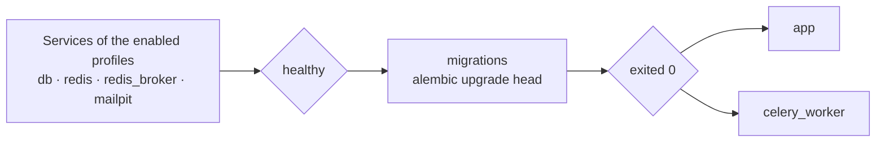

# Getting started

Eight commands from an empty directory to a service answering requests.
Paste the block, then read what it did — or don't, and go look at the
running service instead.

**English** · [Русский](getting-started.ru.md) · [All docs](README.md)

---

## Run it

Needs Python 3.12 and [uv](https://docs.astral.sh/uv/). Nothing else: the
default profile runs on SQLite, keeps its cache in memory and does its
background work inline, so there is no database, no Redis and no queue to
install first.

```bash
git clone https://github.com/IAMN1/link-shortener.git
cd link-shortener
uv sync
cp .env.example .env
uv run flask security generate-secrets --write .env
uv run flask alembic upgrade head
uv run flask create-admin --email admin@example.com --password 'ChangeMe1!'
uv run flask run
```

## Check it

In another terminal:

```bash
curl -s -X POST http://127.0.0.1:5000/api/v1/shorten \
  -H "Content-Type: application/json" \
  -d '{"url": "https://example.com"}'
```

```json
{
  "short_code": "q68J3qY",
  "short_url": "http://localhost:5000/q68J3qY",
  "original_url": "https://example.com",
  "is_new": true,
  "clicks": 0,
  "expires_at": "2026-08-22T08:40:10.886514+00:00",
  "deletion_token": "IjU4OWY2ZGJk…"
}
```

Then open `http://localhost:5000/` and sign in as `admin@example.com` —
the dashboard is at `/dashboard/`, and `http://localhost:5000/api/docs`
describes every endpoint.

---

## What those commands did

| Command | What it does | What tells you it worked |
|---|---|---|
| `uv sync` | Creates `.venv` and installs the project in editable mode, so `flask` and `alembic` run without `PYTHONPATH` | A list of installed packages |
| `cp .env.example .env` | The template already suits a local run: `DATABASE_TYPE=sqlite`, `CELERY_ENABLED=false`, Redis off | — |
| `security generate-secrets --write .env` | Fills `SECRET_KEY` and `SHORT_CODE_PEPPER` in place. Without them `development` invents a key per process, so tokens die on restart | `SECRET_KEY and SHORT_CODE_PEPPER written to .env.` |
| `flask alembic upgrade head` | Creates the schema | `Running upgrade -> 0001, initial schema` |
| `flask create-admin` | The first administrator, which no endpoint can make: registration hands out `user`, and granting `admin` needs an account that already holds it | `Admin user admin@example.com created successfully.` |
| `flask run` | Serves on `http://127.0.0.1:5000/` | The Werkzeug banner |

<details>
<summary>Where are the roles seeded?</summary>

Nowhere, in this run: `development` and `testing` carry
`AUTO_SEED_ROLES=true`, so `admin`, `analyst`, `auditor`, `guest` and
`user` are ensured every time the application starts — including when a
CLI command starts it.

It matters because an anonymous request runs as the `guest` role, and that
role is what carries `link:create`. Without it public shortening answers
`401`.

`staging` and `production` default the flag to `false`, on the grounds
that a production process should not be writing roles on boot. There, seed
once by hand:

```bash
uv run flask db load-base-roles      # Roles and permissions seeded.
uv run flask security list-roles     # what each role now holds
```

</details>

<details>
<summary>Mail, and why nothing arrives</summary>

`MAIL_ENABLED=true` is in the template and points at `localhost:1025`,
where Mailpit from the Docker stack would catch it. With no catcher
running, registration still answers `202`, no message leaves, and the log
says `Verification email not delivered`.

So on a local run there is nothing to confirm an address with — which is
why the block above makes an administrator through the CLI rather than
registering one. To confirm somebody else's address without mail, an
administrator can do it from the users page, or:

```bash
curl -X POST http://127.0.0.1:5000/api/v1/admin/users/<id>/verify-email \
  -H "Authorization: Bearer <token>"
```

</details>

<details>
<summary>Why the template leaves <code>HOST</code> commented out</summary>

The address in a short link is assembled from `HOST` and `PORT` when
`DOMAIN` is not set. An active `HOST=0.0.0.0` therefore produced links like
`http://0.0.0.0:5000/<code>`, which no browser follows — measured by
walking these very steps. The profile's own default is `localhost`, which
is a working link, and inside a container the bind address comes from the
image's `CMD` instead.

</details>

---

## The whole stack, in Docker

PostgreSQL, Redis, a Celery worker and a Mailpit catcher, the way a
deployment runs. This path is not a paste: the template is written for the
local run above, so ten values have to be changed before anything starts —
two of them commented out, which is why they are shown here in full.

```bash
cp .env.example .env.docker
uv run flask security generate-secrets --write .env.docker
```

Then edit `.env.docker`:

```ini
ENV_FILE=.env.docker          # must match what you pass to --env-file
DATABASE_TYPE=postgresql
DATABASE_HOST=db              # the service name inside the compose network
DATABASE_NAME=db_shortener    # a database name, not a file
DATABASE_USER=shortener
DATABASE_PASSWORD=<password>
REDIS_ENABLED=true
REDIS_PASSWORD=<password>
CELERY_ENABLED=true
DOMAIN=localhost:5000         # the name short links are built from
```

```bash
docker compose --env-file .env.docker up -d --build
docker compose --env-file .env.docker exec app \
    flask create-admin --email admin@example.com --password 'ChangeMe1!'
curl -s http://localhost:5000/health
```

```json
{
  "components": {
    "cache": "ok",
    "database": "ok",
    "rate_limiter": "enforcing",
    "task_queue": "ok"
  },
  "status": "healthy"
}
```

Locally the same call answers `"cache": "disabled"`: the development
profile keeps its cache in the process rather than in Redis.

> [!WARNING]
> `--env-file` is not optional. Without it compose reads `.env`, which is
> written for a local SQLite run — and it will not see `COMPOSE_PROFILES`
> either, so neither the database nor Redis comes up.

There is no separate step for migrations: `migrations` runs
`alembic upgrade head` and has to exit `0` before `app` and
`celery_worker` are started.



<details>
<summary>Which services to run yourself</summary>

The template turns on all four:

```ini
COMPOSE_PROFILES=db,cache,broker,mail
```

| Profile | Brings up | Left out — then set |
|---|---|---|
| `db` | PostgreSQL | `DATABASE_URL` |
| `cache` | Redis for cache and limits | `REDIS_URL` |
| `broker` | Redis for the Celery queue | `CELERY_BROKER_URL` |
| `mail` | the Mailpit catcher | `MAIL_HOST`, `MAIL_PORT` |

An empty value means "everything is external": only `migrations`, `app`
and `celery_worker` come up.

The compose files live in `dockers/`, and the commands above still work
from the project root because `COMPOSE_FILE` in the env file names them
both.

</details>

<details>
<summary>The production form of the stack</summary>

```bash
docker compose -f dockers/docker-compose.yml --env-file .env.docker up -d --build
```

The same stack without `dockers/docker-compose.override.yml`: gunicorn
instead of the dev server, no debugger, no mounted sources. You can tell
them apart by `/console` — `200` in dev, `404` here.

Set `FLASK_ENV=production` for it, and note that the profile defaults
`AUTO_SEED_ROLES` to `false`: seed the roles once, as above.

</details>

---

## Using it

Open `http://localhost:5000/`. The page states up front how many links a
day you get without an account and how long they live — ten and seven days
by default. A link you just made can be deleted right there, because a
guest link has nothing to prove ownership with except the token issued
alongside it.

The **Info** tab resolves any short code; its click counters are shown only
to whoever made the link. There is no **Extended** tab for a guest —
extended figures are for the owner or for a holder of `stats:view_any`.

```bash
# With a time to live of one hour
curl -X POST http://localhost:5000/api/v1/shorten \
  -H "Content-Type: application/json" \
  -d '{"url": "https://example.com", "ttl_seconds": 3600}'

# Sign in, then use the token
curl -X POST http://localhost:5000/api/v1/auth/login \
  -H "Content-Type: application/json" \
  -d '{"email": "admin@example.com", "password": "ChangeMe1!"}'

curl "http://localhost:5000/api/v1/links/mine?offset=0&limit=20" \
  -H "Authorization: Bearer <token>"
```

| Dashboard section | Opened by |
|---|---|
| My Links | `link:view_own`, deleting needs `link:delete_own` |
| My Stats | `link:view_own` |
| Create Link | `link:create` |
| Service Stats | `stats:view_basic`; the popular-links table needs `stats:view_full` |
| Users, Roles, Health Check | the administrative permissions |
| Journals | `audit:view` or `logs:view`; each journal is offered only to whoever may read that one |

What a role is shown is decided by the permission its page asks for, so a
menu entry that answers `403` is a bug rather than a fact of life. See
[Development](development.md#the-frontend-asks-the-server).

---

## When something does not work

| Symptom | What to do |
|---|---|
| `ModuleNotFoundError: No module named 'link_shortener'` | `uv sync`, and run through `uv run` |
| `Address already in use` on port 5000 | Something else holds it — on macOS often AirPlay Receiver or a Docker stack from an earlier run. `uv run flask run --port 5055`, or stop the other one |
| `no such table: urls` | `uv run flask alembic upgrade head` |
| `401` on `POST /api/v1/shorten` as an anonymous caller | The `guest` role is missing or lacks `link:create`. `uv run flask db load-base-roles`, then check with `flask security list-roles` |
| `403` on the same call while signed in | That account's role does not hold `link:create` — `analyst` does not, by design |
| `already sets SECRET_KEY` | The file has been filled in before. `--force` replaces the values, which signs out every session and, for `SHORT_CODE_PEPPER`, stops the codes already handed out from resolving |
| Values in `.env` are ignored | The `testing` profile ignores `.env` deliberately. Otherwise a real environment variable outranks the file |
| `No 'script_location' key found` | A bare `alembic` was run from outside the directory holding `alembic.ini` — use `flask alembic` |
| `this profile runs on PostgreSQL` | `production` and `staging` run on PostgreSQL only |
| `a SQLite database that no DATABASE_URL in the environment named` | A migration outside `development` will not go to an unnamed SQLite file. Name it, or hand the URL over in `ALEMBIC_DATABASE_URL` |
| `nothing names a profile` | `FLASK_ENV` is unset — name the profile or the database |
| `SECRET_KEY must be set in environment` | `staging` and `production` require explicit secrets |
| JWTs stop working after a restart | `SECRET_KEY` is unset: in `development` it is generated afresh every process |
| The confirmation message never arrives | Check the log. `Verification email not delivered` means the submission server is unreachable — locally, that is the missing catcher on `localhost:1025`. `MAIL_ENABLED=false` means mail is off entirely |
| Only `app` and `celery_worker` came up | `COMPOSE_PROFILES` is empty or unset in the env file |
| Links look like `http://0.0.0.0:5000/...` | `HOST=0.0.0.0` with no `DOMAIN`; see the note above |

---

## Next

```bash
uv run pytest tests/     # the suite; Docker services for level 2b start themselves
uv run flask alembic migrate "what changed"   # a new revision after editing models
```

- How it is put together — [Architecture](architecture.md)
- Why it is put together that way — [Decisions](decisions.md)
- The rules around the settings — [Configuration](configuration.md)
- Running a deployment — [Operations](operations.md)
