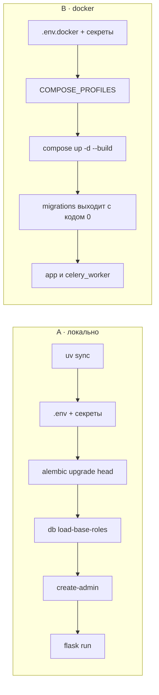

# Быстрый старт

От пустого каталога до сервиса, который отвечает на запросы. Каждый шаг
говорит, что должен напечатать, — чтобы медленный шаг было видно отдельно от
сломанного.

[English](getting-started.md) · **Русский** · [Вся документация](README.md)

Два сценария. Они независимы — выберите один.

| | Что нужно | Что получится |
|---|---|---|
| [**A · Локально**](#a--локально) | Python 3.12 + [uv](https://docs.astral.sh/uv/) | SQLite, кэш в памяти, без Celery |
| [**B · В Docker**](#b--в-docker) | Docker Compose v2+ | PostgreSQL, Redis, Celery, Mailpit |



---

## A · Локально

### 1. Зависимости

```bash
git clone https://github.com/IAMN1/link-shortener.git
cd link-shortener
uv sync
```

Ожидается: создан `.venv`, проект поставлен в editable-режиме — команды
`flask` и `alembic` работают без `PYTHONPATH`.

### 2. Файл окружения

```bash
cp .env.example .env
uv run flask security generate-secrets
```

Вторая команда печатает две готовые строки — впишите их в `.env`:

```ini
SECRET_KEY=<hex-строка 64 байта>
SHORT_CODE_PEPPER=<другая hex-строка>
```

Остальное для локального запуска уже подходит: `DATABASE_TYPE=sqlite`,
`CELERY_ENABLED=false`, а Redis выключен умолчанием профиля `development`.

> [!NOTE]
> Почта в шаблоне включена и нацелена на `localhost:1025` — туда её принял
> бы Mailpit из docker-стека. Если ловушки нет, регистрация по-прежнему
> отвечает `202`, письмо не уходит, и об этом говорит строка
> `Verification email not delivered` в журнале; подтвердить адрес в таком
> запуске нечем.

### 3. Схема базы

```bash
uv run flask alembic upgrade head
```

Ожидается: `Running upgrade -> 0001, initial schema`.

### 4. Системные роли

```bash
uv run flask db load-base-roles
```

Ожидается: `Roles and permissions seeded.` с перечислением
`admin, analyst, guest, user`.

> [!IMPORTANT]
> Шаг обязательный. Анонимный запрос выполняется в роли `guest`, и именно
> она несёт `link:create`. Без него публичное сокращение отвечает `401`.

### 5. Администратор

```bash
uv run flask create-admin --email admin@example.com --password 'ваш-пароль'
```

Ожидается: `Admin user admin@example.com created successfully.`

### 6. Запуск

```bash
uv run flask run
```

Ожидается: сервис на `http://127.0.0.1:5000/`.

### 7. Проверка

```bash
curl -s -X POST http://127.0.0.1:5000/api/v1/shorten \
  -H "Content-Type: application/json" \
  -d '{"url": "https://example.com"}'
```

Ожидается: `201` и тело с полями `short_code`, `short_url`, `is_new: true`,
где `short_url` — `http://localhost:5000/<код>`.

<details>
<summary>Почему в шаблоне <code>HOST</code> закомментирован</summary>

Без `DOMAIN` адрес короткой ссылки собирается из `HOST` и `PORT`. Активное
`HOST=0.0.0.0` давало ссылки вида `http://0.0.0.0:5000/<код>`, по которым
браузер никуда не идёт, — проверено проходом по этим самым шагам. Умолчание
профиля — `localhost`, то есть рабочая ссылка, а в контейнере привязку
задаёт `CMD` образа.

</details>

---

## B · В Docker

### 1. Файл окружения

```bash
cp .env.example .env.docker
```

Задайте в нём одиннадцать значений — остальное шаблон уже знает:

```ini
ENV_FILE=.env.docker          # должен совпадать со значением --env-file
SECRET_KEY=<hex-строка 64 байта>
SHORT_CODE_PEPPER=<другая hex-строка>

DATABASE_TYPE=postgresql
DATABASE_HOST=db              # имя сервиса в сети compose
DATABASE_NAME=db_shortener    # имя базы, а не файла
DATABASE_USER=shortener
DATABASE_PASSWORD=<пароль>

REDIS_ENABLED=true
REDIS_PASSWORD=<пароль>
CELERY_ENABLED=true

DOMAIN=localhost:5000         # имя, из которого строятся ссылки
```

Почту править не нужно: `MAIL_ENABLED=true` стоит в шаблоне, а адрес ловушки
контейнерам подставляет `dockers/docker-compose.override.yml`.

### 2. Какие сервисы поднимать своими

Шаблон включает все четыре:

```ini
COMPOSE_PROFILES=db,cache,broker,mail
```

| Профиль | Что поднимает | Не включён — задайте |
|---|---|---|
| `db` | PostgreSQL | `DATABASE_URL` |
| `cache` | Redis для кэша и лимитов | `REDIS_URL` |
| `broker` | Redis для очереди Celery | `CELERY_BROKER_URL` |
| `mail` | ловушку писем Mailpit | `MAIL_HOST`, `MAIL_PORT` |

Пустое значение означает «всё внешнее»: поднимутся только `migrations`,
`app` и `celery_worker`.

### 3. Запуск

```bash
docker compose --env-file .env.docker up -d --build
```

Ожидается такой порядок — отдельного шага для миграций не нужно:


> [!WARNING]
> Флаг `--env-file` обязателен. Без него compose возьмёт `.env`,
> рассчитанный на локальный SQLite, — и заодно не увидит
> `COMPOSE_PROFILES`, то есть не поднимет ни базу, ни Redis.

Файлы compose лежат в `dockers/`, и команда выше по-прежнему работает из
корня проекта: оба файла названы переменной `COMPOSE_FILE` в env-файле.

```bash
docker compose --env-file .env.docker ps
```

Ожидается: все сервисы `running`, `migrations` — `exited (0)`.

### 4. Роли и администратор

```bash
docker compose --env-file .env.docker exec app flask db load-base-roles
docker compose --env-file .env.docker exec app \
    flask create-admin --email admin@example.com --password 'ваш-пароль'
```

Ожидается: то же, что в шагах A4 и A5.

### 5. Проверка

```bash
curl -s http://localhost:5000/health
```

Ожидается: `{"status": "healthy", "components": {"database": "ok",
"cache": "ok", "task_queue": "ok", "rate_limiter": "enforcing"}}`.

<details>
<summary>Продакшн-форма стека</summary>

```bash
docker compose -f dockers/docker-compose.yml --env-file .env.docker up -d --build
```

Тот же стек без `dockers/docker-compose.override.yml`: gunicorn вместо
dev-сервера, без отладчика и без монтирования исходников. Отличить одно от
другого можно по `/console` — в dev он отвечает `200`, здесь `404`.

</details>

---

## Как этим пользоваться

### Гостем

Откройте `http://localhost:5000/`. Страница сразу говорит, сколько ссылок в
сутки можно сделать без учётной записи и сколько они живут: по умолчанию
десять и семь дней. Только что созданную ссылку можно тут же удалить —
кнопка под результатом работает, пока открыта эта страница: у гостевой
ссылки нет ничего, чем доказать владение, кроме выданного вместе с ней
токена.

Вкладка **Info** показывает, куда ведёт любой короткий код; счётчики
переходов в ней видит только тот, кто ссылку сделал. Вкладки **Extended** у
гостя нет: расширенные цифры — для владельца или для держателя
`stats:view_any`, а гостевая ссылка не принадлежит никому.

### Регистрация

1. **Sign Up** в шапке или `http://localhost:5000/register`. Страница
   отвечает одинаково, свободен адрес или занят.
2. Откройте письмо и перейдите по ссылке. В Docker письма ловит Mailpit:
   `http://127.0.0.1:8025`. Ссылка ведёт на страницу с кнопкой, и токен
   тратит именно нажатие — сканер, идущий по ссылкам в почте, потратить его
   за вас не может.
3. Войдите на `http://localhost:5000/login`.

### Из командной строки

```bash
# Сокращение (гостем)
curl -X POST http://localhost:5000/api/v1/shorten \
  -H "Content-Type: application/json" \
  -d '{"url": "https://example.com"}'

# Со сроком жизни в час
curl -X POST http://localhost:5000/api/v1/shorten \
  -H "Content-Type: application/json" \
  -d '{"url": "https://example.com", "ttl_seconds": 3600}'

# Куда ведёт код
curl http://localhost:5000/api/v1/links/<short_code>

# Вход, затем запрос с токеном
curl -X POST http://localhost:5000/api/v1/auth/login \
  -H "Content-Type: application/json" \
  -d '{"email": "admin@example.com", "password": "ваш-пароль"}'

curl "http://localhost:5000/api/v1/links/mine?offset=0&limit=20" \
  -H "Authorization: Bearer <token>"
```

Полное описание API — `http://localhost:5000/api/docs`.

### Панель управления

| Раздел | Чем открывается |
|---|---|
| Мои ссылки | `link:view_own`, удаление — `link:delete_own` |
| Моя статистика | `link:view_own` |
| Создать ссылку | `link:create` |
| Статистика сервиса | `stats:view_basic`; таблица популярных — `stats:view_full` |
| Пользователи, Роли, Проверка здоровья | административные права |

Что показывать роли, решает право, которое спрашивает сама страница, —
поэтому пункт меню, отвечающий `403`, здесь считается дефектом, а не
данностью. Разбор: [Development](development.md#the-frontend-asks-the-server).

---

## Если что-то не работает

| Симптом | Что делать |
|---|---|
| `ModuleNotFoundError: No module named 'link_shortener'` | `uv sync`, и запускать через `uv run` |
| `no such table: urls` | `uv run flask alembic upgrade head` |
| `Role 'user' not found` при регистрации | `uv run flask db load-base-roles` |
| `401` на `POST /api/v1/shorten` у анонима | Роль `guest` не засеяна или засеяна без `link:create`: повторите `db load-base-roles`, проверьте `flask security list-roles` |
| `403` на том же запросе у вошедшего | У его роли нет `link:create` — у `analyst` его нет по замыслу |
| Значения из `.env` не применяются | Профиль `testing` игнорирует `.env` намеренно; в остальных случаях переменная окружения имеет приоритет над файлом |
| `No 'script_location' key found` | Голая команда `alembic` запущена не из каталога с `alembic.ini` — используйте `flask alembic` |
| `this profile runs on PostgreSQL` | `production` и `staging` работают только на PostgreSQL |
| `a SQLite database that no DATABASE_URL in the environment named` | Миграция вне `development` не пойдёт в неназванный SQLite. Назовите файл или передайте строку в `ALEMBIC_DATABASE_URL` |
| `nothing names a profile` | Не задан `FLASK_ENV` — назовите профиль или базу |
| `SECRET_KEY must be set in environment` | `staging` и `production` требуют явные секреты |
| JWT перестают работать после рестарта | `SECRET_KEY` не задан: в `development` он генерируется заново при каждом запуске |
| Письмо с подтверждением не приходит | Смотрите журнал: `Verification email not delivered` — сервер отправки недоступен (локально это отсутствующая ловушка на `localhost:1025`); `MAIL_ENABLED=false` — почта выключена вовсе |
| Поднялись только `app` и `celery_worker` | В env-файле пуст или не задан `COMPOSE_PROFILES` |
| Ссылки вида `http://0.0.0.0:5000/...` | Задан `HOST=0.0.0.0` и не задан `DOMAIN`; см. врезку в шаге A7 |

---

## Дальше

```bash
uv run pytest tests/     # набор; docker-сервисы для уровня 2b поднимаются сами
uv run flask alembic migrate "описание изменения"   # новая ревизия после правки моделей
```

- Как устроено — [Architecture](architecture.md)
- Почему устроено именно так — [Decisions](decisions.md)
- Эксплуатация — [Operations](operations.md)
