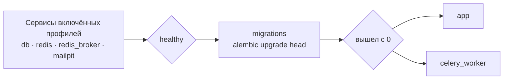

# Быстрый старт

Семь команд от пустого каталога до сервиса, отвечающего на запросы.
Вставьте блок целиком, а потом прочитайте, что он сделал, — или не
читайте и идите смотреть на работающий сервис.

[English](getting-started.md) · **Русский** · [Вся документация](README.md)

---

## Запустить

Нужны Python 3.12 и [uv](https://docs.astral.sh/uv/). Больше ничего:
профиль по умолчанию работает на SQLite, держит кэш в памяти и выполняет
фоновые задачи прямо в процессе, поэтому ни базы, ни Redis, ни очереди
ставить заранее не надо.

```bash
git clone https://github.com/IAMN1/link-shortener.git
cd link-shortener
uv sync
cp .env.example .env
uv run flask security generate-secrets --write .env
uv run flask alembic upgrade head
uv run flask create-admin --email admin@example.com --password 'ChangeMe1!'
uv run flask run
```

## Проверить

В другом окне терминала:

```bash
curl -s -X POST http://127.0.0.1:5000/api/v1/shorten \
  -H "Content-Type: application/json" \
  -d '{"url": "https://example.com"}'
```

```json
{
  "short_code": "q68J3qY",
  "short_url": "http://localhost:5000/q68J3qY",
  "original_url": "https://example.com",
  "is_new": true,
  "clicks": 0,
  "expires_at": "2026-08-22T08:40:10.886514+00:00",
  "deletion_token": "IjU4OWY2ZGJk…"
}
```

Дальше откройте `http://localhost:5000/` и войдите как
`admin@example.com`: панель — по адресу `/dashboard/`, а полное описание
API — на `http://localhost:5000/api/docs`.

---

## Что сделали эти команды

| Команда | Что делает | По чему видно, что получилось |
|---|---|---|
| `uv sync` | Создаёт `.venv` и ставит проект в editable-режиме, поэтому `flask` и `alembic` работают без `PYTHONPATH` | Список установленных пакетов |
| `cp .env.example .env` | Шаблон уже подходит для локального запуска: `DATABASE_TYPE=sqlite`, `CELERY_ENABLED=false`, Redis выключен | — |
| `security generate-secrets --write .env` | Вписывает `SECRET_KEY` и `SHORT_CODE_PEPPER` на место. Без них `development` придумывает ключ на каждый процесс, и токены умирают при перезапуске | `SECRET_KEY and SHORT_CODE_PEPPER written to .env.` |
| `flask alembic upgrade head` | Создаёт схему | `Running upgrade -> 0001, initial schema` |
| `flask create-admin` | Первый администратор, которого не сделать ни одним запросом: регистрация выдаёт роль `user`, а раздавать `admin` может только тот, у кого она уже есть | `Admin user admin@example.com created successfully.` |
| `flask run` | Поднимает сервис на `http://127.0.0.1:5000/` | Баннер Werkzeug |

<details>
<summary>А где засеваются роли?</summary>

Нигде — в этом запуске они засеваются сами: в профилях `development` и
`testing` включён `AUTO_SEED_ROLES`, и роли `admin`, `analyst`, `guest` и
`user` проверяются при каждом старте приложения, в том числе когда
приложение поднимает CLI-команда.

Это важно, потому что анонимный запрос выполняется от роли `guest`, а
именно она несёт `link:create`. Без неё публичное сокращение отвечает
`401`.

В `staging` и `production` флаг по умолчанию выключен — рабочий процесс не
должен писать роли при загрузке. Там роли засеваются один раз руками:

```bash
uv run flask db load-base-roles      # Roles and permissions seeded.
uv run flask security list-roles     # что теперь несёт каждая роль
```

</details>

<details>
<summary>Почта, и почему письма не приходят</summary>

`MAIL_ENABLED=true` стоит в шаблоне и нацелен на `localhost:1025`, где
письмо поймал бы Mailpit из докеровского стека. Если приёмника нет,
регистрация всё равно отвечает `202`, письмо никуда не уходит, а в журнале
появляется `Verification email not delivered`.

Значит, в локальном запуске подтвердить адрес нечем — поэтому блок выше и
делает администратора через CLI, а не регистрацией. Подтвердить чужой
адрес без письма администратор может со страницы пользователей или так:

```bash
curl -X POST http://127.0.0.1:5000/api/v1/admin/users/<id>/verify-email \
  -H "Authorization: Bearer <token>"
```

</details>

<details>
<summary>Почему <code>HOST</code> в шаблоне закомментирован</summary>

Адрес в короткой ссылке собирается из `HOST` и `PORT`, когда `DOMAIN` не
задан. Поэтому активный `HOST=0.0.0.0` давал ссылки вида
`http://0.0.0.0:5000/<код>`, по которым не ходит ни один браузер, — это
измерено проходом ровно по этим шагам. Умолчание самого профиля —
`localhost`, то есть рабочая ссылка, а внутри контейнера адрес привязки
приходит из `CMD` образа.

</details>

---

## Весь стек, в Docker

PostgreSQL, Redis, воркер Celery и приёмник почты Mailpit — так, как
работает развёртывание. Этот путь не вставляется одним куском: шаблон
написан под локальный запуск выше, поэтому до старта надо поменять десять
значений, причём два из них закомментированы — потому здесь они выписаны
целиком.

```bash
cp .env.example .env.docker
uv run flask security generate-secrets --write .env.docker
```

Дальше правим `.env.docker`:

```ini
ENV_FILE=.env.docker          # должно совпадать с тем, что передаёте в --env-file
DATABASE_TYPE=postgresql
DATABASE_HOST=db              # имя сервиса внутри сети compose
DATABASE_NAME=db_shortener    # имя базы, а не файла
DATABASE_USER=shortener
DATABASE_PASSWORD=<пароль>
REDIS_ENABLED=true
REDIS_PASSWORD=<пароль>
CELERY_ENABLED=true
DOMAIN=localhost:5000         # имя, из которого собираются короткие ссылки
```

```bash
docker compose --env-file .env.docker up -d --build
docker compose --env-file .env.docker exec app \
    flask create-admin --email admin@example.com --password 'ChangeMe1!'
curl -s http://localhost:5000/health
```

```json
{
  "components": {
    "cache": "ok",
    "database": "ok",
    "rate_limiter": "enforcing",
    "task_queue": "ok"
  },
  "status": "healthy"
}
```

Локально тот же запрос отвечает `"cache": "disabled"`: профиль разработки
держит кэш в процессе, а не в Redis.

> [!WARNING]
> `--env-file` не опция. Без него compose читает `.env`, написанный под
> локальный запуск на SQLite, — и не увидит `COMPOSE_PROFILES`, так что не
> поднимется ни база, ни Redis.

Отдельного шага для миграций нет: сервис `migrations` выполняет
`alembic upgrade head` и должен выйти с кодом `0`, прежде чем стартуют
`app` и `celery_worker`.



<details>
<summary>Какие службы поднимать самому</summary>

Шаблон включает все четыре:

```ini
COMPOSE_PROFILES=db,cache,broker,mail
```

| Профиль | Что поднимает | Если выключить — задайте |
|---|---|---|
| `db` | PostgreSQL | `DATABASE_URL` |
| `cache` | Redis для кэша и ограничителя | `REDIS_URL` |
| `broker` | Redis под очередь Celery | `CELERY_BROKER_URL` |
| `mail` | приёмник Mailpit | `MAIL_HOST`, `MAIL_PORT` |

Пустое значение означает «всё внешнее»: поднимутся только `migrations`,
`app` и `celery_worker`.

Файлы compose лежат в `dockers/`, и команды выше работают из корня
проекта, потому что `COMPOSE_FILE` в env-файле называет их оба.

</details>

<details>
<summary>Продакшн-форма стека</summary>

```bash
docker compose -f dockers/docker-compose.yml --env-file .env.docker up -d --build
```

Тот же стек без `dockers/docker-compose.override.yml`: gunicorn вместо
отладочного сервера, без отладчика и без смонтированных исходников.
Отличить одно от другого можно по `/console` — `200` в dev, `404` здесь.

Для него задайте `FLASK_ENV=production` и учтите, что в этом профиле
`AUTO_SEED_ROLES` по умолчанию выключен: роли надо засеять один раз, как
описано выше.

</details>

---

## Как этим пользоваться

Откройте `http://localhost:5000/`. Страница сразу говорит, сколько ссылок
в сутки даётся без учётной записи и сколько они живут — по умолчанию
десять и семь дней. Только что созданную ссылку можно тут же удалить:
гостевой ссылке нечем доказать владение, кроме токена, выданного вместе с
ней.

Вкладка **Info** разворачивает любой короткий код, но счётчики переходов
показываются только тому, кто ссылку создал. Вкладки **Extended** у гостя
нет: расширенные цифры — для владельца или для того, у кого есть
`stats:view_any`.

```bash
# Со сроком жизни в один час
curl -X POST http://localhost:5000/api/v1/shorten \
  -H "Content-Type: application/json" \
  -d '{"url": "https://example.com", "ttl_seconds": 3600}'

# Войти и пользоваться токеном
curl -X POST http://localhost:5000/api/v1/auth/login \
  -H "Content-Type: application/json" \
  -d '{"email": "admin@example.com", "password": "ChangeMe1!"}'

curl "http://localhost:5000/api/v1/links/mine?offset=0&limit=20" \
  -H "Authorization: Bearer <токен>"
```

| Раздел панели | Чем открывается |
|---|---|
| My Links | `link:view_own`, удаление — `link:delete_own` |
| My Stats | `link:view_own` |
| Create Link | `link:create` |
| Service Stats | `stats:view_basic`; таблица популярных ссылок — `stats:view_full` |
| Users, Roles, Health Check | административные разрешения |
| Журналы | `audit:view` или `logs:view`; каждый журнал предлагается только тому, кто вправе его читать |

Что показать роли, решает то самое разрешение, которое спрашивает
страница, поэтому пункт меню, отвечающий `403`, — это дефект, а не
данность. Разбор — [Development](development.md#the-frontend-asks-the-server).

---

## Когда что-то не работает

| Симптом | Что делать |
|---|---|
| `ModuleNotFoundError: No module named 'link_shortener'` | `uv sync`, и запускать через `uv run` |
| `Address already in use` на порту 5000 | Порт занят чем-то другим — на macOS часто приёмником AirPlay или докеровским стеком с прошлого раза. `uv run flask run --port 5055` либо остановить занявшего |
| `no such table: urls` | `uv run flask alembic upgrade head` |
| `401` на `POST /api/v1/shorten` от анонимного вызова | Роли `guest` нет или в ней нет `link:create`. `uv run flask db load-base-roles`, проверить через `flask security list-roles` |
| `403` на том же вызове из-под учётной записи | В роли этой учётки нет `link:create` — у `analyst` его нет намеренно |
| `already sets SECRET_KEY` | Файл уже заполняли. `--force` перезапишет значения, а это разлогинивает все сессии и, в случае `SHORT_CODE_PEPPER`, ломает уже выданные коды |
| Значения из `.env` игнорируются | Профиль `testing` намеренно не читает `.env`. В остальных случаях настоящая переменная окружения старше файла |
| `No 'script_location' key found` | Голый `alembic` запущен не из каталога с `alembic.ini` — нужен `flask alembic` |
| `this profile runs on PostgreSQL` | `production` и `staging` работают только на PostgreSQL |
| `a SQLite database that no DATABASE_URL in the environment named` | Миграция вне `development` не пойдёт в безымянный файл SQLite. Назовите его или передайте URL в `ALEMBIC_DATABASE_URL` |
| `nothing names a profile` | `FLASK_ENV` не задан — назовите профиль или базу |
| `SECRET_KEY must be set in environment` | `staging` и `production` требуют явных секретов |
| JWT перестают работать после перезапуска | `SECRET_KEY` не задан: в `development` он генерируется заново каждым процессом |
| Письмо с подтверждением не приходит | Смотрите журнал. `Verification email not delivered` означает, что сервер отправки недоступен — локально это отсутствующий приёмник на `localhost:1025`. `MAIL_ENABLED=false` означает, что почта выключена вовсе |
| Поднялись только `app` и `celery_worker` | `COMPOSE_PROFILES` пуст или не задан в env-файле |
| Ссылки выглядят как `http://0.0.0.0:5000/...` | `HOST=0.0.0.0` без `DOMAIN`; см. примечание выше |

---

## Дальше

```bash
uv run pytest tests/     # набор; докеровские службы для уровня 2b поднимаются сами
uv run flask alembic migrate "что изменилось"   # новая ревизия после правки моделей
```

- Как всё устроено — [Architecture](architecture.md)
- Почему устроено так — [Decisions](decisions.md)
- Все настройки, какие есть — [Configuration](configuration.md)
- Эксплуатация развёртывания — [Operations](operations.md)
