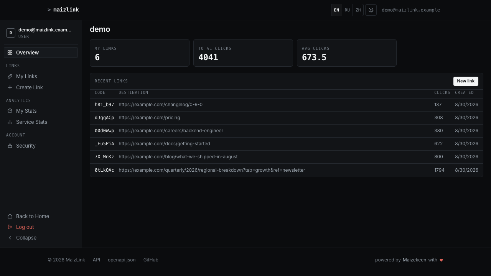
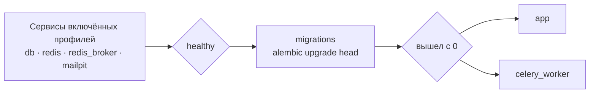

# Быстрый старт

Восемь команд от пустого каталога до сервиса, отвечающего на запросы.
Вставьте блок целиком, а потом прочитайте, что он сделал, — или не
читайте и идите смотреть на работающий сервис.

[English](getting-started.md) · **Русский** · [Вся документация](README.md)

---

## Запустить

Нужны Python 3.12 и [uv](https://docs.astral.sh/uv/). Больше ничего:
профиль по умолчанию работает на SQLite, держит кэш в памяти и выполняет
фоновые задачи прямо в процессе, поэтому ни базы, ни Redis, ни очереди
ставить заранее не надо.

```bash
git clone https://github.com/IAMN1/link-shortener.git
cd link-shortener
uv sync
cp .env.example .env
uv run flask security generate-secrets --write .env
uv run flask alembic upgrade head
uv run flask create-admin --email admin@example.com --password 'ChangeMe1!'
uv run flask run
```

## Проверить

В другом окне терминала:

```bash
curl -s -X POST http://127.0.0.1:5000/api/v1/shorten \
  -H "Content-Type: application/json" \
  -d '{"url": "https://example.com"}'
```

```json
{
  "clicks": 0,
  "created_at": "2026-08-30T12:36:33.619533+00:00",
  "deletion_token": "Ijg0YjgwMWY1LWFjMDAtNDM2Zi05ZDM2…",
  "expires_at": "2026-09-06T12:36:33.619533+00:00",
  "from_cache": false,
  "is_new": true,
  "last_accessed": null,
  "original_url": "https://example.com",
  "owner_id": null,
  "short_code": "q68J3qY",
  "short_url": "http://localhost:5000/q68J3qY"
}
```

Дальше откройте `http://localhost:5000/` и войдите как
`admin@example.com`: панель — по адресу `/dashboard/`, а описание JSON-API
— на `http://localhost:5000/api/docs`: каждая операция под `/api/v1` и
перенаправление `/<код>` рядом с ними. Чего там нет — то и не входит в
API: страницы панели и `/health`, который это руководство велит дёрнуть
ниже.



Это настоящий снимок этого приложения, а не макет — сделан на
демонстрационной учётной записи с засеянными данными (`flask db seed`),
поэтому в нём есть ссылки и счётчики. Панель сразу после восьми команд выше
пуста, а администратор видит больше разделов, чем `user` на картинке:
Пользователи, Роли, Состояние и Журналы. Тема тёмная — переключатель стоит
в шапке, выбор хранится в куке и применяется сервером до того, как страница
нарисована, поэтому при входе ничего не мигает.

---

## Что сделали эти команды

| Команда | Что делает | По чему видно, что получилось |
|---|---|---|
| `uv sync` | Создаёт `.venv` и ставит проект в editable-режиме, поэтому `flask` и `alembic` работают без `PYTHONPATH` | Список установленных пакетов |
| `cp .env.example .env` | Шаблон уже подходит для локального запуска: `DATABASE_TYPE=sqlite`, `CELERY_ENABLED=false`, Redis выключен | — |
| `security generate-secrets --write .env` | Вписывает `SECRET_KEY` и `SHORT_CODE_PEPPER` на место. Без них `development` придумывает ключ на каждый процесс, и токены умирают при перезапуске | `SECRET_KEY and SHORT_CODE_PEPPER written to .env.` |
| `flask alembic upgrade head` | Создаёт схему | `INFO  [alembic.runtime.migration] Running upgrade  -> 0001, initial schema` — строку печатает собственный журнал alembic, отсюда приставка |
| `flask create-admin` | Первый администратор, которого не сделать ни одним запросом: регистрация выдаёт роль `user`, а раздавать `admin` может только тот, у кого она уже есть | `Admin user admin@example.com created successfully (active: True).` |
| `flask run` | Поднимает сервис на `http://127.0.0.1:5000/` | `* Serving Flask app` и `* Debug mode: on` |

> [!NOTE]
> Строки, которую вы, возможно, ищете, —
> `* Running on http://127.0.0.1:5000` — не будет. В шаблоне стоит
> `WERKZEUG_LOG_LEVEL=WARNING`, а Werkzeug печатает её через свой
> логгер на уровне `INFO`. Две строки выше печатает сам Flask, их это
> не касается; следом идёт `* Debugger is active!` — это
> предупреждение.

<details>
<summary>А где засеваются роли?</summary>

Нигде — в этом запуске они засеваются сами: в профилях `development` и
`testing` включён `AUTO_SEED_ROLES`, и роли `admin`, `analyst`,
`auditor`, `guest` и `user` проверяются при каждом старте приложения, в
том числе когда приложение поднимает CLI-команда.

Это важно, потому что анонимный запрос выполняется от роли `guest`, а
именно она несёт `link:create`. Без неё публичное сокращение отвечает
`401`.

В `staging` и `production` флаг по умолчанию выключен — рабочий процесс не
должен писать роли при загрузке. Там роли засеваются один раз руками:

```bash
uv run flask db load-base-roles      # Roles and permissions seeded. permissions created: 15; roles created: 5
                                     # (второй раз: permissions created: 0; roles created: 0;
                                     #  left as they are: admin, analyst, auditor, guest, user)
uv run flask security list-roles     # что теперь несёт каждая роль
```

</details>

<details>
<summary>Почта, и почему письма не приходят</summary>

`MAIL_ENABLED=true` стоит в шаблоне, а `MAIL_HOST` рядом оставлен пустым —
значит адрес берётся из профиля, а `development` по умолчанию указывает на
`localhost:1025`, где и слушает Mailpit из докеровского стека. Если
приёмника нет, регистрация всё равно отвечает `202`, письмо никуда не
уходит, а в журнале появляется `could not deliver mail via localhost:1025:
[Errno 61] Connection refused`, а следом `Verification email not
delivered`.

Поэтому, чтобы ловить письма локально, достаточно поднять этот Mailpit —
задавать ничего не нужно. Число `587` в шаблоне — умолчание развёрнутых
профилей, где называют настоящий почтовый сервер.

Значит, в локальном запуске подтвердить адрес нечем — поэтому блок выше и
делает администратора через CLI, а не регистрацией.

Вход в такую неподтверждённую запись отвечает `401 INVALID_CREDENTIALS`,
«Invalid email or password» — тем же, чем отвечает неверный пароль, и это
сделано намеренно: различие подсказывало бы «этот ли пароль» любому, кто
пробует. Дело не в пароле, а в неподтверждённом адресе. Что именно
случилось, видно в журнале безопасности, под правом `audit:view`.

Подтвердить чужой адрес без письма администратор может со страницы
пользователей или так:

```bash
curl -X POST http://127.0.0.1:5000/api/v1/admin/users/<id>/verify-email \
  -H "Authorization: Bearer <token>"
```

</details>

<details>
<summary>Почему <code>HOST</code> в шаблоне закомментирован</summary>

Адрес в короткой ссылке собирается из `HOST` и `PORT`, когда `DOMAIN` не
задан. Поэтому активный `HOST=0.0.0.0` давал ссылки вида
`http://0.0.0.0:5000/<код>`, по которым не ходит ни один браузер, — это
измерено проходом ровно по этим шагам. Умолчание самого профиля —
`localhost`, то есть рабочая ссылка, а внутри контейнера адрес привязки
приходит из `CMD` образа.

</details>

---

## Весь стек, в Docker

PostgreSQL, Redis, воркер Celery и приёмник почты Mailpit — так, как
работает развёртывание. Пять команд, и ни одна из них не «дальше поправьте
десять значений»:

Перед началом остановите `flask run` из первого блока: этот стек публикует
тот же порт, и оставленный сервер стоит вдвойне — `up` упадёт с
`bind: address already in use`, а если не упадёт, то `curl` в конце ответит
не стек, а локальный сервер. Отличить их можно по `"cache": "disabled"`.

Блок написан для первого запуска. Если `.env.docker` у вас уже есть —
отложите его в сторону, а не давайте первой строке скопировать шаблон
поверх: в нём лежит тот пароль, с которым была инициализирована база, и
взять его больше неоткуда.

```bash
cp .env.docker.example .env.docker
uv run flask security generate-secrets --write .env.docker --with-service-passwords
docker compose --env-file .env.docker up -d --build
docker compose --env-file .env.docker exec app \
    flask create-admin --email admin@example.com --password 'ChangeMe1!'
curl -s http://localhost:5000/health
```

> [!WARNING]
> Если `up` заканчивается на `service "migrations" didn't complete
> successfully: exit 1`, консоль причину не назовёт — она внутри
> контейнера: `docker logs link-shortener-migrations-1`. На втором запуске
> вероятнее всего это `password authentication failed for user
> "shortener"`: том базы пережил env-файл и хранит тот пароль, с которым
> был **инициализирован**, так что только что сгенерированный его не
> открывает. Два выхода — в таблице неполадок в конце страницы.

> [!NOTE]
> `.env.docker.example` — тот же каталог, что и `.env.example`, с девятью
> строками под контейнеры: бэкенд, имя сервиса базы, два переключателя для
> Redis и Celery, домен, из которого собираются короткие ссылки, и запись
> журналов в файлы — этот стек везёт ротатор, который их двигает. Все
> девять с причинами перечислены в шапке самого файла, а остальные строки
> держит одинаковыми `test_the_two_templates_do_not_drift.py`.
>
> Шаблон был один на оба пути, и в нём на одной странице стояли
> `COMPOSE_PROFILES=db,cache,broker` и `DATABASE_TYPE=sqlite`. По нему
> поднимались PostgreSQL и два Redis, а приложение шло мимо всех трёх:
> миграция записывала схему внутрь своего же контейнера и выходила с
> нулём, приложение открывало пустой файл рядом, `/health` отвечал
> `healthy`, а главная — `500 no such table: roles`. Двух из трёх больше
> не будет: шаблоны не могут противоречить друг другу, а `/health` на
> такой базе отвечает `no_schema` и 503 вместо `ok`. Этот ответ решается при старте процесса и запоминается, как только схема увидена целиком, — так что схему, исчезнувшую под работающим сервисом, он заметит только после перезапуска. Замерено на двух живых прогонах: это граница, о которой стоит знать, а не обещание непрерывного наблюдения.

> [!TIP]
> `--with-service-passwords` пишет на два значения больше, чем нужно
> локальному запуску: те, с которыми стартуют собственные PostgreSQL и
> Redis этого стека. Пароля по умолчанию в репозитории нет ни для одного
> из них, и оба сервиса скорее откажутся стартовать, чем поднимутся
> открытыми — с сообщением, которое называет переменную, команду для её
> заполнения и способ подключить свою службу вместо этой.

```json
{
  "components": {
    "cache": "ok",
    "database": "ok",
    "rate_limiter": "enforcing",
    "task_queue": "ok"
  },
  "status": "healthy"
}
```

Локально тот же запрос отвечает `"cache": "disabled"` и `"task_queue":
"inline"`: профиль разработки
держит кэш в процессе, а не в Redis.

> [!WARNING]
> `--env-file` не опция. Без него compose читает `.env`, написанный под
> локальный запуск на SQLite, — а его compose-секция несёт те же профили,
> так что службы как раз поднимутся: замерено,
> `docker compose --env-file .env config --services` разворачивает все
> восемь, включая `db`, оба Redis и приёмник почты. Получится стек рядом с
> приложением, которому сказано `DATABASE_TYPE=sqlite` и которое ни с чем
> из этого не разговаривает, — та самая раскладка, ради предотвращения
> которой шаблонов два.

Отдельного шага для миграций нет: сервис `migrations` выполняет
`alembic upgrade head` и должен выйти с кодом `0`, прежде чем стартуют
`app` и `celery_worker`.



<details>
<summary>Какие службы поднимать самому</summary>

Любая из них может быть чужой. Таблица того, что назвать вместо каждой, и
ещё четыре способа собрать этот стек — [ниже](#где-что-запускать).
Написано там один раз, а не два: профиль и переключатель рядом с ним
обязаны быть согласованы, а вторая копия — это второе место, которое
может разъехаться.

Файлы compose лежат в `dockers/`, и команды выше работают из корня
проекта, потому что `COMPOSE_FILE` в env-файле называет их оба.

</details>

<details>
<summary>Продакшн-форма стека</summary>

```bash
docker compose -f dockers/docker-compose.yml --env-file .env.docker up -d --build
```

Тот же стек без `dockers/docker-compose.override.yml`: gunicorn вместо
отладочного сервера, без отладчика и без смонтированных исходников.
Отличить одно от другого можно по `/console` — `200` в dev, `404` здесь.

Для него задайте `FLASK_ENV=production` и учтите, что в этом профиле
`AUTO_SEED_ROLES` по умолчанию выключен: роли надо засеять один раз, как
описано выше.

</details>

---

## Где что запускать

Два блока выше — края диапазона, а не весь он. Ничто в стеке не требует,
чтобы часть работала в контейнере: каждая инфраструктурная служба стоит за
профилем compose, и любую можно заменить адресом. С самим приложением так
же — это процесс, и где он живёт, решаете вы.

Правило, которому подчинена вся таблица: **профиль поднимает службу, а
переключатель говорит приложению ею пользоваться.** Это два разных
утверждения, и сделать надо оба. Профиль включён, а переключатель выключен
— контейнер работает ни для кого; переключатель включён, а профиль
выключен — нужен адрес службы, которую вы принесли сами.

| # | Приложение | Его зависимости | `COMPOSE_PROFILES` | Настройки | Ещё назвать |
|---|---|---|---|---|---|
| 1 | контейнер | контейнеры | `db,cache,broker,mail,logs` | `DATABASE_TYPE=postgresql` · `REDIS_ENABLED=true` · `CELERY_ENABLED=true` | — |
| 2 | хост | контейнеры | `db,cache,broker,mail` | `DATABASE_TYPE=postgresql` · `REDIS_ENABLED=true` · `CELERY_ENABLED=true` | `DATABASE_HOST=localhost` · `REDIS_URL` · `CELERY_BROKER_URL` |
| 3 | хост | хост | *(пусто)* | `DATABASE_TYPE=sqlite` · `REDIS_ENABLED=false` · `CELERY_ENABLED=false` | — |
| 4 | контейнер | ваши, снаружи | *(пусто)* | `DATABASE_TYPE=postgresql` · `REDIS_ENABLED=true` · `CELERY_ENABLED=true` | `DATABASE_URL` · `REDIS_URL` · `CELERY_BROKER_URL` |
| 5 | хост | база в контейнере, остальное в процессе | `db` | `DATABASE_TYPE=postgresql` · `REDIS_ENABLED=false` · `CELERY_ENABLED=false` | `DATABASE_HOST=localhost` |

> [!NOTE]
> Английскую версию этой таблицы читает
> `test_the_documented_matrix_is_coherent.py` и проверяет на каждой строке
> правило выше: профиль с выключенным переключателем или переключатель без
> профиля и без адреса роняют набор. Сочетание, из-за которого этот
> документ и появился, — строка 1 с `DATABASE_TYPE=sqlite`, и написать её
> здесь больше нельзя.

**Строка 1** — это `.env.docker.example` как есть и блок выше.

**Строка 2** — приложение на хосте против служб стека. Поднимаем только
инфраструктуру, приложение запускаем как в первом блоке:

```bash
docker compose --env-file .env.docker up -d db redis redis_broker mailpit
uv run flask alembic upgrade head
uv run flask run
# в другом терминале: CELERY_ENABLED=true означает, что очередь кто-то должен разбирать
uv run celery -A link_shortener.infrastructure.task_queue.celery_app worker --loglevel=info
```

Службы перечислены поимённо — это и удерживает `app` и `celery_worker` от
старта: профиля у них нет, и голый `up` поднял бы их. Адреса пишутся в
`.env`, а не в `.env.docker`: порты опубликованы на петле —
`127.0.0.1:5432`, `127.0.0.1:6379` для кэша, `127.0.0.1:6381` для брокера,
— а пароли те, что записала `generate-secrets`.

Воркер — то, о чём забывают, и сервис об этом говорит, а не умалчивает:
без него `/health` отвечает `degraded` и `"task_queue": "unavailable"` —
измерено при написании этой строки. Перестают считаться переходы и
перестаёт уходить почта, больше ничего не ломается — потому об этом и
стоит узнать. Второй честный ответ — `CELERY_ENABLED=false`: тогда работа
выполняется на месте, в самом запросе.

**Строка 3** — это настройки приложения, какими их несёт `.env.example`, и первый блок выше. Столбец `COMPOSE_PROFILES` у неё пуст, потому что эта строка не поднимает контейнеров вовсе, — сам файл называет пять профилей, в секции «For docker compose only», для того, кто направит compose на `.env`. Ровно об этом предупреждение выше.

**Строка 4** — своя PostgreSQL и свой Redis, где угодно. Пустой
`COMPOSE_PROFILES` означает, что поднимутся только `migrations`, `app` и
`celery_worker`; каждый адрес задаётся одной строкой, и строка бьёт части
`DATABASE_*`.

Адрес пишется изнутри контейнера — вот на чём спотыкаются: `localhost` там
это сам контейнер. Служба, опубликованная на loopback хоста, достижима как
`host.docker.internal`, для чего вне Docker Desktop нужен
`extra_hosts: host.docker.internal:host-gateway`, — и даже с ним замерено,
как он посреди прогона переставал разрешаться. Если ваши службы сами в
контейнерах, самый надёжный адрес — их собственные имена в их собственной
сети: подключитесь к ней как к external и зовите `db:5432`.

**Строка 5** и всё остальное — уберите профиль, назовите то, что его
заменяет. И назовите службы прямо в команде, по той же причине, что и в
строке 2:

```bash
docker compose --env-file .env.docker up -d db
```

Замерено: при `COMPOSE_PROFILES=db` голый `up -d` разворачивает четыре
службы, а не одну — `app`, `celery_worker` и `migrations` профиля не несут
и идут следом. На этой строке так поднимается второе приложение в
контейнере: оно занимает опубликованный порт и затем циклится на именах
`redis` и `redis_broker`, на которые никто не отвечает.

| Профиль | Что поднимает | Если выключить — задайте |
|---|---|---|
| `db` | PostgreSQL | `DATABASE_URL` или части `DATABASE_*` |
| `cache` | Redis для кэша и ограничителя | `REDIS_URL`, либо `REDIS_ENABLED=false` — кэш в процессе |
| `broker` | Redis под очередь Celery | `CELERY_BROKER_URL`, либо `CELERY_ENABLED=false` — работа выполняется на месте |
| `mail` | приёмник Mailpit | `MAIL_HOST` и `MAIL_PORT`, либо `MAIL_ENABLED=false` |
| `logs` | ротацию журналов | ротируйте сами: без этого файлы растут, пока не кончится диск |

### Какой профиль и какой бэкенд

`FLASK_ENV` — отдельная ось от всего перечисленного: он выбирает класс
конфигурации, а класс задаёт умолчания, которые env-файл затем
переопределяет.

| `FLASK_ENV` | База | Кэш | Заметно |
|---|---|---|---|
| `development` | SQLite или PostgreSQL | в процессе или Redis | отладка включена, роли засеваются при старте, куки без `Secure` |
| `staging` | **только PostgreSQL** | Redis | тот же список обязательных настроек, что у production, вместе с `DOMAIN` |
| `production` | **только PostgreSQL** | Redis | `Secure`-куки, gunicorn, `AUTO_SEED_ROLES=false`, почта без TLS отвергается |
| `testing` | не читает окружение вовсе | — | чтобы тест давал один ответ на любой машине |

Развёрнутые профили отказываются стартовать на чём-либо, кроме PostgreSQL,
и вот почему: `DATABASE_TYPE` по умолчанию `sqlite`, поэтому развёртывание,
забывшее настроить базу, поднималось на пустом новом файле и отвечало так,
будто данных никогда и не было. Полный список того, без чего они не
стартуют, — в
[Конфигурации](configuration.md#what-the-deployed-profiles-refuse-to-start-without).

Две настройки стоит знать до того, как переключать контейнерный стек в
`production`:

* `AUTO_SEED_ROLES` там по умолчанию `false` — засейте роли один раз через
  `flask db load-base-roles`, иначе анонимный посетитель вообще не сможет
  создать ссылку: право `link:create` носит роль `guest`;
* `CORS_ORIGINS` должен содержать адрес, который люди открывают, если он
  **не** совпадает с `DOMAIN`. CSRF-слой сверяет `Origin` браузера с этим
  списком плюс `BASE_URL`, а его уже задаёт `DOMAIN`, — так что собственные
  страницы сервиса здесь называть не нужно, а второй адрес нужно. При
  неверном значении главная страница работает — аноним через CSRF не идёт —
  и любая форма ломается, как только кто-то войдёт. Замеренная таблица — в
  [Configuration](configuration.md).

---

## Как этим пользоваться

Откройте `http://localhost:5000/`. Страница сразу говорит, сколько ссылок
в сутки даётся без учётной записи и сколько они живут — по умолчанию
десять и семь дней. Только что созданную ссылку можно тут же удалить:
гостевой ссылке нечем доказать владение, кроме токена, выданного вместе с
ней.

Карточка **Найти по коду** (*Look up a code*) разворачивает любой короткий код, но счётчики
переходов показываются только тому, кто ссылку создал. Карточка над ней
сокращает, и это её вкладки — **Одна ссылка** (*One link*) и **Сразу несколько**
(*Many at once*). Расширенного
вида у гостя нет: расширенные цифры — для владельца или для того, у кого
есть `stats:view_any`.

```bash
# Со сроком жизни в один час
curl -X POST http://localhost:5000/api/v1/shorten \
  -H "Content-Type: application/json" \
  -d '{"url": "https://example.com/an-hour", "ttl_seconds": 3600}'

# Войти. В ответе два токена: `access_token` — тот, что подставляется ниже,
# и `refresh_token`, которым берут новую пару, когда первый истёк
curl -X POST http://localhost:5000/api/v1/auth/login \
  -H "Content-Type: application/json" \
  -d '{"email": "admin@example.com", "password": "ChangeMe1!"}'

curl "http://localhost:5000/api/v1/links/mine?offset=0&limit=20" \
  -H "Authorization: Bearer <access_token>"
```

> [!NOTE]
> Под `/api/v1` служба отвергает то, чего не понимает, а не пропускает
> мимо. Оба ответа — `400 VALIDATION_ERROR`, оба называют виновника в
> `details[0].field`, а слова даёт тот слой, который поймал: поле тела,
> которого не объявляет модель, получает `Extra inputs are not permitted`
> с `"code": "extra_forbidden"`, а параметр строки запроса, которого не
> объявляет операция, — `'bogus' is not a parameter of this endpoint`.
> Поэтому опечатка `?short_code=` не вернётся цифрами по всей службе. На
> страницы правило не распространяется: навигация несёт что угодно из
> адресной строки.

| Раздел панели | Чем открывается |
|---|---|
| Обзор (Overview) | любая вошедшая учётная запись — прав не спрашивает и говорит, чего эта учётка *не* может |
| Мои ссылки (My Links) | `link:view_own`, удаление — `link:delete_own` |
| Моя статистика (My Stats) | `link:view_own` |
| Создать ссылку (Create Link) | `link:create` |
| Статистика службы (Service Stats) | `stats:view_basic`; таблица популярных ссылок — `stats:view_full` |
| Пользователи, Роли, Состояние (Users, Roles, Health Check) | административные разрешения |
| Журналы (Journals) | `audit:view` или `logs:view`; каждый журнал предлагается только тому, кто вправе его читать |
| Безопасность (Security) | любая вошедшая учётная запись — там смена собственного пароля |

Что показать роли, решает то самое разрешение, которое спрашивает
страница, поэтому пункт меню, отвечающий `403`, — это дефект, а не
данность. Разбор — [Development](development.md#the-frontend-asks-the-server).

---

## Когда что-то не работает

| Симптом | Что делать |
|---|---|
| `ModuleNotFoundError: No module named 'link_shortener'` | `uv sync`, и запускать через `uv run` |
| `Address already in use` на порту 5000 | Порт занят чем-то другим — на macOS часто приёмником AirPlay или докеровским стеком с прошлого раза. `uv run flask run --port 5055` либо остановить занявшего. **Заодно поставьте `PORT=5055` в `.env`**: флаг переносит сокет, а все адреса, которые сервис *выдаёт*, берутся из конфигурации. С одним флагом выданные ссылки и пример на главной по-прежнему называют 5000, и перейти по такой ссылке некуда |
| `no such table: roles` (и `urls`, и остальные) | Схема к этой базе не применялась. `uv run flask alembic upgrade head`. Первым обычно виден именно `roles`: главная страница спрашивает, что можно гостю, раньше, чем дело дойдёт до ссылок |
| `401` на `POST /api/v1/shorten` от анонимного вызова | Роли `guest` нет или в ней нет `link:create`. Проверьте через `uv run flask security list-roles`. Если роли **нет** — `uv run flask db load-base-roles` её создаст. Если она есть, но без права, эта команда её не тронет: засев намеренно оставляет существующую роль как есть, чтобы чья-то правка уцелела. Замените набор роли из поставляемого файла: `uv run flask db load-custom-roles src/link_shortener/infrastructure/configs/rbac/roles.yaml --update-existing` — команда ответит `permissions replaced on: guest` (замерено: одна `load-base-roles` оставила `guest` с `stats:view_basic` и тем же 401). Через панель не выйдет: пять базовых ролей — системные, и обе двери отказывают — `PUT /api/v1/admin/roles/guest/permissions` отвечает `400 ROLE_IS_SYSTEM`, а на странице ролей они помечены защищёнными и ссылки на правку не имеют |
| `403` на том же вызове из-под учётной записи | В роли этой учётки нет `link:create` — у `analyst` его нет намеренно |
| `already sets SECRET_KEY` | Файл уже заполняли. `--force` перезапишет значения, а это разлогинивает все сессии. С `SHORT_CODE_PEPPER` цена меньше, чем кажется: ссылка разрешается поиском сохранённого кода, поэтому уже выданные коды остаются рабочими — замерено, код, сделанный под одним перцем, отвечает `302` из процесса с другим, и тот же URL по-прежнему сводится к нему. Меняется код, который получит URL, ещё **не** сокращённый |
| Значения из `.env` игнорируются | Профиль `testing` намеренно не читает `.env`. В остальных случаях настоящая переменная окружения старше файла |
| `No 'script_location' key found` | Голый `alembic` запущен не из каталога с `alembic.ini` — нужен `flask alembic` |
| `this profile runs on PostgreSQL` | `production` и `staging` работают только на PostgreSQL |
| `a SQLite database that no DATABASE_URL in the environment named` | Миграция вне `development` не пойдёт в безымянный файл SQLite. Назовите его или передайте URL в `ALEMBIC_DATABASE_URL` |
| `nothing names a profile` | `FLASK_ENV` не задан — назовите профиль или базу |
| `SECRET_KEY must be set in environment` | `staging` и `production` требуют явных секретов |
| JWT перестают работать после перезапуска | `SECRET_KEY` не задан: в `development` он генерируется заново каждым процессом |
| Письмо с подтверждением не приходит | Смотрите журнал. `Verification email not delivered` означает, что сервер отправки недоступен — локально это отсутствующий приёмник на `localhost:1025`. `MAIL_ENABLED=false` означает, что почта выключена вовсе |
| Поднялись только `app` и `celery_worker` | `COMPOSE_PROFILES` пуст или не задан в env-файле |
| Ссылки выглядят как `http://0.0.0.0:5000/...` | `HOST=0.0.0.0` без `DOMAIN`; см. примечание выше |
| `password authentication failed for user "shortener"` сразу после свежего `.env.docker` | Том пережил файл. PostgreSQL хранит тот пароль, с которым была **инициализирована** база, поэтому только что сгенерированный `DATABASE_PASSWORD` до неё не доходит. `docker compose --env-file .env.docker down -v` — начать заново, стерев том вместе с данными, — либо вернуть прежний пароль. **Сохраните прежний файл, чтобы было откуда возвращать**: первая команда блока копирует шаблон поверх `.env.docker`, так что второе прохождение уничтожает единственный экземпляр этого пароля и оставляет выходом только стирание данных. Если `.env.docker` уже есть — отложите его в сторону, а не перезаписывайте. Поймано при прохождении этого гайда |
| Вторая копия проекта работает с базой первой | Имя проекта compose задано в самом файле как `link-shortener`, а не берётся из каталога, так что обе копии адресуют одни и те же тома. Так задумано — это удерживает стек вне пространства имён тестового, — но означает, что два клона суть одно развёртывание |
| `/health` отвечает `"database": "no_schema"` | База доступна и не содержит ни одной таблицы приложения: миграция ушла в другое место или не выполнялась вовсе. `flask alembic upgrade head` против **этой** базы. До тех пор сервис отвечает 503, потому что обслуживать ему нечем. Перезапуск не нужен: отсутствующую схему спрашивают заново на каждом наблюдении, так что `/health` зеленеет сам, как только миграция прошла, — замерено. Запоминается обратное направление, и об этом говорит заметка выше |

---

## Дальше

```bash
uv run pytest tests/     # набор; докеровские службы для уровня 2b поднимаются сами
uv run flask alembic migrate "что изменилось"   # в репозитории одна ревизия: см. Operations
```

- Как всё устроено — [Architecture](architecture.md)
- Почему устроено так — [Decisions](decisions.md)
- Правила вокруг настроек — [Configuration](configuration.md)
- Эксплуатация развёртывания — [Operations](operations.md)
