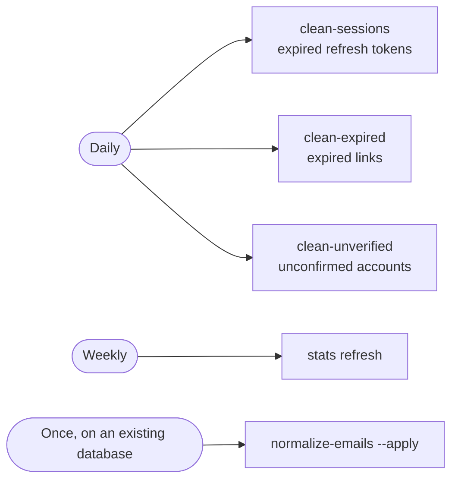

# Operations

Running a deployment: migrations, the CLI, the maintenance schedule,
backups, health and upgrades.

[All docs](README.md) · [Configuration](configuration.md) ·
[Getting started](getting-started.md)

Commands below are written without a prefix. Use:

```bash
uv run flask <command>                                        # locally
docker compose --env-file .env.docker exec app flask <command>  # in Docker
```

`uv run` puts the command in the project's virtual environment, where the
profile and settings come from `.env`. With the environment already
activated the prefix is unnecessary; with neither, you get
`flask: command not found`.

---

## Migrations

The schema is owned by Alembic. A committed baseline creates everything from
nothing, and later changes to the models arrive as new revisions.

```bash
flask alembic upgrade head        # apply
flask alembic current             # where the database stands
flask alembic history             # the chain of revisions
flask alembic migrate "what changed"   # autogenerate a new revision
flask alembic downgrade -1        # step back one
```

In Docker there is no separate step: the `migrations` service runs
`upgrade head` and `app` waits for it with
`condition: service_completed_successfully`. The schema is applied before
the application starts, always.

> [!WARNING]
> Use `flask alembic`, not bare `alembic`. The bare command reads
> `alembic.ini` from the working directory and fails with
> `No 'script_location' key found` anywhere else — and, worse, it resolves
> the database from its own environment rather than from the profile the
> application is running under.

<details>
<summary>How a migration decides which database to open</summary>

Alembic is handed one string and reads nothing else of the application's
configuration, so `infrastructure/configs/app/migration_url.py` produces
that string without demanding a configuration a migration does not need —
secrets, the domain and the mail settings would each otherwise stop a
migration that reads none of them.

A caller that already resolved a URL hands it over in
`ALEMBIC_DATABASE_URL`. The Flask CLI does exactly that when it shells out:
without a handoff the subprocess re-derives a profile from its own
environment, nothing exports `FLASK_ENV`, and a run under `testing` — the
profile that pins an in-memory database precisely so a test cannot reach a
real one — landed on the developer's own file. The value travels in the
environment rather than in `-x` because it carries the database password and
argv is visible in the process list.

Outside `development` a migration refuses to go to an unnamed SQLite file,
to an in-memory database, and to a database no profile names. Each refusal
says which of those it is.

</details>

---

## The CLI

Seven groups. `flask --help` lists them; `flask <group> --help` lists a
group.

### Accounts

| Command | |
|---|---|
| `create-admin --email <e> --password <p>` | The first administrator. Without the options it prompts; `--non-interactive` refuses instead and names what is missing — that is the form for provisioning scripts, where stdin is closed |
| `create-user --email <e> --password <p> --role <r>` | An account with a given role |

### Security

| Command | |
|---|---|
| `security check-secrets` | Are the secrets set properly |
| `security generate-secrets` | Print a fresh `SECRET_KEY` and `SHORT_CODE_PEPPER`; `--write <file>` fills them into an env file instead, `--force` replaces values already set |
| `security list-users` · `security list-roles` | What exists |
| `security validate-token <token>` | Verdict plus claims |
| `security reset-password` | Set a new password |

> [!NOTE]
> `validate-token` says `Token is VALID (type: access)`. The type is named
> deliberately: a bare "VALID" read the same for an access and a refresh
> token, and they are not interchangeable — a refresh token opens no
> endpoint. A token with no `exp` is treated as invalid: the library checks
> expiry only when the claim is present, so one issued without it would
> never expire.

### Database

| Command | |
|---|---|
| `db check` · `db status` | Can the database be reached |
| `db migrate` | Apply Alembic migrations |
| `db load-base-roles` | Seed or update the system roles from YAML |
| `maintenance roll-up-visits` | Fold finished days of visits into day totals, then delete raw rows past `VISIT_RETENTION_DAYS`. Run daily |
| `db load-custom-roles <file>` | The same from a file of your own |
| `db seed --count N` | Fill the database with test links. These are **guest** links, so they hit `GUEST_LINK_LIMIT` — raise it for large N |
| `db init` · `db drop --yes` | Only meaningful with `USE_ALEMBIC=false` |

### Maintenance and statistics

| Command | |
|---|---|
| `maintenance clean-sessions` | Remove `refresh_sessions` rows whose tokens have expired |
| `maintenance clean-expired` | Remove links past `expires_at` |
| `maintenance clean-unverified` | Remove accounts nobody confirmed within `UNVERIFIED_ACCOUNT_TTL_HOURS`, and their dead tokens |
| `maintenance normalize-emails --apply` | One-off, on an existing database |
| `maintenance health` | A dependency report on the terminal |
| `stats refresh` | Rebuild the statistics cache |

---

## Maintenance schedule



| Job | Why it is not optional |
|---|---|
| `clean-sessions` | One row per refresh token ever issued; without the job the table only grows. It removes only rows that already grant nothing |
| `clean-expired` | Removes only links that already answer `410 Gone`. Not just space: while an expired row sits in the database it occupies a place in its owner's statistics and in `/links/mine` |
| `clean-unverified` | **Not cosmetic.** An unconfirmed account holds an address: it cannot be registered again (taken) and cannot be signed into (unconfirmed). Without this job anyone can squat addresses in bulk, permanently, and their owners are told "already registered". Confirmed accounts are never touched, whatever their age |

> [!WARNING]
> **A behaviour change.** `clean-expired` used to delete anything untouched
> for N days — regardless of `expires_at` or owner — and `--days` set that
> threshold. The option was removed rather than redefined: an old cron line
> now fails with `No such option: --days` instead of quietly doing something
> else. The "not clicked in a while" sweep was not reinstated.

---

## Backups

The user must match `DATABASE_USER` from your env file (`shortener` in the
shipped `.env.docker`).

```bash
docker compose --env-file .env.docker exec -T db \
    pg_dump --clean --if-exists -U shortener db_shortener > backup.sql
```

`--clean --if-exists` puts drop statements in the dump. Without them,
restoring into a database where the `migrations` service has already created
the schema fails on "relation already exists".

```bash
docker compose --env-file .env.docker exec -T db \
    psql -U shortener -d db_shortener < backup.sql
```

---

## Health

```bash
curl -s http://localhost:5000/health                 # liveness, never throttled
curl -s http://localhost:5000/api/v1/admin/health    # detail, needs admin:view_system_health
```

The detailed answer reports what each dependency said, and — where a
failover logger is configured — the counters that tell you whether the audit
trail is still being written:

```json
{
  "database": true, "cache": true, "task_queue": true, "rate_limiter": true,
  "logging": {
    "logger": { "active": "structlog", "dropped_calls": 0,
                "failed_checks": 0, "lost_log_lines": 0 },
    "audit":  { "active": "structlog", "dropped_calls": 0 }
  }
}
```

Those counters are reported nowhere else. An audit trail that had quietly
stopped being written looked, from every surface an operator has, exactly
like one that was fine.

> [!IMPORTANT]
> `/health` is exempt from rate limiting and cannot be given a limit. A
> probe is how an orchestrator learns whether an instance is alive, and it
> cannot tell `429` from a real failure — throttling the probe means a busy
> service gets restarted. The application refuses to start if
> `RATE_LIMITS` names it.

---

## Upgrading

```bash
git pull
docker compose --env-file .env.docker build --no-cache
docker compose --env-file .env.docker run --rm migrations alembic upgrade head
docker compose --env-file .env.docker up -d
```

The separate `migrations run` is belt and braces: `up -d` would apply them
anyway, but running the step alone shows the schema change on its own before
any application container restarts.

Rolling back a revision is `flask alembic downgrade -1`. Rolling back the
*application* below a revision it does not know is not supported — take a
backup first.

---

## Logs

With `LOG_TO_FILE=true` the journals go to `LOG_DIR` (`datas/logs` by
default): `application.log`, `error.log`, `audit.log`. Rotation is not the
application's job — a logrotate configuration is provided in
[`docs/utils/logrotate/`](utils/logrotate/logrotate_setup.md).

The audit journal is separate on purpose: it records what was done to
links and accounts, and it is the one an incident is reconstructed from.
