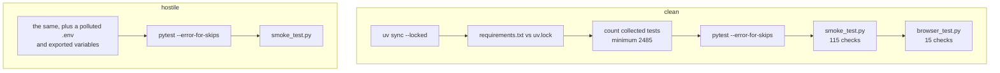

# Testing

**2497 tests**, 95.03% coverage against a floor of 88%, plus two live runs
pytest does not collect. This page is how to run them and what each level is
actually for.

[All docs](README.md) · [Development](development.md) ·
[Decisions](decisions.md)

## Running them

| Level | Against | Command |
|---|---|---|
| 1 · unit | Mocks instead of a database and cache | `uv run pytest tests/unit/` |
| 2a · integration | In-memory SQLite | `uv run pytest tests/integration/ --ignore=tests/integration/docker/` |
| 2b · integration | Real PostgreSQL and Redis in Docker | `uv run pytest tests/integration/docker/` |
| 3 · e2e | A user's path on SQLite, and the same one on PostgreSQL with Redis | `uv run pytest tests/e2e/` |
| — | Everything | `uv run pytest tests/` |
| — | With coverage | `uv run pytest tests/ --cov=src/link_shortener --cov-report=term-missing` |

The `--ignore` on level 2a is needed: without it 2b is collected too, and
that one wants Docker. Services for 2b start themselves.

```bash
uv run flake8 src tests && uv run pylint src && uv run bandit -r src -q && uv run mypy src
```

## Layout

```
tests/
├── unit/                    # Mocks, in isolation
│   ├── domain/              # Entities, value objects, policies
│   ├── application/         # Use cases, services, ports
│   ├── infrastructure/      # Config, cache, task queue, auth, logging
│   └── web/                 # Controllers, middleware, security, schemas
│
├── integration/             # Real in-memory SQLite
│   ├── application/         # Cache against the database, deletion, custom codes
│   ├── infrastructure/      # Repository CRUD, UoW, migrations
│   ├── web/                 # API, auth, admin, middleware, templates
│   ├── cli/                 # CLI commands
│   └── docker/              # Real PostgreSQL + Redis
│
├── e2e/                     # Whole user journeys
├── support/                 # Shared machinery: bringing the stack up
├── live/                    # smoke_test.py · browser_test.py · mail_catcher.py
└── load/                    # The locust profile; pytest does not collect it
```

> [!NOTE]
> **The directory decides the category, not a hand-written mark.**
> `pytest_collection_modifyitems` in `tests/conftest.py` applies a marker by
> path: `unit`, `integration`, `docker`, `e2e`. A marker written into a file
> could disagree with where the file lives; this way `-m integration`
> selects exactly what sits in `integration/`.

## The live runs

Neither is collected by pytest — `python_files = "test_*.py"` does not match
their names.

### smoke_test.py — 115 checks over HTTP

```bash
uv run python tests/live/smoke_test.py
```

The exit code is non-zero if any check failed **or if the number of checks
is not 115**: "everything passed" is a statement about the checks that ran,
and says nothing about the ones that stopped running.

Route coverage is not claimed but counted: the run records which rule
answered each request and goes red if one was never touched. Exactly one is
never touched — `/static` — and the file names it.

<details>
<summary>Why the run needs five separate clients</summary>

A Flask test client keeps a cookie jar, so after any request logs in, *every*
later request on that client is cookie-authenticated — and the CSRF layer
refuses unsafe cookie-authenticated requests that carry no token, before the
request reaches any logic. One shared client therefore turned every later
POST and DELETE into a 403 and every "anonymous" check into a check on a
signed-in caller: 32 of 56.

- `guest` never authenticates, so it really is an anonymous caller.
- `api` carries `Authorization: Bearer` and holds no cookies — CSRF does not
  apply to it by construction.
- `session_client` logs in and keeps cookies, which is what a browser is.
- `admin` gets its role written straight into the database, the way an
  operator makes the first administrator.
- `stranger` is a second account: signed in and entitled to nothing here.
  Without it the file has only an owner and an anonymous caller, and every
  per-object authorization check could be deleted from the application with
  this run still green.

Each client answers from its own address: registration is limited to three
per hour per address, so a fourth scenario from one address would measure
the throttle instead of what it is named after.

</details>

### browser_test.py — 15 checks in a real browser

```bash
uv sync --group browser
uv run playwright install chromium     # once
uv run python tests/live/browser_test.py
```

This is the only thing that executes `web/static/js`. The rest of the suite
drives the Flask test client, which has no engine in it, so the page scripts
could be broken entirely and stay green.

What it holds:

- **Pages speak sentences, not codes.** Measured: reversing
  `data.message || data.error` in all eight page scripts turns three checks
  red (`VALIDATION_ERROR`, `VALIDATION_ERROR`, `INVALID_CREDENTIALS`) while
  the suite and the HTTP run stay green.
- **A refusal is shown rather than swallowed.** The page scripts used to
  answer `403` with `if (!resp.ok) return;`, leaving a table on "Loading…"
  for good. One check replaces `fetch` with a 403 and demands a sentence.
- **The confirmation link is inert until clicked**, so a mail scanner that
  follows links cannot spend somebody's token.

Playwright is declared in its own `browser` dependency group rather than in
`dev`: `requirements.txt` is exported from the lock file without filtering
groups, and the Dockerfile installs exactly that. Measured — with playwright
in `dev` the runtime image grew from 540 MB to 731 MB, for a browser the
service never launches.

<details>
<summary>Address confirmation goes through the message, not around it</summary>

Both runs used to skip that seam: the HTTP run minted a token itself and
wrote its digest into `email_verifications`, and the browser run did
`UPDATE users SET email_verified = 1`. Neither exercised the token
registration issues, the link the template builds, or the delivery — and one
of those broke unnoticed.

Both now raise `tests/live/mail_catcher.py`, an SMTP server on the loopback,
point the mailer at it, and take the link out of the delivered message.

Measured by pointing `VERIFY_PATH` at a path nothing answers: the HTTP run
gives 78/115, the browser run 7/15.

The link has to be **opened**, not parsed. The message now leads to a page
whose button posts the token, which tempted the HTTP run into extracting the
token and posting it to a path written inside the run. That is what was done
first — and the broken `VERIFY_PATH` still gave 114 of 115, because every
account was confirmed anyway. `confirm_email` follows the address from the
message first and spends the token second.

Two details, each of which cost a green run for no reason.
`EmailMessage.set_content` picks quoted-printable, so in the raw body the
link reads `token=3DAAAA...=\nAAAA`: the catcher has to decode the body or
the token arrives truncated. And the path in the message must not be
compared against a path written in the run itself — the pattern looks for
any address carrying a `token` parameter, otherwise the check restates what
it is meant to check.

</details>

## What the suite is protected from

### The machine

`tests/conftest.py` moves each test into an empty directory and strips
**everything** except an explicit allow-list: the run's own variables, the
interpreter's, the locale, the runner's and the Docker daemon's.

That is not the first attempt. The previous three went the other way round,
listing what to remove, and each missed something:

| What was listed | What it missed |
|---|---|
| variable names | `DATABASE_TYPE`, `DATABASE_NAME`, `DATABASE_HOST`, `DATABASE_USER`, `DATABASE_PASSWORD` — only `DATABASE_URL` was named |
| configuration classes | `CeleryConfig` with `CELERY_BROKER_TIMEOUT`, which lives outside the application profiles |
| `EnvField` descriptors | `DATABASE_POOL_SIZE`, `DATABASE_MAX_OVERFLOW`, `DATABASE_POOL_RECYCLE` — declared as properties reading `read_env` |

The miss had the same shape every time: the configuration grew a new way to
name a setting that the enumeration did not know about. An allow-list ends
that — a new setting is covered the moment it appears, whatever idiom
declares it.

The protection is itself tested:
`tests/unit/infrastructure/test_config/test_env_isolation.py` plants settings
from a **module-scoped** fixture — that is, before `detached_env` runs — and
checks that none reaches the test.

### Silent skips

> [!IMPORTANT]
> An unreachable Docker daemon is a legitimate skip: the machine cannot run
> those tests. Everything else is a failure. The distinction was not there
> from the start — once the test stack failed to come up on a taken port,
> every branch reported `skipped`, and the run came back green:
> `492 passed, 16 skipped` where it used to be `508 passed`. Only counting
> noticed.

### Migrations

`integration/infrastructure/database/test_migrations.py` runs the revision
chain against a real database file. Every other test builds the schema with
`create_all` from the models and executes no revisions — which is how a
broken migration stayed unnoticed for a long time.

### Documentation that has drifted

Two tests read the docs and compare them with the code:

- `test_documented_rate_limits.py` parses the limits table in
  [Configuration](configuration.md#rate-limits) and holds it against
  `BaseConfig.RATE_LIMITS`. A published limit the service does not enforce
  is a failure — a limit is a security decision, and a document naming the
  wrong one is worse than one naming none, because it is believed.
- `test_api_docs.py` holds `/api/openapi.json` against the real URL map: a
  new endpoint is a failing test rather than an undocumented endpoint.

## Mail in development

The development overlay raises Mailpit, a catcher that accepts SMTP on 1025
and delivers nothing anywhere. Everything caught is visible at
`http://127.0.0.1:8025`.

```bash
docker compose --env-file .env.docker up -d mailpit
curl -s http://127.0.0.1:8025/api/v1/messages | python3 -m json.tool
```

A catcher rather than "write mail to a file in dev": the same code runs
through it as in production — `smtplib`, the SMTP conversation, header
assembly. A "development does it differently" branch does not exercise that
path and breaks quietly.

The suite sends no mail under any machine configuration: `TestingConfig`
declares `MAIL_ENABLED = False` as a plain attribute, which overrides the
environment descriptor entirely.

## What CI enforces

The suite runs **twice**, in a clean environment and in a hostile one, to
catch tests that read configuration nobody gave them.



Beyond "the tests passed", five things are checked:

| | Why |
|---|---|
| The number of collected tests, as a floor | "N passed" means nothing until you know how many were collected. A file that stops being collected gives a green run with a smaller N |
| The exit code of collection, before the count | An interrupted collection prints a plausible number and exits 2 |
| `--error-for-skips` | A skip is a failure, except for the Docker daemon |
| `requirements.txt` against `uv.lock` | Otherwise the image ships a different set of packages than CI tested |
| The live runs | They are the only thing that walks every routing rule and executes the page scripts |

The browser run is on the clean half only: it reads nothing from the
environment, and Chromium is a hundred megabytes to download.

Linters are a separate job, one pass, with a step each so the summary says
which tool objected: `flake8`, `pylint` (floor 9.0, currently 9.21),
`bandit`, `mypy` (floor: zero errors).
